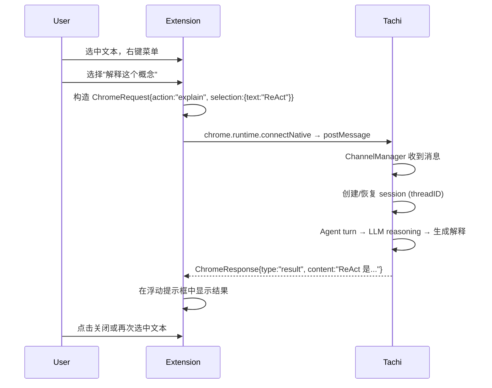

# Chrome 扩展 + Tachi Native Messaging Channel 设计

> 版本: 1.0 | 日期: 2026-06-18 | 状态: 设计阶段
> 关联: [Channel 架构](../pkg/channel/channel.go),
>       [Channel Manager](../channel/manager/manager.go),
>       [Memory 系统](./2026-05-17-memory.md)

---

## 一、概述

### 1.1 架构总览

Chrome 扩展通过 Native Messaging 与 Tachi 通信，Tachi 将 Chrome 作为一个新的 Channel 类型接入。

```
┌──────────────────────────────────────────────────┐
│                   Chrome 浏览器                     │
│                                                    │
│  ┌──────────────────────┐                          │
│  │  Tachi Extension      │                         │
│  │                       │                         │
│  │  ┌─────────────────┐  │                        │
│  │  │ 右键菜单 (MVP)    │  │ cmd/context menu      │
│  │  └────────┬────────┘  │                        │
│  │           │            │                        │
│  │  ┌────────▼────────┐  │                        │
│  │  │ Side Panel      │  │ 后续功能               │
│  │  │ · HN 热门       │  │                        │
│  │  │ · 论文推荐      │  │                        │
│  │  │ · A股复盘       │  │                        │
│  │  │ · Page Memory   │  │                        │
│  │  └────────┬────────┘  │                        │
│  │           │            │                        │
│  │  ┌────────▼────────┐  │                        │
│  │  │ Native Messaging │  │ stdin/stdout           │
│  │  │ Host (tachi)     │  │                        │
│  └──────────┬────────────┘                        │
│             │ chrome.runtime.connectNative()        │
└─────────────┼────────────────────────────────────┘
              │
              ▼  stdin / stdout (JSON + 4字节长度头)
              │
┌─────────────┼────────────────────────────────────┐
│  Tachi      │                                     │
│             ▼                                     │
│  ┌──────────────────────┐                         │
│  │ Channel Manager      │                         │
│  │  ┌────────────────┐  │                        │
│  │  │ WeChat Channel │  │ 已有                    │
│  │  ├────────────────┤  │                        │
│  │  │ Chrome Channel │  │ 新增 ← 本文设计          │
│  │  └────────┬───────┘  │                        │
│  │           │           │                        │
│  │  ┌────────▼───────┐  │                        │
│  │  │ Agent 循环      │  │                        │
│  │  │ · Tool use     │  │                        │
│  │  │ · Memory       │  │                        │
│  │  │ · MCP          │  │                        │
│  └──────────────────────┘                         │
└──────────────────────────────────────────────────┘
```

### 1.2 通信协议

Chrome 扩展与 Tachi 之间走 **Native Messaging** 协议：

```
[4字节小端序消息长度] [JSON 消息体]
```

扩展端调用方式：

```javascript
const port = chrome.runtime.connectNative("com.tachi.chrome");
port.postMessage({...});
port.onMessage.addListener((msg) => {...});
```

---

## 二、MVP 范围：右键菜单

### 2.1 功能矩阵

| 功能 | 动作 | 后端处理 | 耗时 |
|------|------|---------|------|
| 问 Tachi | 选中文本 → 右键 → "问 Tachi" | 完整 Agent turn | 慢（几秒） |
| 解释这个概念 | 选中文本 → 右键 → "解释这个概念" | 完整 Agent turn | 慢（几秒）|
| 搜索这个 | 选中文本 → 右键 → "搜索这个" | 直接调 WebSearch | 快（1-2s） |
| 存入记忆 | 选中文本 → 右键 → "记住这个" | 直接调 MemoryStore | 极快（<1s） |
| 搜索过去记忆 | 选中文本 → 右键 → "我读过这个吗？" | MemoryRecall | 快（1-2s） |

### 2.2 消息类型定义

扩展发给 Tachi 的消息：

```typescript
// Chrome 扩展 → Tachi 的消息
type ChromeRequest = {
  id: string;           // 唯一请求ID，用于匹配响应
  action: "ask_tachi"   // 完整 Agent 对话
         | "explain"    // 解释概念
         | "search"     // WebSearch
         | "remember"   // 存入记忆
         | "recall"     // 搜索记忆
         | "ping";      // 心跳保活
  threadID: string;      // 标签页ID或会话ID
  selection: {
    text: string;        // 选中的文本
    url?: string;        // 当前页面URL
    title?: string;      // 当前页面标题
  };
  content?: string;      // 补充说明（用户输入的问题）
};
```

Tachi 回复扩展的消息：

```typescript
// Tachi → Chrome 扩展
type ChromeResponse = {
  id: string;           // 对应请求ID
  type: "result"        // 正常结果
       | "error"        // 错误
       | "stream";      // 流式输出片段（用于 ask_tachi）
  threadID: string;
  content: string;       // 回复文本
  done?: boolean;        // stream 结束时为 true
};
```

### 2.3 用户交互流程



### 2.4 右键菜单按钮

```json
// manifest.json (permissions)
{
  "permissions": [
    "contextMenus",
    "nativeMessaging"
  ],
  "background": {
    "service_worker": "background.js"
  }
}
```

```javascript
// background.js — 右键菜单注册
chrome.contextMenus.create({
  id: "tachi-ask",
  title: "问 Tachi 🤖",
  contexts: ["selection"]
});
chrome.contextMenus.create({
  id: "tachi-explain",
  title: "解释这个概念 📖",
  contexts: ["selection"]
});
chrome.contextMenus.create({
  id: "tachi-search",
  title: "搜索这个 🔍",
  contexts: ["selection"]
});
chrome.contextMenus.create({
  id: "tachi-remember",
  title: "记住这个 🧠",
  contexts: ["selection"]
});
chrome.contextMenus.create({
  id: "tachi-recall",
  title: "我读过这个吗？ 🔎",
  contexts: ["selection"]
});
```

### 2.5 结果展示方式

MVP 阶段采用 **浮动提示框**（info bar / toast），不打开新的标签页或侧边栏：

```
┌─────────────────────────────────────────────────┐
│  📖 解释这个概念                                   │
│                                                   │
│  ReAct: Synergizing Reasoning and Acting in        │
│  Language Models...                                │
│                                                   │
│  [关闭]  [打开全文]  [存入记忆]                     │
└─────────────────────────────────────────────────┘
```

位置：页面顶部或选中文本附近，可拖拽，3 分钟后自动关闭。

---

## 三、Tachi Chrome Channel 实现

### 3.1 代码结构

```
channel/chrome/
├── channel.go         ← Channel 接口实现
├── channel_test.go
├── native_host.go     ← Native Manifest 安装/卸载
└── install_test.go
```

### 3.2 Channel 实现

```go
// channel/chrome/channel.go

package chrome

import (
    "bufio"
    "context"
    "encoding/binary"
    "encoding/json"
    "io"
    "os"

    "github.com/monsterxx03/tachi/pkg/channel"
)

type ChromeChannel struct {
    reader  io.Reader
    writer  io.Writer
    handler channel.MessageHandler
    name    string
}

func NewChromeChannel(name string) *ChromeChannel {
    return &ChromeChannel{
        reader: os.Stdin,
        writer: os.Stdout,
        name:   name,
    }
}

func (c *ChromeChannel) Name() string { return c.name }

func (c *ChromeChannel) Run(ctx context.Context, handler channel.MessageHandler) error {
    for {
        msg, err := c.readMessage()
        if err != nil {
            return err
        }

        result := handler(ctx, c.toIncoming(msg))

        if !result.Steered && !result.Buffered {
            c.writeMessage(c.toOutgoing(result.Reply))
        }
    }
}

// readMessage reads a Native Messaging message (4-byte length prefix + JSON).
func (c *ChromeChannel) readMessage() (ChromeRequest, error) {
    var length uint32
    if err := binary.Read(c.reader, binary.LittleEndian, &length); err != nil {
        return ChromeRequest{}, err
    }

    data := make([]byte, length)
    if _, err := io.ReadFull(c.reader, data); err != nil {
        return ChromeRequest{}, err
    }

    var req ChromeRequest
    if err := json.Unmarshal(data, &req); err != nil {
        return ChromeRequest{}, err
    }
    return req, nil
}

// writeMessage writes a response back to Chrome.
func (c *ChromeChannel) writeMessage(resp ChromeResponse) error {
    data, err := json.Marshal(resp)
    if err != nil {
        return err
    }

    header := make([]byte, 4)
    binary.LittleEndian.PutUint32(header, uint32(len(data)))

    if _, err := c.writer.Write(header); err != nil {
        return err
    }
    _, err = c.writer.Write(data)
    return err
}
```

### 3.3 请求/响应类型

```go
// channel/chrome/types.go

package chrome

type ChromeRequest struct {
    ID        string `json:"id"`
    Action    string `json:"action"`
    ThreadID  string `json:"threadID"`
    Selection struct {
        Text  string `json:"text"`
        URL   string `json:"url,omitempty"`
        Title string `json:"title,omitempty"`
    } `json:"selection"`
    Content string `json:"content,omitempty"`
}

type ChromeResponse struct {
    ID       string `json:"id"`
    Type     string `json:"type"` // "result", "error", "stream"
    ThreadID string `json:"threadID"`
    Content  string `json:"content"`
    Done     bool   `json:"done,omitempty"`
}
```

### 3.4 消息路由（Channel → Agent）

```go
// channel/chrome/channel.go

func (c *ChromeChannel) toIncoming(req ChromeRequest) channel.IncomingMessage {
    // 根据 action 类型构造 prompt
    prompt := c.buildPrompt(req)

    return channel.IncomingMessage{
        ThreadID:  req.ThreadID,
        MessageID: req.ID,
        Content:   prompt,
    }
}

func (c *ChromeChannel) buildPrompt(req ChromeRequest) string {
    switch req.Action {
    case "search":
        return fmt.Sprintf("搜索以下内容并返回结果：%s", req.Selection.Text)
    case "explain":
        return fmt.Sprintf(
            "请解释以下概念。先用 100 字以内给出核心定义，再用 2-3 个要点展开。"+
            "最后给一个生活中的类比。\n\n概念：%s",
            req.Selection.Text,
        )
    case "remember":
        return fmt.Sprintf(
            "使用 RecordMemory 工具记录以下内容到记忆中。\n\n内容：%s\n来源：%s",
            req.Selection.Text, req.Selection.URL,
        )
    case "recall":
        return fmt.Sprintf(
            "使用 MemoryRecall 工具搜索记忆中是否有与以下内容相关的信息。\n\n查询：%s",
            req.Selection.Text,
        )
    case "ask_tachi":
        return fmt.Sprintf(
            "用户从浏览器中提问。\n\n当前页面：%s\n选中文本：%s\n\n用户问题：%s",
            req.Selection.Title, req.Selection.Text, req.Content,
        )
    default:
        return req.Selection.Text
    }
}
```

### 3.5 Native Host 安装/卸载

```go
// channel/chrome/native_host.go

package chrome

import (
    "encoding/json"
    "os"
    "path/filepath"
    "runtime"
)

const ManifestName = "com.tachi.chrome"

type NativeManifest struct {
    Name          string   `json:"name"`
    Description   string   `json:"description"`
    Path          string   `json:"path"`
    Type          string   `json:"type"`
    AllowedOrigins []string `json:"allowed_origins"`
}

func InstallExtensionID(extensionID string) error {
    manifestPath, err := getManifestPath()
    if err != nil {
        return err
    }

    manifest := NativeManifest{
        Name:        ManifestName,
        Description: "Tachi Chrome Extension Bridge",
        Path:        getTachiBinaryPath(),
        Type:        "stdio",
        AllowedOrigins: []string{
            "chrome-extension://" + extensionID + "/",
        },
    }

    data, err := json.MarshalIndent(manifest, "", "  ")
    if err != nil {
        return err
    }

    return os.WriteFile(manifestPath, data, 0644)
}

func Uninstall() error {
    manifestPath, err := getManifestPath()
    if err != nil {
        return err
    }
    return os.Remove(manifestPath)
}

func getManifestPath() (string, error) {
    var base string
    switch runtime.GOOS {
    case "linux":
        base = filepath.Join(os.Getenv("HOME"), ".config", "google-chrome")
    case "darwin":
        base = filepath.Join(os.Getenv("HOME"), "Library", "Application Support", "Google", "Chrome")
    case "windows":
        base = filepath.Join(os.Getenv("APPDATA"), "Google", "Chrome")
    default:
        return "", fmt.Errorf("unsupported platform: %s", runtime.GOOS)
    }

    dir := filepath.Join(base, "NativeMessagingHosts")
    if err := os.MkdirAll(dir, 0755); err != nil {
        return "", err
    }
    return filepath.Join(dir, ManifestName+".json"), nil
}

func getTachiBinaryPath() string {
    // 使用 tachi 自身二进制，通过 --channel=chrome 参数启动
    // Chrome 会为每个扩展实例启动一个单独的进程
    exe, _ := os.Executable()
    return exe
}
```

### 3.6 Tachi 入口注册

在 Tachi 的 main.go 或 channel 注册处添加：

```go
// 启动时检测 --channel=chrome 参数
// Chrome 启动 Tachi 时自动带上此参数

if cfg.Chrome.Enabled {
    ch := chrome.NewChromeChannel("chrome")
    manager.RegisterChannel(ch)
}
```

---

## 四、Chrome 扩展项目结构

```
tachi-chrome-extension/
├── manifest.json          ← 扩展配置
├── background.js          ← Service Worker（Native Messaging + 右键菜单）
├── content.js             ← Content Script（浮动提示框 UI）
├── popup.html / popup.js  ← 弹窗面板（后续功能）
├── sidepanel.html         ← 侧边栏（后续功能）
├── icons/
│   ├── icon16.png
│   ├── icon48.png
│   └── icon128.png
├── Makefile               ← 构建/打包
└── README.md
```

### 4.1 manifest.json

```json
{
  "manifest_version": 3,
  "name": "Tachi",
  "version": "0.1.0",
  "description": "AI 助手 — 右键选中文本即可提问、搜索、记忆",
  "permissions": [
    "contextMenus",
    "nativeMessaging",
    "storage",
    "sidePanel"
  ],
  "background": {
    "service_worker": "background.js"
  },
  "content_scripts": [{
    "matches": ["<all_urls>"],
    "js": ["content.js"]
  }],
  "side_panel": {
    "default_path": "sidepanel.html"
  },
  "icons": {
    "16": "icons/icon16.png",
    "48": "icons/icon48.png",
    "128": "icons/icon128.png"
  }
}
```

### 4.2 background.js 核心逻辑

```javascript
// background.js — Service Worker

let port = null;

// 连接 Tachi Native Host
function connectTachi() {
    port = chrome.runtime.connectNative("com.tachi.chrome");
    port.onMessage.addListener(handleResponse);
    port.onDisconnect.addListener(() => {
        console.log("Tachi disconnected, attempting reconnect...");
        setTimeout(connectTachi, 1000);
    });
}

// 发送请求到 Tachi
function sendToTachi(action, selection, content = "") {
    return new Promise((resolve, reject) => {
        const id = crypto.randomUUID();
        const listener = (msg) => {
            if (msg.id === id) {
                port.onMessage.removeListener(listener);
                resolve(msg);
            }
        };
        port.onMessage.addListener(listener);
        port.postMessage({
            id,
            action,
            threadID: `tab_${chrome.devtools?.inspectedWindow?.tabId || "global"}`,
            selection: {
                text: selection.text,
                url: selection.url,
                title: selection.title
            },
            content
        });
        // 10秒超时
        setTimeout(() => {
            port.onMessage.removeListener(listener);
            reject(new Error("Request timeout"));
        }, 10000);
    });
}

// 注册右键菜单
chrome.runtime.onInstalled.addListener(() => {
    connectTachi();
    createContextMenus();
});

function createContextMenus() {
    const items = [
        { id: "tachi-ask",     title: "问 Tachi 🤖",       contexts: ["selection"] },
        { id: "tachi-explain", title: "解释这个概念 📖",    contexts: ["selection"] },
        { id: "tachi-search",  title: "搜索这个 🔍",       contexts: ["selection"] },
        { id: "tachi-remember",title: "记住这个 🧠",       contexts: ["selection"] },
        { id: "tachi-recall",  title: "我读过这个吗？🔎",  contexts: ["selection"] },
        { id: "separator-1",   type: "separator" },
        { id: "tachi-open",    title: "打开 Tachi 面板 🚀", contexts: ["action"] },
    ];
    items.forEach(item => chrome.contextMenus.create(item));
}

// 处理右键菜单点击
chrome.contextMenus.onClicked.addListener(async (info, tab) => {
    const selection = {
        text: info.selectionText || "",
        url: tab?.url || "",
        title: tab?.title || ""
    };

    let action;
    switch (info.menuItemId) {
        case "tachi-ask":      action = "ask_tachi"; break;
        case "tachi-explain":  action = "explain"; break;
        case "tachi-search":   action = "search"; break;
        case "tachi-remember": action = "remember"; break;
        case "tachi-recall":   action = "recall"; break;
        default: return;
    }

    try {
        const result = await sendToTachi(action, selection);
        // 通过 content script 显示结果
        chrome.tabs.sendMessage(tab.id, {
            type: "show_result",
            action,
            content: result.content
        });
    } catch (err) {
        chrome.tabs.sendMessage(tab.id, {
            type: "show_error",
            content: err.message
        });
    }
});

// 心跳保活（防止 Service Worker 被休眠）
setInterval(() => {
    if (port) port.postMessage({ action: "ping" });
}, 20000);
```

### 4.3 content.js 核心逻辑

```javascript
// content.js — 浮动提示框

chrome.runtime.onMessage.addListener((msg) => {
    if (msg.type === "show_result") {
        showToast(msg.action, msg.content);
    } else if (msg.type === "show_error") {
        showToast("error", msg.content, true);
    }
});

function showToast(action, content, isError = false) {
    // 移除已存在的 toast
    const existing = document.getElementById("tachi-toast");
    if (existing) existing.remove();

    const icons = {
        "explain": "📖",
        "search": "🔍",
        "remember": "🧠",
        "recall": "🔎",
        "ask_tachi": "🤖",
        "error": "⚠️"
    };

    const toast = document.createElement("div");
    toast.id = "tachi-toast";
    toast.innerHTML = `
        <div class="tachi-header">
            <span>${icons[action] || "🤖"} Tachi</span>
            <button id="tachi-close">×</button>
        </div>
        <div class="tachi-body">${marked.parse(content)}</div>
    `;

    // 样式
    toast.style.cssText = `
        position: fixed; top: 20px; right: 20px; z-index: 2147483647;
        max-width: 480px; max-height: 60vh; overflow-y: auto;
        background: white; border: 1px solid #ddd; border-radius: 12px;
        box-shadow: 0 8px 32px rgba(0,0,0,0.15); padding: 16px;
        font-size: 14px; line-height: 1.6; font-family: -apple-system, sans-serif;
    `;

    document.body.appendChild(toast);

    document.getElementById("tachi-close").onclick = () => toast.remove();

    // 3分钟后自动关闭
    setTimeout(() => toast.remove(), 180000);
}
```

---

## 五、前端编译与集成

### 5.1 构建方式

```makefile
# Makefile
.PHONY: build install clean

build:
	@mkdir -p dist
	@cp manifest.json dist/
	@cp background.js content.js dist/
	@cp -r icons dist/
	@echo "Extension built in dist/"

install: build
	@echo "Load dist/ in chrome://extensions with Developer Mode"

clean:
	@rm -rf dist/
```

### 5.2 加载方式

开发阶段：`chrome://extensions` → 开发者模式 → 加载已解压的扩展 → 选择 `tachi-chrome-extension/dist/`

用户安装：打包成 `.crx` 或在 Chrome Web Store 上架。

### 5.3 Native Host 安装

```bash
# 方式一：tachi 提供命令
tachi chrome install --extension-id=xxx

# 方式二：手动安装（扩展首次启动时引导）
# 扩展检测到 Native Host 未安装时，显示指引页面
```

---

## 六、后续功能规划

| 阶段 | 功能 | 说明 |
|------|------|------|
| **MVP** | 右键菜单 5 项 | 选中文本 → 问/解释/搜索/记忆/回忆 |
| **V2** | Side Panel | 侧边栏集成 HN/A股/论文推荐 |
| **V3** | Page Memory | 自动记录页面，浏览时提示"你读过" |
| **V4** | Read Later | 收藏推迟读，Tachi 自动处理摘要 |

---

## 七、安全问题

| 风险 | 缓解措施 |
|------|---------|
| 恶意网站通过 content script 读 Tachi 数据 | Content script 只与 background.js 通信，不与页面直接交换数据 |
| 其他扩展冒充 Tachi | Native Messaging 通过 manifest 中的 allowed_origins 绑定扩展ID |
| Tachi 二进制被替换 | 用户自行管理 tachi 安装路径，manifest 中指定绝对路径 |
| Service Worker 被杀死 | 20 秒心跳保活，断开后自动重连 |

---

## 八、Open Questions

1. **多个标签页的 session 策略**：每个标签页独立 session，还是共享一个全局 session？
   → MVP 阶段共享全局 session，后续可选 per-tab 隔离

2. **ask_tachi 的流式响应**：是否需要 SSE-like 流式输出？
   → MVP 不流式，后续通过 stream 类型支持

3. **扩展图标点击行为**：点击扩展图标时弹出什么？
   → MVP 显示简单状态（已连接/未连接），V2 接入 side panel

4. **Native Host 自动发现**：扩展如何找到 Tachi 二进制？
   → 通过 `tachi chrome install` 写入 manifest，路径固定
