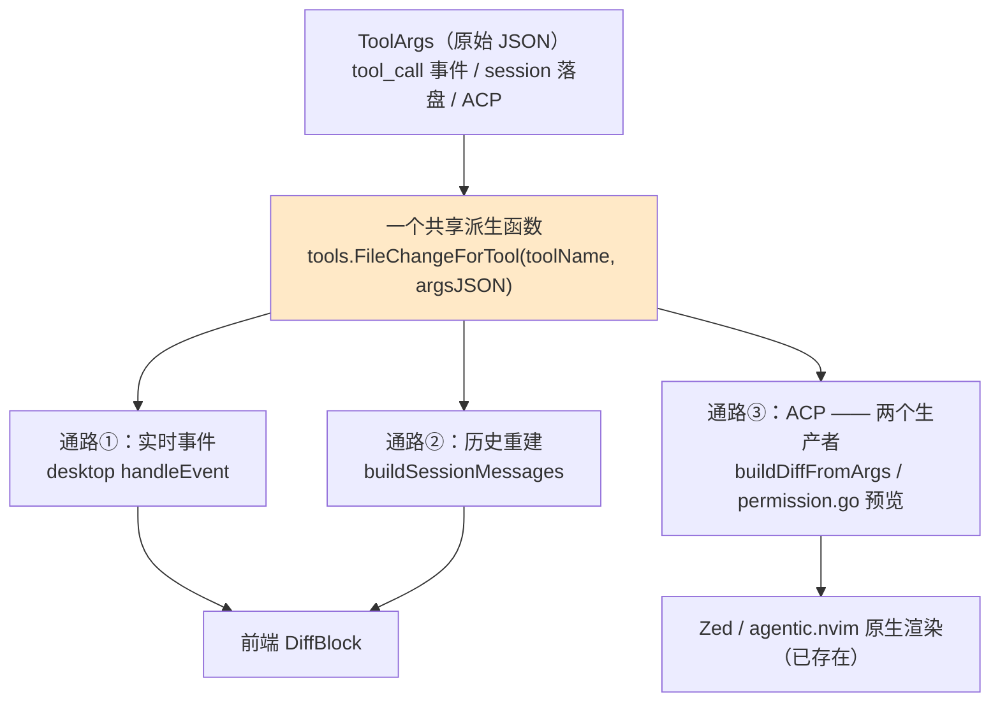

# Desktop 变更审阅（Diff Review）设计

> 版本: 0.10 | 日期: 2026-09-12 | 状态: P1/P2/P3 已落地；P4（checkpoint）未开始
> 关联: [desktop/agent.go](../desktop/agent.go)、[agent/acp/stream.go](../agent/acp/stream.go)、
>       [agent/tools/edit.go](../agent/tools/edit.go)、[agent/tools/arg_summary.go](../agent/tools/arg_summary.go)、
>       [agent/tool_executor.go](../agent/tool_executor.go)、[App.tsx](../desktop/frontend/src/App.tsx)、
>       [lib.ts](../desktop/frontend/src/lib.ts)、[components.tsx](../desktop/frontend/src/components.tsx)、
>       [2026-09-11-desktop-multi-workspace-design.md](./2026-09-11-desktop-multi-workspace-design.md)

---

## 目录

1. [背景与问题](#1-背景与问题)
2. [关键发现：三条通路，一个派生函数](#2-关键发现三条通路一个派生函数)
3. [竞品交互对照](#3-竞品交互对照)
4. [目标与非目标](#4-目标与非目标)
5. [语义定义](#5-语义定义)
6. [数据模型](#6-数据模型)
7. [实现设计](#7-实现设计)
8. [风险与边界](#8-风险与边界)
9. [测试计划](#9-测试计划)
10. [分阶段实施](#10-分阶段实施)
11. [待决问题](#11-待决问题)
12. [附录 A：diff 生产者与消费者清单](#附录-adiff-生产者与消费者清单)

---

## 本版修订（0.9 → 0.10：卡片不再重复显示工具输出）

有 diff 的 tool card 不再渲染 `summary`。对 EditFile/WriteFile 来说，工具输出就是同一处变更的文本版
（P1 之前桌面唯一能看到的那段带行号文本）——diff 是它的**更好渲染**，不是它的补充，
两样一起摆只是把同一件事说两遍。失败的调用没有 diff（`hasDiff` 要求 `ok`），错误文本照旧显示；
「复制结果」按钮同此口径，只在没有 diff 的卡片上出现。

## 本版修订（0.8 → 0.9：P3 实现回填）

P3（评论回灌）已实现，**纯前端，不需要新绑定**——输送管道就是 composer 那条 `SendMessage`。四处决定，
外加一处顺带补上的缺口，都写进 §12.5 与 §12.7：

1. **默认勾选规则**：🐛/⚠️ 默认勾上，💡 默认不勾。评审说"这里有问题"时前两档是要动的，💡 多为"可以考虑"，
   留给读者自己加——省掉一轮取消，也不会把鸡毛蒜皮一起塞给 agent。
2. **草稿是面板局部的**：以 findings 在载荷里的下标为键，**只存读者的编辑**，没动过的条目没有记录、
   由 `defaultPick(severity)` 实时推导。载荷晚到或被替换都不需要同步步骤；代价是关面板即丢草稿，
   所以 **Esc 在输入框里先是失焦、第二下才关闭**，免得把正在写的补充说明一起关掉。
3. **发送走 composer 同一条路**：会话在跑时进待发队列，而不是直连 `SendMessage`。`beginTurn` 会拒绝忙碌会话，
   直连等于静默丢消息；这也是 §12.5 里"Steer 是插话、新 turn 是反馈"的落地方式——两者最终共用同一段发送代码。
4. **发送后关面板并清空草稿**：面板是覆盖式的，接下来该看的是对话里的流式输出；要对照着看，重开一次即可。
5. **顺带补上的缺口（P2b 遗留，冒烟时暴露）**：当意见指向**本轮没改过的文件**（评审看得比 diff 作用域宽）时，
   `findingMatchesFile` 会把它从每个文件组里过滤掉——面板头部数着 2 条，却只渲染出 1 条，读者既看不到也勾不上，
   而「全选」又确实把它算进了消息。现在这类意见有自己的一组（`其它文件 / 不在本轮差异里`），照常可勾、可补充。

## 本版修订（0.3 → 0.4：P2 定稿）

P2 的三处粒度/载体决定已经拍定，写进[§12](#12-p2-详细设计工作树-diff--结构化评审)：

1. **findings 的载体是工具**（`ReportFinding`），不是 JSON 段、也不是解析报告文件。决定性理由是
   工具调用天然落进 session 记录 → findings 重启/切会话可重放，与 P1 的 diff 同性质、零迁移。
2. **评审入口是 turn 级唯一入口**（footer chip 那一行），**不在每个 edit 卡片上放**。第三条理由是硬约束：
   卡片渲染的是片段（行号是片段内的），findings 带的是文件真实行号，**两个坐标系不兼容**——
   意见只能落在整文件 diff 面板上。
3. **不做全自动，默认显式**：一次 review 是一整个 fork 回合（默认上限 200 iterations、最多 10 轮），
   每轮对话后自动挂一个几分钟/几分钱的回合是量级错误；竞品也都是显式动作。可选自动化按会话开关 + 两道护栏。

## 本版修订（0.2 → 0.3：实现回填）

P1 已实现并验证（Go 单测 + itest + 真机两条通路）。实现过程中有五处需要记录：

1. **`Hunk` 补了 json tag**（`kind`/`oldLine`/`newLine`/`text`）：§6.2 的结构体只写字段没写 tag，
   而它经 `FileChangeVO` 进入前端，落成 PascalCase 会与其它 VO 的 camelCase 不一致。ACP 不受影响（不走这个类型）。
2. **`old_string == ""` 的行为变了**（有意，且不可达）：旧代码无条件把 `args.OldString` 传给
   `ToolDiffContent`，所以这种编辑会发 `"oldText": ""`；现在统一"空旧文本 ⇒ 不发 oldText"。
   依据：该编辑在工具层必然失败（空 `old_string` 匹配不到），权限预览也只覆盖需要确认的工具，
   而且 `""` 本来就是对"没有旧内容"的错误编码。§9 有一条子测试显式钉住这个决定。
3. **`FileChange` / `FileChangeVO` 多一个 `ReplaceAll`**：§6 的数据模型里没写，但 §7.6 要求
   标注"多处替换，整段对照"，标头必须知道这件事。
4. **折叠是统一规则**（24 行 + "还有 N 行"），`WriteFile` 不做特例——原 §11 待决 2 倾向"完全折叠"，
   实现选了更简单也更一致的那条：小文件（≤24 行）本来就全显示，大文件露出前 24 行。
5. **尾部终止符归一**：两侧都以换行结尾时，那个空元素是终止符不是行；不归一的话每个 diff 尾部都会
   多一条空 context 行。只有一侧以换行结尾时保留——那是真实差异（"末尾换行被加/删"），不能吞掉。

**已知缺口（记录）**：§8.1 的"含 shell"标记只出现在**有变更**的回合（它挂在 chip 上）。
"本轮只跑了 Bash、没有任何片段 diff"时没有地方提示"改动可能在视图之外"——那时也确实没有 diff 视图可误导，
但这一点在 §8.1 里写明了。

## 本版修订（0.1 → 0.2）

评审发现三处会让设计的核心承诺落空的地方，已并入正文；另有两处 UI 判断就地定下：

1. **§7.1「对外行为逐字不变」原本不成立**：`acp.ToolDiffContent(path, newText, oldText ...string)`
   是变参，现状 Write 分支不传第三个参数（`OldText = nil`，SDK 注释写明"None for new files"），
   而草案里的薄适配会传一个**指向空串的指针** → 线上 JSON 从"没有 `oldText`"变成 `"oldText": ""`。
   适配器改为"非空才传"，并新增**字节级**回归测试（§9）——这条不能靠"指向同一组文本"的断言兜住。
2. **ACP 侧有两个生产者，不是三个调用点里的一个**：`agent/acp/permission.go:35` 自己解 `editArgs` 调
   `ToolDiffContent`（编辑器权限预览，agentic.nvim 在用）。原本被附录 A 记成
   `buildDiffFromArgs` 的消费者。现在**两处都改为消费 `FileChangeForTool`**，
   "一个派生函数"这句话才成立（§7.1）。
3. **实时通路少了把 `change` 落到已有 part 上的一环**：`agent:tool` 会在 `ToolCallStart` 与
   `ToolCallArgs` 各发一次，前端靠 `updateToolPart` 把后一次 patch 进正在运行的 part——
   草案只写了后端载荷与 ToolCard props，漏了这个函数与 `Part.change`（§7.3）。
4. **两个 UI 判断就地定下**：片段 diff **不渲染行号**（片段没有有意义的坐标，显示 1,2,3 会被读成文件行号，
   §5.3）；`+N −M` 字形保留，但口径在 tooltip 里说明是"本次调用片段"的行数（§5.4）。
5. 补上一条此前没人提的盲区：**`EditFile` 实际替换的文本未必等于 args 里的 `old_string`**
   （`findActualString` 会做引号归一化与去尾空白重试），所以 `-` 侧可能与磁盘上的变化有出入（§8.1）。

## 1. 背景与问题

desktop 已经能完整地跑一个 coding agent：多工作区、`@`-file、斜杠命令、MCP、用量与上下文指标都齐了。
唯独**"这一轮到底改了什么"没有视图**——用户只能一张张展开 tool card，读里面的文本摘要，
从 `Successfully edited /Users/x/repo/src/main.go` 后面那段带着行号的 `@@` 里，用眼睛还原一次改动。

对比之下，同一个 agent 通过 ACP 接到 Zed 时**早就在渲染结构化 diff** 了
（[stream.go:466](../agent/acp/stream.go) 的 `buildDiffFromArgs` → `acp.ToolDiffContent`）。
也就是说 desktop 目前落后于自己的另一个前端，而且落后的不是一个数据源，只是一次渲染。

这件事在竞品那边已经收敛成 coding agent GUI 的标准配置（§3）：**只有一个能让人"看见并裁定 agent 改了什么"的界面，
agent 才谈得上可以被放手使用。** 本设计的第一阶段（P1）目标很小：把已经存在的数据接到 desktop 的 UI 上，
不引入任何快照、git 或权限基建。

---

## 2. 关键发现：三条通路，一个派生函数

设计之前先固定四个事实。它们直接决定了后面的取舍——尤其是"不要动哪些东西"。

### 2.1 事实一：diff 的原始素材在三条通路上都有

| 通路 | 入口 | diff 素材的形态 |
|---|---|---|
| **① 实时事件** | `agent:event` / `agent:tool`（[agent.go:1426](../desktop/agent.go)） | `AgentEvent.ToolArgs` —— 原始 JSON |
| **② 历史重建** | `LoadSession` → `buildSessionMessages`（[agent.go:497](../desktop/agent.go)） | `session.Message.Args` —— 落盘的原始 JSON |
| **③ ACP（Zed）** | `buildDiffFromArgs`（[stream.go:466](../agent/acp/stream.go)） | 已经是 `ToolArgs` → `acp.ToolDiffContent` |

关键在于：**三者都以 `ToolArgs`（tool call 的原始 JSON）为准，而不是以工具的输出文本为准。**
`ToolArgs` 结构化、在落盘的历史里完整保留、且 ACP 已经验证过这条推导是可靠的。

### 2.2 事实二：今天 desktop 唯一能看到的"diff"是 tool output 里的一段带行号文本

`EditFile` 的返回值是：

```
Successfully edited /path/to/file
@@ -12,3 +12,4 @@
 11 | context line
-12 | old line
+12 | new line
 13 | context line
```

由 [`generateDiffSnippet`](../agent/tools/edit.go)（[edit.go:401](../agent/tools/edit.go)，调用点 163 / 236 / 306）生成。
这是一份**给模型看的**渲染：行号内嵌在行首、只覆盖片段、格式非标准。
它作为 UI 的 diff 数据源是不合适的（前端得反向解析一个自造格式），
但它是**模型可见输出**——改动它会改变模型看到的东西，进而可能改变模型行为。**P1 不碰它。**

### 2.3 事实三：`AgentEvent.ToolDiff` 的既有语义不是文件 diff

`AgentEvent.ToolDiff`（[agent_loop.go:143](../agent/agent_loop.go)）今天是**确认预览**：
两个发射点、同一语义——权限预览（[agent_permission.go:169](../agent/agent_permission.go)）与
TUI 确认路径转发 `tr.Diff`（[tool_executor.go:396](../agent/tool_executor.go)），
而 `ToolResult.Diff` 只在 `ToolResultPendingConfirm` 时被赋值（[tool.go:331](../agent/tools/tool.go)）。
其测试断言的是 `"git push*"` 这样的命令串（[agent_permission_test.go:155](../agent/agent_permission_test.go)），
由 TUI 的确认卡片消费（[model_events.go:75](../tui/model_events.go)）。

**所以：不要往 `ToolDiff` 里塞文件 diff。** 那会是一个字段两种语义，TUI 的确认卡片会开始显示文件内容。
P1 新增独立字段（§6）。

### 2.4 事实四：`EditTool.GetDiff()` 是死代码

`GetDiff`（[edit.go:128](../agent/tools/edit.go)）只在 `NeedsConfirmation()` 为真时被调用
（[tool.go:327](../agent/tools/tool.go)），而 `EditTool.NeedsConfirmation()` 恒为 `false`（[edit.go:66](../agent/tools/edit.go)）——
只有测试覆盖它。也就是说"Edit 的确认 diff"这条路今天**不可能在运行时走到**。

这不是本设计要修的东西（既不激活也不删除，见 §8.6），但它解释了一件事：
**为什么"复用确认路径拿 diff"这个想法行不通**——desktop 是 `PermissionModeSkip`
（[agent_driver.go:164](../desktop/agent_driver.go)），确认路径整个不会发生。

### 2.5 结论



**一个派生函数，四个调用点**（desktop 实时 / desktop 历史 / ACP 两处），其中 ACP 的两处必须一起收口（§7.1）——只改 `buildDiffFromArgs` 会留下第二个派生点。
这是本设计唯一的结构性决策。

---

## 3. 竞品交互对照

调研以各官方文档为准（Claude Code Desktop 文档、Conductor 文档、Cursor 课程/文档）。

| | Claude Code Desktop | Conductor | Cursor |
|---|---|---|---|
| **审阅入口** | 改动出现时浮出 `+12 -1` 统计条 → 点开 diff viewer | Diff Viewer（`⌘⇧D`） | 变更即浮出 diff 覆层 |
| **粒度** | workspace 级，可按 commit 过滤 | workspace 级 + 逐文件；聊天里也有逐轮 diff | 逐"显著变更" |
| **裁定的最小单位** | 行级评论 | 文件级 revert + 行级评论 | 逐个 change 的 Keep / Undo（+ Keep All / Undo All） |
| **反馈回灌** | 点行 → 评论 → `Cmd+Enter` 批量提交 → agent 改出新 diff | 评论 → send back to agent | 重 prompt |
| **agent 自审** | 工具栏 "Review code"：agent 在 diff 内留行内评论（只报编译/逻辑/安全/明显 bug） | `Review` 动作 + 仓库级 code review preferences | — |
| **回退** | rewind | 悬停消息 → revert；**私有 git ref**，每个 user message 前打点 | 每变更打点；restore **只回滚文件，保留对话** |
| **回退语义** | — | 删除该轮及之后的消息 **+ 回滚全部代码改动** | 文件回到那一点，可原地重 prompt |
| **检查点边界** | — | 明确承认 git 工作树外的副作用抓不到（装包、DB migration） | 明确写着 "do not replace Git" |

三条对 Tachi 有直接指导意义的规律：

1. **轻入口是主流**：三家都先给一个不占地方的痕迹（`+12 -1` / 侧栏标记），要看全貌才进面板。
   常驻的 diff 面板会让人不敢看聊天。
2. **评论回灌比"自己动手改"更有价值**——它把人的判断通过 agent 自己的循环执行下去。
   这条链路 Tachi 已有输送管道（`Steer`，[agent.go:1333](../desktop/agent.go)）。
3. **回退必须承认边界**。Conductor 那篇 checkpointing 文章的核心论点就是
   "Claude Code 和 Cursor 的 checkpoint 是 **leaky** 的"：装了包、跑了 migration、stage 了文件，回退后这些还在。
   **git 工作树之外的东西没有一家能救。** 这是 P4 的输入（§8.6）。

---

## 4. 目标与非目标

### 目标（P1）

1. desktop 的 tool card 能把 `EditFile` / `WriteFile` 渲染成**结构化、可读的 diff**（增/删着色、按 hunk 分组）。
2. turn footer 上给出本轮的变更摘要（改了 N 个文件、`+X -M`），点击即可展开/收起本轮所有 diff。
3. **实时与历史两条通路渲染完全一致**——切走再切回、重启 app，看到的 diff 逐字相同。
4. 与 ACP 共用同一份派生逻辑，杜绝两边漂移。
5. 零新增基础设施：不引入 git、快照、权限或新的持久化字段。

### 非目标

- ❌ **整文件 diff / 工作树 diff**（含 agent 通过 Bash 造成的改动）。P1 只做"工具调用片段级"的 diff。
  整文件 diff 需要 git 参与，属于 P2（与 `/review` 落进 diff 一起做）。
- ❌ **checkpoint / 回退**。需要快照基建，独立立项（P4）。
- ❌ 行内评论与"评论 → prompt"回灌（P3）。
- ❌ 改动 `generateDiffSnippet` 或模型可见的任何输出。
- ❌ 激活 `EditTool.GetDiff()`（§2.4）。

---

## 5. 语义定义

### 5.1 一次"变更"（FileChange）

一次**成功**的 `EditFile` 或 `WriteFile` 调用 = 一条 `FileChange`。判别规则分两段，
因为**后端在派生的时刻还不知道这次调用会不会失败**（`tool_call` 与 `tool_result` 在落盘里是两条独立消息）：

**派生段（后端）** —— 只回答"这次调用想改什么"，不回答"是否成功"：

- 工具名是 `tools.ToolNameEdit`（`"EditFile"`）或 `tools.ToolNameWrite`（`"WriteFile"`）；
- args 可解析出 `path`，且能取到新旧文本（Edit 取 `old_string` / `new_string`；Write 取 `content`，旧文本为空串）；
- 否则 `ok=false`，不发该字段。

**呈现段（前端）** —— 只回答"是否把它显示出来"：

- 只有 part 已经 `done` **且** `ok === true` 时才渲染 diff；
- 失败的编辑没有改动文件（EditFile 是原子写，[edit.go:303](../agent/tools/edit.go)），
  给它画一个 diff 是**误导**——失败卡片保持今天的形态（显示错误输出）。

> 这个分工同时满足实时与历史两条通路：实时通路在 `tool_result` 事件里拿到 `ok`
> （[agent.go:1439](../desktop/agent.go) → `finishToolPart`），
> 历史通路在 `buildTurns` 合并 `tool_result` 时拿到（[lib.ts:93](../desktop/frontend/src/lib.ts)）。
> 后端因此不需要知道执行结果，也不需要两次派生。

> 有意不做的事：把一次 `EditFile` 的 `replace_all: true`（多处替换）拆成多条变更。
> 参数里没有出现位置信息，拆出来的多条无法定位，不如老老实实一条（§8.2）。

### 5.2 `FileChange` 与 `Hunk`

两个正交的表示，分别服务两类消费者：

| 表示 | 形态 | 消费者 | 理由 |
|---|---|---|---|
| **`FileChange`** | `{Path, OldText, NewText}` | ACP | 与 `acp.ToolDiffContent(path, new, old)` 同构，**已经是验证过的形态** |
| **`Hunk`** | `[]Hunk{Kind, OldLine, NewLine, Text}` | desktop 前端 | 前端只做渲染，不做 diff 计算（§7.2） |

`OldText` / `NewText` 是**片段**，不是整文件。这一点在 UI 文案上必须成立（§5.3）。

### 5.3 片段级 diff，不是整文件 diff

`EditFile` 的 `old_string` / `new_string` 是模型给出的**局部片段**，不是文件全文。因此：

- P1 渲染的是"这次调用改动了什么"，**不是"这个文件现在长什么样"**；
- **P1 不渲染行号**：片段没有有意义的坐标，左侧显示 1,2,3 只会被读成文件真实行号。
  `Hunk` 仍保留 `OldLine`/`NewLine`（§6.2）——那是 P3 行内评论的定位锚点，不是给 P1 的渲染器用的；
- 这与 Zed/ACP 下看到的内容**完全一致**。所以 P1 之后可以给出一个精确的 parity 断言：
  *"desktop 的 diff 与 Zed 看到的逐字一致。"*

想在 diff 左侧看到真实行号，需要读文件或 git diff——那是 P2 的事。

### 5.4 `+N -M` 的口径

turn footer 的 `+N -M` 是**片段行数**的合计：`-` 行数记为 `M`，`+` 行数记为 `N`。
它不是 git 的 numstat（那是真实文件行数），两者在多行片段只改一行时会不一致。

**字形上仍然用 `+N −M`**（认知成本最低，Claude Code 等也是这个形态），但把口径写进 tooltip：
"本次工具调用在片段内新增/删除的行数"。不写进 chip 本身是因为那行已经够挤。
一旦 P2 引入 git numstat（真实文件行数），tooltip 文案同步升级即可，字形不用动。

---

## 6. 数据模型

### 6.1 中立类型（`agent/tools`，新增 `filechange.go`）

放在 `tools` 包而不是 `agent` 包：`ToolArgsSummary(name, argsJSON)`（[arg_summary.go](../agent/tools/arg_summary.go)）
已经是"给一个工具调用，导出展示用的派生数据"的既有先例，且 `agent/acp`、`desktop` 都已导入 `tools`
（[stream.go:12](../agent/acp/stream.go)、[agent.go:20](../desktop/agent.go)），无新导入边。

```go
// agent/tools/filechange.go

// FileChange is the edit a single tool call performed, in the shape both
// consumers need: OldText/NewText are the fragments the tool call carried
// (NOT the whole file), empty OldText meaning "created".
type FileChange struct {
    Path    string
    OldText string
    NewText string
}

// FileChangeForTool derives the change of a tool call from its raw arguments.
// It returns ok=false for tools that do not change a file's text, for
// unparsable args, or when the arguments carry no usable text — a failed call
// never reaches here (the caller filters on IsError first).
func FileChangeForTool(name, argsJSON string) (FileChange, bool)
```

**`OldText` 的"空"只有一种含义**（"这次调用没有旧文本"），与既有的两个生产者逐字对齐：

| 工具 | 现状（[stream.go:466](../agent/acp/stream.go)，判定在 481 / 495） | `FileChange` |
|---|---|---|
| `EditFile` | `path == "" \|\| (old == "" && new == "")` → nil；否则 `ToolDiffContent(path, new, old)` | 同左：两端都空 → `ok=false` |
| `WriteFile` | `path == "" \|\| content == ""` → nil；否则 `ToolDiffContent(path, content)`（**不传** oldText） | `NewText = content`；`OldText = ""` **且下游必须按"没传"处理**（§7.1） |

两条容易被实现漏掉的边界：

- **WriteFile 的空 content 今天不产生 diff**（`stream.go:495`），薄适配后必须保持一致；
- `EditFile` 在 `old_string == "" && new_string != ""` 时**派生层**是有效变更（ACP 今天就会画一个 diff），
  但**工具层**必然失败（空 `old_string` 匹配不到，`findActualString` 返回空 → "old_string not found"，
  [edit.go:160](../agent/tools/edit.go)）——所以前端不会渲染它（§5.1 的 `ok` 门）。两边行为一致即可，
  不需要为这个角落加特例。

> 为什么不用 `generateDiffSnippet` 的产物做数据源：见 §2.2。这里只复用它的**输入**（args），不复用它的**输出格式**。

### 6.2 Hunk（`pkg/linediff`，新增）

```go
// pkg/linediff/linediff.go

// Kind classifies one hunk line.
type Kind string

const (
    KindContext Kind = "context"
    KindAdd     Kind = "add"
    KindDel     Kind = "del"
)

// Hunk is one render-ready line of a fragment diff. OldLine/NewLine are
// 1-based line numbers *within the fragment* (0 when the line does not exist
// on that side), so the renderer never has to count.
type Hunk struct {
    Kind    Kind
    OldLine int
    NewLine int
    Text    string
}

// Fragments diffs two text fragments line by line and returns render-ready
// hunks plus the added/removed line counts. Identical inputs yield no hunks.
func Fragments(oldText, newText string) []Hunk

// Counts returns the added and removed line totals of a hunk list.
func Counts(hunks []Hunk) (added, removed int)
```

**为什么放在 `pkg/`**：这是纯粹的文本算法，与 agent 业务无关，符合
`.tachi.md` 的"business-agnostic 公共逻辑收进 `pkg/`"。放 `pkg/linediff` 而不是 `pkg/strutil`：
`strutil` 是字符串工具集合，塞进一个带类型的分块算法会降低它的可读性。
将来 TUI 的确认卡片、`/review` 的评论定位都可以复用它。

算法取**公共前缀 / 公共后缀裁剪**（trim 掉两侧相同的行，中间剩一段全删 + 全增），
不引入 LCS 依赖（`go.mod` 里没有直接 diff 依赖；`go-difflib` 只是间接的测试依赖）。
片段级 diff 本来就短，裁剪的结果与 LCS 在绝大多数情况下一致，且**行为可预测、可单测**。

> **它的已知形态**：`replace_all: true` 的多处替换会渲染成"一整段红 + 一整段绿"（整段对照），
> 而不是逐处配对——裁剪算法不做对齐。这是除 WriteFile 之外最常见的"大 diff"，
> 所以 UI 上必须在表头标注「多处替换，整段对照」（§7.6），让人知道这不是逐处差异。
> 想要逐处配对就得换 LCS；`go-difflib` 已在 module graph 里（`go.mod` 的 indirect 段），
> 是那时最便宜的升级路径。

`OldLine` / `NewLine` 在 P1 **只作为数据存在、不渲染**（§5.3）：它们是 P3 行内评论的锚点。
`Fragments` 仍然要算对，并单测（§9）——将来渲染与否是 UI 决定，数据错了就没得选。

### 6.3 desktop VO

```go
// desktop/agent.go
// FileChangeVO carries a tool call's change to the frontend. Hunks are
// computed in Go so the frontend stays a renderer (and so the diff logic is
// unit-testable in one place).
type FileChangeVO struct {
    Path    string          `json:"path"`
    Hunks   []linediff.Hunk `json:"hunks"`
    Added   int             `json:"added"`
    Removed int             `json:"removed"`
}
```

两个落点：

- `SessionMessage` 增 `Change *FileChangeVO`（[agent.go:93](../desktop/agent.go)）——历史通路；
- tool call 事件（[agent.go:1426](../desktop/agent.go) 的 `agent:tool`）增同名字段——实时通路。

**两条通路发同一个结构**，前端因此不需要知道消息来自哪里。这是 §4 目标 3 的实现方式。

---

## 7. 实现设计

### 7.1 共享派生函数：ACP 侧改成薄适配

ACP 侧今天有**两个**独立的生产者，都要收窄成"中立类型 → ACP SDK 类型"这一层薄适配：

| 位置 | 现状 | 改造后 |
|---|---|---|
| `buildDiffFromArgs`（[stream.go:466](../agent/acp/stream.go)） | 自己 `switch toolName` + 解 args + 调 `ToolDiffContent` | `tools.FileChangeForTool` → `ToolDiffContent` |
| 权限预览（[permission.go:35](../agent/acp/permission.go)） | 自己解 `editArgs` + 调 `ToolDiffContent`，无 diff 时回退纯文本 | 同上（`editArgs` 换 `FileChange`），**保留** `diff != ""` 的文本回退 |

只改前者的话，"一个派生函数"仍然不成立——两处各自解析 args，正是要避免的漂移。

```go
// agent/acp/stream.go — after
func buildDiffFromArgs(toolName, argsJSON string) *acp.ToolCallContent {
    fc, ok := tools.FileChangeForTool(toolName, argsJSON)
    if !ok {
        return nil
    }
    return fileChangeContent(fc)
}

// fileChangeContent is the ONE place the neutral change becomes an SDK type.
//
// The old text is passed ONLY when there is one: ToolDiffContent takes it as a
// variadic, and the SDK's own contract says a nil OldText means "new file"
// (types_gen.go: "The original content (None for new files)"). Passing an empty
// string instead would put `"oldText": ""` on the wire — a create would start
// reading as "the file used to be empty".
func fileChangeContent(fc tools.FileChange) *acp.ToolCallContent {
    var c acp.ToolCallContent
    if fc.OldText == "" {
        c = acp.ToolDiffContent(fc.Path, fc.NewText)
    } else {
        c = acp.ToolDiffContent(fc.Path, fc.NewText, fc.OldText)
    }
    return &c
}
```

**对外行为逐字不变**（同一个 `acp.ToolDiffContent`、同样的 `nil` 条件），所以 ACP 侧的既有测试无需改动、
Zed 无感知。这是本设计里唯一"动了 ACP 代码但不改 ACP 行为"的地方，因此 §9 用**字节级**回归测试钉它
（不是"指向同一组文本"那种弱断言——那挡不住 `nil` → `&""` 这种变化）。

> `acp-go-sdk` 是外部依赖（`go.mod` replace 到 `monsterxx03/acp-go-sdk`）。
> 让 SDK 类型停在 `agent/acp` 边界内、`tools` 只产出中立类型——这与
> `NormalizeAdditionalRoots` 收进 `agent`、ACP 只做薄包装是同一个套路。

### 7.2 Hunk 计算落在 Go 侧

前端只做渲染，不做 diff 计算。理由：

- diff 逻辑（裁剪、行号、计数）需要单测，Go 侧有 `roots_test.go` / `preview_test.go` 这样成熟的测试基建，前端没有；
- 前端若自己算，实时通路与历史通路会各自实现一遍，正是要避免的漂移；
- 后端算一次，字节数也很小（片段级 diff 通常几十行）。

### 7.3 通路一：实时事件

`desktopApp.handleEvent` 的 tool call 分支（[agent.go:1426](../desktop/agent.go)）已经在发 `agent:tool`
（携带 `name` / `title` / `args`）。在同一处补一次派生：

```go
// agent:tool payload
map[string]any{
    "name":   ev.ToolName,
    "title":  tools.ToolArgsSummary(ev.ToolName, ev.ToolArgs),
    "args":   ev.ToolArgs,
    "change": changeVO(ev.ToolName, ev.ToolArgs), // nil for non-file tools
}
```

`changeVO` 在 args 不可解析或工具不产生变更时返回 `nil`，JSON 里省略该字段——
**既有消费者（tool card 的 title/args）完全不受影响**。

注意这个时刻**执行还没发生**，所以后端不判断成功与否（§5.1 的分工）：
字段只是"这次调用想改什么"，是否渲染由前端在 `tool_result` 到达后决定。

**这一次事件会被发两遍，第二遍才带完整 args。** `agent:tool` 挂在
`AgentEventToolCallStart` 与 `AgentEventToolCallArgs` 两个事件上（[agent.go:1426](../desktop/agent.go)），
而 `ToolCallArgs` 携带的是**完整**参数（不是增量：`tool_executor.go:128` / `274`，紧挨执行前发一次）。
前端的落点是 `updateToolPart(m, name, title, args)`（[App.tsx:1154](../desktop/frontend/src/App.tsx)），
它把后一遍 patch 进正在运行的那条 part —— **这个函数必须一并透传 `change`**，
否则 diff 永远进不了前端（`Part.change` 字段见 §7.7）。

### 7.4 通路二：历史重建

`buildSessionMessages`（[agent.go:497](../desktop/agent.go)）的 `MessageTypeToolCall` 分支
（[agent.go:515](../desktop/agent.go)）已经有 `rm.Args`（落盘的原始 JSON），在同一处派生即可：

```go
case session.MessageTypeToolCall:
    argsJSON := marshalArgs(rm.Args)
    out = append(out, SessionMessage{
        Role: "tool_call", ToolName: rm.Name, ToolCallID: rm.ToolCallID,
        Args: argsJSON, Title: tools.ToolArgsSummary(rm.Name, argsJSON),
        Change: changeVO(rm.Name, argsJSON), // ← 新增
        …
    })
```

**旧 session 不需要迁移**：`Change` 是从已落盘的 `Args` 现算的，不是新落盘的字段。
任何历史会话重新加载后，diff 自动出现。这是选择"从 args 派生"而不是"把 diff 写进 session"的最大好处。

### 7.5 通路三：ACP

由 §7.1 的薄适配自动覆盖，desktop 侧无需任何动作。P1 完成后应断言 desktop 与 ACP 对同一 args
产出**对应的** diff（§9）。

### 7.6 前端：`DiffBlock`（新增 `frontend/src/diff.tsx`）

新开一个模块，与 `markdown.tsx` / `filepreview.tsx` / `viewer.tsx` 的"一个关注点一个文件"保持一致。
`components.tsx` 已 659 行，不宜再塞。

```tsx
export const DiffBlock = memo(function DiffBlock({ change, open }: {
  change: FileChangeVO
  open: boolean
}) { … })
```

渲染规则：

- 表头一句：`<path>` + `+N −M`（M/N 为 0 时省略对应项）；
- **不渲染行号**（§5.3）：片段没有有意义的坐标；
- hunk 按行渲染，`add` / `del` 用左侧色条 + 极浅底色区分，前缀 `+` / `-` 保留
  （**不用颜色单独承载语义**，与无障碍要求一致）；
- `replace_all: true` 的变更在表头加一句「多处替换，整段对照」（§6.2 的算法形态）；
- 长 diff 默认折叠到前 N 行（N 取常数，与 tool card 现在的 `long` 阈值同源思路），可展开。

新增两个设计令牌（`base.css`，明暗两套都要给），不要在组件里硬编码 rgba——
`.tachi.md` 的"预定义常量"约束在这里体现为令牌而不是字面量：

```css
--diff-add-wash: …;  /* 新增行底色 */
--diff-del-wash: …;  /* 删除行底色 */
```

（`--green` / `--red` / `--red-wash` 已存在（[base.css:95-99](../desktop/frontend/public/base.css)），
新增的只是"新增行的浅底"这一档。）

### 7.7 前端：tool card 与 turn footer

**Tool card**（[components.tsx:281](../desktop/frontend/src/components.tsx)）：
`ToolCard` 增三个可选 prop —— `change?: FileChangeVO`、`done?: boolean`、`diffOpen?: boolean`。
有 `change` 且 `done && ok` 时，卡片主体渲染 `DiffBlock`，而 `summary`（工具输出文本）**不再渲染**：
对 EditFile/WriteFile 而言那段输出就是同一处变更的文本版（带行号的旧形态），放在 diff 下面只是重复一次。
失败的调用没有 diff（`hasDiff` 要求 `ok`），错误文本照旧显示——那正是它唯一的内容。
「复制结果」按钮同此口径：只在没有 diff 的卡片上出现，否则它复制的是一段屏幕上看不到的文字。

> `done` 必须是显式 prop：`agent:tool` 与 `tool_call_start` 推入的 part 默认 `ok: true, done: false`
> （[App.tsx:1170](../desktop/frontend/src/App.tsx)），
> 只看 `ok` 会把"正在执行的编辑"提前画成 diff。`TurnPart` 目前只透传 `ok`
> （[App.tsx:139](../desktop/frontend/src/App.tsx)），需要补上 `done`。

`Part` 需要两个新字段：`change?: FileChangeVO`（后端载荷的落点，实时与历史两条通路共用）与
`diffOpen?: boolean`（展开状态）。`TurnPart` 透传它们 —— 注意它今天只透传 `ok`
（[App.tsx:139](../desktop/frontend/src/App.tsx)），`done` 与 `change` 都要补上。

**展开状态放在 part 上，不放在组件内。** 现在 `ToolCard` 用自己的 `useState` 管展开
（[components.tsx:282](../desktop/frontend/src/components.tsx)），这没问题；
但"点一下 chip 展开本轮所有 diff"要求外部能控制它。因此 `diffOpen` 由 `App.tsx` 持有并在 `TurnPart` 里透传，
`ToolCard` 变成受控组件（仅对 diff 部分）。
沿用 `Part.expand` 是**不行的**：那个字段的语义是"工具输出就是用户要的答案"
（`ToolAutoExpand`，见 [types.ts](../desktop/frontend/src/types.ts) 的注释），两者不是一回事。

**Turn footer chip**（[App.tsx:177](../desktop/frontend/src/App.tsx) 的 `.msg-footer`）
在现有 `⏱ / iters / ¥ / 积分` 同一行末尾追加：

```
🧾 3 files +24 −7        ← tooltip: 本次调用的片段行数（不是 git numstat）
```

- 数据由前端从该 turn 的 `parts` 聚合，**只计已 `done` 且 `ok === true` 的 part**（§5.1）：
  按 `path` 去重、`Added`/`Removed` 求和。
  **同一个文件被改两次算一个文件**（次数不展示，避免解释成本）。
- chip 只在有变更时出现——没有改动的回合与今天逐字相同。
- 点击 → 把该 turn 内所有 `diffOpen` 置为真；再点击 → 全部置回假。
  **不做"滚动到第一个 diff"**（那会在长回合里制造一次意外的视口跳动）。
- chip 是 `<button>`，可键盘触发（沿用 `actOnKey`，[lib.ts:127](../desktop/frontend/src/lib.ts)）。

**聚合逻辑放在前端**是刻意的：实时与历史两条通路都落到同一个 `parts` 数组上，
所以"从 parts 派生 chip"这一条代码同时覆盖两种情况，后端不需要额外的 turn 汇总 API。

### 7.8 明确不动的三处

| 不动的东西 | 理由 |
|---|---|
| `generateDiffSnippet` 及其三个调用点（[edit.go:401](../agent/tools/edit.go)） | 模型可见输出。改它等于改模型的行为（§2.2） |
| `AgentEvent.ToolDiff`（[agent_loop.go:143](../agent/agent_loop.go)） | 既有语义是 Bash 命令预览，TUI 确认卡片在消费（§2.3） |
| `EditTool.GetDiff()`（[edit.go:128](../agent/tools/edit.go)） | 死代码，且激活它等于改变确认语义（§2.4）。记录在案，另行处理 |

### 7.9 为 P2 / P3 预留的接口

P1 不做，但数据结构上不要挡住：

- **P2 整文件 diff + `/review` 落进 diff**：`/review` 已经是 agent fork 做的多轮评审
  （[commands.go:48](../agent/commands/commands.go)，desktop 已注册 handler）。
  它今天唯一的短板是评审意见只能吐进聊天流。给它一个 diff 承载面即可——
  这比 Claude 的 "Review code" 更强，因为 Tachi 的评审本身就是多轮 fork。
- **P3 行内评论 → prompt**：评论需要 `path` + 片段行号 → 已经有（`Hunk.OldLine`/`NewLine`）；
  输送管道也已经有——就是一条普通的用户消息（`SendMessage`，与 composer 同路）。`Steer` 不是这个场景的
  通道（它只在回合运行中回答 `steer_check`，空闲时返回 "not running"），详见 §12.5。
- **P4 checkpoint**：用私有 git ref，每个 user message 前打点。边界见 §8.6。

---

## 8. 风险与边界

### 8.1 片段 diff 的盲区（最重要的边界）

P1 的 diff 只覆盖**工具调用显式携带的文本**。因此以下改动**不会出现在 diff 里**：

- agent 通过 `Bash` 改的文件（`sed -i`、代码生成器、`git checkout`、`npm install` 改 lockfile）；
- `EditFile` 之外的工具造成的写（MCP 工具、将来的新工具）；
- 工具执行过程中的间接副作用。

第二条同样重要、且和"args 是可靠素材"直接相关的事实：**args 里的 `old_string` 未必等于真正被替换掉的文本。**
`EditFile` 拿的是 `actualOld := findActualString(content, oldString)`（[edit.go:158](../agent/tools/edit.go)、281）
才做替换，而 `findActualString` 会做**引号归一化**匹配（`findNormalized` → `normalizeQuotes`，
[edit.go:344](../agent/tools/edit.go)），失败还会退一步"去掉尾部空白再匹配"。
后果：diff 的 `-` 侧显示的是**模型请求删的文本**，可能与磁盘上被删的那几个字节不同（引号风格、行尾空白）。
`+` 侧没有这个问题——`new_string` 是原样写入的。
这与 ACP/Zed 看到的内容仍然一致（两边都从 args 派生），但**用户拿它和 `git diff` 对照时会看到差异**，
所以记在这里而不是让人自己去发现。

这不是"实现不完整"，而是**架构上的分界线**：片段 diff 来自 args，工作树 diff 来自 git。
P1 的 UI 不能让人误以为"没有 diff = 没有改动"。缓解：

- turn footer 的 chip 文案是"变更"而非"全部变更"；
- 一个 turn 里只要有 `Bash` 调用，chip 的行尾加一个弱化的提示标记（`· 含 shell`）——
  成本一行代码，避免"我看过了 diff，所以我知道改了什么"的错误确信。

### 8.2 同一文件在一个 turn 内被改多次

每次调用一条 `FileChange`、一张卡片；chip 聚合时按 `path` 去重只计一次、行数相加。

**已知失真**：两次编辑如果第一次新增、第二次删掉，行数会双计。不做处理，只记录——
要修就得引入"同一文件的多条变更合并成一条 diff"的逻辑，而那要求的正是整文件 diff（P2）。

### 8.3 `WriteFile` 的语义

`WriteFile` 是整文件覆盖，`OldText` 为空 → diff 呈现为"整个文件全是新增"。
对大文件这会很吓人（几千行全绿）。缓解：`WriteFile` 的 `DiffBlock` 默认折叠，
表头标注"写入整个文件（N 行）"，展开才看内容。**不要**去读磁盘拿旧内容做真 diff——
那会引入 IO 失败路径，且执行时刻的旧内容未必等于我们现在读到的内容。

### 8.4 旧 turn 的行为

已落盘的旧会话重新加载后会自动出现 diff（§7.4），因为这些 turn 的 `Args` 一直在。
不需要任何迁移脚本或版本号。唯一不会渲染的是**失败**的编辑调用与**还在执行中**的调用（§5.1）——
两者都是有意为之。

### 8.5 体量

片段级 diff 通常很小，但 `replace_all: true` 的编辑或 WriteFile 可能很大。
`DiffBlock` 折叠阈值（§7.6）是体量控制的主要手段。
不需要后端截断——它是渲染问题，不是传输问题。

### 8.6 checkpoint 的 leaky 边界（记录给 P4）

竞品调研最值得记住的一条：**任何基于 git 工作树的 checkpoint 都抓不到工作树之外的副作用**——
装了的包、跑过的 migration、动的容器、写进 `~/.config` 的东西、git 工作树外的文件。
Conductor 明确承认这点（只恢复 files + git + chat）。因此 P4 立项时必须先定死一句话：

> Tachi 的 checkpoint **只回滚 git 工作树内的文件内容**；工作树外的副作用不回滚、也不假装回滚，
> 且这一点要在 UI 上明说（而不是只在文档里）。

非 git 目录则**不具备回退能力**（不给 revert 图标），而不是降级成某种"近似回退"。

### 8.7 性能

`changeVO` 在每次 tool call 与每次历史加载时各算一次。成本是"解析一次 JSON + 一次前后缀裁剪"，
与现有 `tools.ToolArgsSummary` 同量级（它已经在同一处调用）。**不需要缓存**。
若将来实测成为热点，缓存键是 `(toolName, argsJSON)`——但先不预支这个复杂度。

---

## 9. 测试计划

**Go**

| 用例 | 断言 |
|---|---|
| `FileChangeForTool` — Edit | `path/old_string/new_string` 解析正确；`replace_all` 不影响结果 |
| `FileChangeForTool` — Write | `content` → `NewText`，`OldText` 为空 |
| `FileChangeForTool` — 负例 | ReadFile / Bash / Grep → `ok=false`；空 args → `ok=false`；args 非法 JSON → `ok=false`；缺 `path` → `ok=false`；Edit 两端都空 → `ok=false`；**WriteFile 空 `content` → `ok=false`** |
| `buildDiffFromArgs` — 字节级回归 | Edit / Write 新建 / Write 覆盖 / 空 content 四种输入：改造后的 `ToolCallContent` JSON **与改造前逐字节相同**（尤其 `oldText` 必须仍是 `nil` 而不是 `""`） |
| 权限预览路径一致 | `permission.go` 与 `buildDiffFromArgs` 对同一 Edit args 产出相同的 `ToolDiffContent`（两处共用 `fileChangeContent`） |
| `linediff.Fragments` — 基本 | 等长替换 → 1 del + 1 add；纯新增 → 全 add；纯删除 → 全 del；相同文本 → 空 |
| `linediff.Fragments` — 行号 | `OldLine`/`NewLine` 在片段内 1-based；不存在的一侧为 0 |
| `linediff.Counts` | 与 hunk 列表一致；空列表 → 0,0 |
| ACP↔desktop 一致性 | 同一 `(toolName, argsJSON)`：ACP 的 `ToolCallContent` 与 desktop 的 `FileChangeVO` **指向同一组新旧文本**（只比这一层，渲染格式各自不同是允许的） |
| `buildSessionMessages` | 含 Edit 的 `tool_call` → `Change` 非空且字段正确；含 Bash 的 → `Change` 为 nil |
| 失败的调用 | Edit 的 `tool_call` **仍然**派生 `Change`（后端不知道成败，§5.1）——这是有意的，断言它存在 |
| 回归 | 无变更的会话：`buildSessionMessages` 输出与改动前**逐字段相同**（新字段为 nil，`omitempty` 不出现） |

**前端 / 手测**

- 一个回合里连续改 3 个文件 → chip 显示 `3 files +X −Y` → 点击展开三张卡片的 diff。
- **失败的编辑不渲染 diff**：让 agent 改一个 `old_string` 不存在的目标 → 卡片显示错误输出、无 diff、chip 不计入。
- 编辑执行**过程中**不出现 diff（`done === false`），只有 `tool_result` 到达后才出现。
- 切到别的会话再切回来 → diff 与 chip **与切走前一致**（这是两通路一致性的端到端验证）。
- 重启 app → 同上。
- 一个只跑了 `Bash` 的回合 → 无 chip；带 `Bash` 的回合 → chip 出现"含 shell"标记。
- 明暗主题各看一遍 diff 着色（令牌两套都要给）。
- 键盘：Tab 到 chip、Enter 触发展开/收起。

---

## 9.5 实现验证记录（P1 / P2a）

| 项 | 结果 |
|---|---|
| `pkg/linediff` 单测（替换/新增/删除/创建/尾换行/重复行/行号/多 occurrence 形态） | 通过 |
| `tools.FileChangeForTool` 单测（Edit / replace_all / Write / 五类负例） | 通过 |
| `buildDiffFromArgs` **字节级**回归（Edit 与 Write 的 golden JSON；`oldText` 在 create 时必须是 `nil`） | 通过 |
| 两个 ACP 生产者一致性（`permission.go` 与 stream 走同一个 `fileChangeContent`） | 通过 |
| desktop `changeVO` + `buildSessionMessages` 带上 `Change` | 通过 |
| 全量 `make test` / `make itest`（ACP 51 项）/ 两侧 lint | 通过 |
| 真机·历史通路 | 卡片显示 `+N −M`、展开后段落着色正确、失败编辑无 diff、footer chip `🧾 2 files +8 −2 · 含 shell`、chip 一次展开全部 diff、`replace_all` 表头有标注 |
| 真机·实时通路（脚本化 mock LLM 跑真实 turn） | 发送前 0 个 diff，工具完成后卡片出现 `+1 −1`、chip 出现 `1 files +1 −1` —— 证明 `agent:tool` 的 `change` 经 `updateToolPart` 落到了 part 上 |
| **P2a** `pkg/linediff.ParseUnified` 单测（普通修改 / 创建 / 删除 / 二进制 / rename / 引号路径 / 多文件 / mode-only / 空 diff） | 通过 |
| **P2a** `GetTurnDiff` 单测（改文件 / 未跟踪 / 限定 path / 相对路径 / 仓库外的 path / 非 git / 无工作区 / 干净树）—— 全部在 `t.TempDir()` 的临时 git 仓库上，不碰用户目录与全局 git 配置 | 通过 |
| **P2b** `ReportFindingTool` 单测（完整意见 / 区间 / 只回第一行 / path、line、text、severity、区间反转、非法 JSON 六类负例）+ 声明性（非破坏、非并发、severity 枚举） | 通过 |
| **P2b** `extraForkTools`（普通 fork 无附加工具；评审 fork 拿到 ReportFinding）+ 白名单不含它 | 通过 |
| **P2b** 真机 | 面板汇总「评审意见 3 条 🐛1 ⚠️1 💡1 · 来自最近一次评审」；`[bug]` 意见挂在它所评论的那一行代码下方（带"建议："），孤儿意见标出 `（main.go:99，不在以上差异行内）`，文件头显示「N 条意见」 |
| **P2c** `AppendReviewScope` 单测 + **作用域穿透**（ReviewOptions.Scope → orchestrator 的 `Next()` → 单轮与多轮 prompt 都带 `## Scope`） | 通过 |
| **P2c** `ReviewChanges` 三道拒绝（无改动 / 无活跃会话 / 会话不匹配） | 通过 |
| **P2c** `GetReviewFindings`（真实记录形态 / 只取最新一份 / 无评审时给 note） | 通过 |
| **P2c** 真机（用 mockllm 驱动真实评审） | 点「评审本轮改动」→ 评审 fork 收到的 prompt 里带 `## Scope (only these files)` 与两个改动文件的绝对路径 + `git diff HEAD -- …` 指令；评审记录落 `oneoff/review-*.jsonl`；**重启 app 后**面板仍能读到该次评审的 2 条意见（`评审意见 2 条 🐛1 💡1`），`[bug]` 行内挂在被评论的第 17 行下、带「建议：」 |
| **P2a** 真机 | footer 出现两个入口（`🧾 2 files +8 −2 · 含 shell` 与「完整 diff」）；面板显示 `main.go +17 −2` 与**双列真实行号**（旧侧 1,2 删除 / 新侧 1–18 新增 / 3:18 上下文），未跟踪的 `CHANGELOG.md` 标「新增」并合成全新增 hunk；每个文件头有「打开」 |

## 10. 分阶段实施

| 阶段 | 内容 | 交付物 |
|---|---|---|
| **P1**（本次设计主体） | `tools.FileChangeForTool` + `pkg/linediff` + ACP 薄适配 + desktop 两条通路派生 + `DiffBlock` + tool card diff 渲染 + turn footer chip + 两个设计令牌 | 可审阅的片段 diff |
| **P2**（详见 §12） | git 参与：整文件 / 工作树 diff（真实行号）+ `ReportFinding` 结构化 findings + turn 级「评审本轮改动」入口 | 完整变更视图 + agent 自审 |
| **P3** | 行内评论 → 组装 `file:line` prompt → 走 `Steer` 回灌 | 人机回路闭环 |
| **P4** | 私有 git ref checkpoint + 悬停 revert（边界按 §8.6 交付） | 可回退 |

P1 的边界（务必遵守）：**不改** `generateDiffSnippet`、**不改** `AgentEvent.ToolDiff`、
**不激活** `EditTool.GetDiff()`、**不引入** git 与快照、**不新增**持久化字段。

---

## 11. 待决问题

1. **chip 的文案与阈值**：`3 files +24 −7` 是否需要一个"含 shell"之外的第二档提示
   （例如"本轮改动 > N 个文件"时是否折叠文件数）。倾向前者已够，待实测。
2. **`WriteFile` 的默认展开**：完全折叠（倾向）vs 表头下露出前几行。
3. **是否需要在 P1 就加一个"打开文件"的入口**：`DiffBlock` 表头的路径点击 → 复用现有
   `PreviewFile`（[preview.go:168](../desktop/preview.go)）打开预览。成本很低，但属于 P2 的"完整视图"叙事，
   是否提前到 P1 待定。

已决定：`Hunk.OldLine`/`NewLine` 保留但 P1 不渲染（§5.3 / §6.2）；`replace_all` 的表头标注"整段对照"（§6.2）；
chip 保留 `+N −M` 字形、口径写进 tooltip（§5.4）；折叠统一 24 行、`WriteFile` 不做特例（0.3 修订 4）。

P2 三问已定稿（§12）：findings 用 `ReportFinding` 工具上报；评审入口 turn 级唯一、**不放在 per-call 卡片**；
自动化默认关（按会话开关 + 护栏），评审作用域默认"本轮改动的 path 集合"。
4. **`pkg/linediff` vs `agent/tools`**：把 hunk 算法放进 `tools` 可以少建一个包，
   但 `tools` 已经承载工具实现 + args 摘要两类关注点。倾向前者（§6.2），待评审确认。

---

## 12. P2 详细设计（工作树 diff + 结构化评审）

### 12.1 目标与不做的

目标：把"这一轮到底改了什么"从**片段**提升到**文件真实坐标**，并让评审意见落到具体行上。
不做：checkpoint / 回退（P4）、行内评论回灌（P3）、非 git 目录的替代实现（只做诚实降级）。

### 12.2 P2a 数据源：git（真实行号）——✅ 已实现

实现落点：`pkg/linediff.ParseUnified`（解析 git 输出 → 复用 `Hunk`）+ `desktop/gitdiff.go`
（`GetTurnDiff` / `TurnDiffVO` / `FileDiffVO`）+ `frontend/src/diff.tsx` 的 `DiffPanel`
（footer 的「完整 diff」按钮打开，与 P1 共用 `DiffLines`，只多一列行号）。
实现细节与文档的差异：`git diff --no-color -U3` 的结果里，**没有 HEAD 的仓库**退化为
`git diff --cached` + `git diff`（此时"所有内容都是新的"，未跟踪分支会兜住它）；
未跟踪文件的内容在 Go 侧合成全新增（`maxPreviewBytes` 截断）；总 hunk 数超过 2000 时截断并出提示。

- **`pkg/linediff` 增加 `ParseUnified(diffText) []FileDiff`**：解析 git 输出成 `FileDiff{Path, Hunks}`，
  复用 P1 的 `Hunk` 类型——在解析结果里 `OldLine`/`NewLine` 就是**文件真实行号**。
  于是一份数据模型、两个视图：P1 的卡片不渲染行号，P2 的面板渲染，差别只在渲染器的一个开关。
- **desktop 绑定** `GetTurnDiff(sessionID string, paths []string) []FileDiffVO`：
  - root = 会话主目录；`git diff HEAD -- <paths>`（无 HEAD 时退 `git diff` + `git status`）；
  - **未跟踪文件单独处理**（`git ls-files --others --exclude-standard -- <paths>`）→ 全新增，`OldLine = 0`；
  - 非 git 目录 / 没有 git → 返回带 `error` 的空结果，UI 明说"这里只有片段 diff"，不假装；
  - 边界：二进制（git 输出 "Binary files differ" → `binary: true`）、超大（截断 + 标注）、
    rename/copy（按 git 的 rename 头显示，不合并两侧）、CRLF（按字节，不转换）。
- **前端变更面板**：从 footer chip 打开，复用查看器浮层（滚动 / Esc / 关闭都是现成的），
  按文件分组、**显示真实行号**，行样式沿用 P1 的 `.diff-line`（多一列行号）。
  文件头有两个入口：**预览**（复用 `PreviewFile`——`FilePreviewOverlay` 直接用附件卡片那套查看器：
  markdown/mermaid、HTML 沙箱、图片 lightbox、高亮源码、CSV 表格）与**打开**（系统默认应用）。
  「预览」这条也顺带回答了原 §11 待决 3。

### 12.3 P2b 评审产物：`ReportFinding` 工具 —— ✅ 已实现

实现落点：`agent/tools/reportfinding.go`（参数校验 + 只回一行确认，不写任何文件）；
`agent/agent_fork.go` 的 `ForkConfig.ForReview` 在**白名单之后**把工具注册到子 agent
（因此它既不在主 registry、也不在 `DefaultReviewAllowedTools` 里，两处都有测试钉住）；
四个评审入口（desktop / acp / tui / channel）都标了 `ForReview: true`；`ReviewUserPrompt` 的
"Output format" 一节改成"每条意见一次 ReportFinding，散文只留给最后的叙述性报告"。

实现时补了三条文档没写的决定：

1. **面板只显示"最近一次评审"的意见**（`latestFindings`）：findings 没有评审 ID，
   "历史上所有意见"会让已修的旧意见永远挂在面板上。规则：从最后一条含 findings 的消息取，
   新的评审**替换**旧的列表。
2. **findings 与文件的匹配**：模型写的 path 可能是仓库相对或绝对，面板按"去掉 root 前缀后相等"匹配。
3. **行内落点**：优先挂在该意见所指行的 **new 侧**（删除文件退到 old 侧）；
   若该行不在差异范围内（评审看的是更大的窗口，或文件在评审后又变了），
   退回文件组的末尾并标注"（path:line，不在以上差异行内）"——**不静默丢弃**。

- 新增 `agent/tools/reportfinding.go`：`ReportFinding{path, line, end_line, severity(bug|warn|info), category, text, suggestion}`。
  **只注册给评审 fork**，不进主 agent 的工具集（评审是唯一需要这份结构化输出的场景）。
- **为什么是工具**：工具调用天然落进 session 记录 → findings 重启 / 切会话后**可重放**（与 P1 的 diff 同性质，
  零迁移、零新持久化字段）；schema 就是契约，比"让模型吐 JSON、前端容错解析"稳；
  评审 prompt 只需把"输出格式"一节改成"逐条用 ReportFinding 上报"。报告文件保留（人读的长文），
  findings 是给 UI 的索引。
- **渲染位置**：只在变更面板（真实行号所在），按 severity 过滤。per-call 卡片不挂 findings（§12.4 第 3 条）。

### 12.4 P2c 触发：turn 级唯一入口 —— ✅ 主体已实现

实现落点：`cmds.ReviewOptions.Scope` + `cmds.AppendReviewScope`（在 orchestrator 的 `Next()` 里追加到每一轮
prompt，不动任何既有签名）；`desktop/commands.go` 的 `commandRun.scope` 与 `ReviewChanges(sessionID, paths)`
绑定（校验无改动/无活跃会话/会话不匹配，其余复用 `startCommand` 的 turn 脚手架）；前端 footer 的
「评审本轮改动」按钮（评审中禁用、会话忙时禁用、note 提示）。

**实现时暴露的两件事（都已修，值得记）**：

1. **findings 不能在会话 transcript 里找**：评审是 one-off fork 运行，它的消息落在
   `session/<id>/oneoff/review-*.jsonl`，**不进会话历史**（这是有意的：评审是旁路运行，不该污染主上下文）。
   所以 `GetReviewFindings(sessionID)` 直接读**最新一份评审记录**——文件即记录，
   既覆盖"刚评审完"也覆盖"重启之后"（真机验证过：重启后仍能读到上一轮的 2 条意见）。
2. **两份记录的 `args` 形态不同**：会话 messages.jsonl 里 `args` 是对象，而 one-off 记录里是 **JSON 字符串**。
   解析器两种都要接受——只按对象解析会静默读到 0 条（这个 bug 逃过了当时的单测，因为单测用的是对象形态；
   现在测试用真实形态 + 面板在无意见时也会显示 note，便于下次一眼看出）。

**未实现（刻意）**：按会话的"每轮结束自动评审"开关。理由见下——它是我明确不推荐的默认行为；
若要做，护栏按本节开头的两条（仅本轮有变更时触发、>20 文件或 >500 行先问）执行。

### 12.4（原设计）P2c 触发：turn 级唯一入口

- 一个 turn **一个**入口，长在 footer chip 那一行：`🧾 3 files +24 −7 · 含 shell  [评审]`。
- **不放在每个 edit 卡片上**，三条理由：
  1. **噪音**：10 次 edit 就是 10 个按钮，等于推翻 P1 的"轻入口"决定；
  2. **同文件多次编辑无法归属**：chip 的聚合按 `path` 去重（一个文件改两次算一个），评审的作用域跟着这个粒度；
  3. **坐标系不兼容（硬约束）**：卡片渲染的是片段（片段内行号），findings 带的是文件真实行号；
     要把意见落到卡片上需要"当时的文件内容"才能映射，P1 没有——所以意见只能落在整文件面板。
- 点击后以**本轮 path 集合**为作用域：prompt 带 path 列表，fork 用 `git diff HEAD -- <paths>`
  （比现在 `/review` 让模型自己看整个仓库更聚焦、更省 token，也修掉"`/review` 与刚跑完这轮脱节"）。
- 状态与成本：chip 上显示 评审中 / 已评审（N 条）；用量已按 `UsageKindReview` 单独记账，天然可见。
- **不做全自动，默认显式**：一次 review 是一个 fork 回合（`DefaultReviewMaxIterations = 200`、最多 10 轮），
  每轮对话后自动挂一个是量级错误；竞品（Claude Code "Review code"、Cursor）也都是显式动作；自动会变噪音。
- **按会话的"每轮结束自动评审"：不做**（已决定）。理由与前面一致——一次 review 是一整个 fork 回合
  （默认上限 200 iterations、最多 10 轮），每轮对话后自动挂一个是量级错误，而且小改动也弹意见会让这个功能
  被忽略。真要做的话，做法是"仅本轮有文件变更时触发 + 变更超阈值（>20 文件或 >500 行）先问再跑"，
  这里只记录，不在计划内。
- 文件级动作（次要）：长在面板的**文件头**上（真实行号在那里），不回到卡片。

### 12.5 P2d（= P3 的前半）：评论回灌 —— ✅ 已实现

findings → 行内评论 → 勾选若干条 → 组装 `file:line` 清单 → **作为一条普通的用户消息开一个新 turn**
（`SendMessage` → `startTurn`，与 composer 同一条路）。

**实现落点**（纯前端，无新绑定）：

- `diff.tsx`：`defaultPick(severity)` / `findingAnchor(finding)` / `buildFindingMessage(items)`
  ——消息格式的唯一下落，后者是纯函数；`FindingRow` 长出勾选框与补充框（`CommentField`，按内容自动长高），
  `DiffPanel` 持有 drafts、实时派生 picks，面板底部是 `sticky` 的 `.diff-sendbar`
  （`已选 N/M · 全选 · 全不选 · 发给 agent`）。
- `App.tsx`：`sendFindings` = 关面板 + 走 composer 那条路（会话在跑则入待发队列，空闲则 `sendText`）；
  另外**切换会话时关掉面板**——面板属于打开它的那个会话，这同时保证"发给 agent"不会发进别的会话。
- `viewer.tsx`：`ViewerOverlay` 的 Esc 在焦点落在 `INPUT`/`TEXTAREA`/contenteditable 时**先失焦、不关闭**，
  第二下才关。这是所有浮层的统一契约，不止服务 P3。

消息形状（真机在 LLM 边界抓到过原文）：

```
请按以下评审意见修改（共 2 条）：

1. main.go:17［bug］超时常量与注释不一致
   建议：提取常量并在注释里引用
   补充：按建议改，别动其它地方
2. notes.txt:2［info］这行可以更具体
   建议：补一句上下文
   补充：这处先不动
```

锚点在前、`建议` 与读者的 `补充` 缩进在下：模型要动手的是锚点，其余是上下文。`findingAnchor` 用
`path:line` / `path:line-endLine`（`line` 缺失时只给 `path`），正是 P1 特意保留 `Hunk.OldLine`/`NewLine`
要换来的那套**文件真实坐标**——tool card 上的片段行号没有这个资格。

**发送行为**：勾选与补充说明是读者对评审的回应，所以它必须和手打一条消息完全等价——走 `sendText`
（= `SendMessage` → `startTurn`），因此白拿 transcript 记录、turn footer、Stop、上下文压缩等既有行为。
会话正好在跑时并入待发队列（见本版修订第 3 条：直连会被 `beginTurn` 静默丢弃）。

**为什么是"新 turn"而不是 `Steer`**（0.7 曾写成 Steer，本版保留这段更正）：

- `Steer` 的语义是**回答回合运行期间的 `steer_check`**：把排队文本注入到当前回合的下一个 steer 点
  （刚跑完的工具之后、下一次 LLM 调用之前）。它**开不了 turn**——没有回合在跑时直接返回 `"not running"`
  （[agent.go](../desktop/agent.go) 的 `Steer`）。评审结束时会话是空闲的，用 Steer 只会得到一句
  "not running"。
- 反馈意见在语义上就是**新的一轮对话**：用户读了评审结果，要求 agent 按意见改。它和用户手打的
  "把第 17 行那个常量提出来" 没有区别，所以走同一条路。
- `Steer` 仍有它的位置：**用户恰好在某个回合还在跑的时候**提交评论，那才是插话（
  `StopAndSend` 是"打断并替换"的变体）。这是 composer 现在已有的行为，P3 直接沿用即可。

**不做**：评论的持久化（草稿随面板走）、按意见行做 diff 局部高亮、把 findings 的 category 一起写进消息。

### 12.6 P2 验证计划

- **Go**：`ParseUnified` 表驱动（普通修改 / 新增 / 删除 / 多 hunk / 二进制 / rename / 空 diff）；
  `GetTurnDiff` 在 `t.TempDir()` 里临时 `git init` 的仓库上验证（**绝不写用户目录**），
  覆盖未跟踪文件、指定 path 过滤、非 git 目录的降级；`ReportFinding` 的参数校验 + 只对评审 fork 可见。
- **真机**：造一个含多次编辑 + 新建文件 + 未跟踪文件的会话 → 点 chip → 面板显示真实行号与文件分组；
  在非 git 目录下打开 → 显示降级文案而不是空白。

### 12.7 P3 验证记录

与 P1/P2 同样的真机套路（隔离 HOME + `TachiSmoke.app` + `TACHI_DEMO_JS` 驱动 + 截图带断言的横幅），
外加**在 LLM 边界复核**：mock 把收到的请求原文落盘，确认发出去的就是 UI 组装的那一份。

驱动脚本按顺序断言了十件事，全部通过：

| # | 断言 | 结果 |
|---|---|---|
| 1 | 面板渲染出**全部** findings（含不在 diff 里的那条） | ✅ 2 条：`组=main.go 默认勾选=true` / `组=其它文件 默认勾选=false` |
| 2 | 默认勾选规则（🐛 勾、💡 不勾）与发送栏计数一致 | ✅ `已选 1 / 2 条`，按钮可用 |
| 3 | 全不选 → 计数 0、补充框收起、按钮禁用；全选 → 2/2；单条取消 → 1/2 | ✅ 三步都对 |
| 4 | 补充框按内容自动长高 | ✅ 35 → 54px |
| 5 | Esc 第一下只失焦，面板不关、内容不丢 | ✅ 仍打开，焦点回 BODY，值保留 |
| 6 | Esc 第二下关闭 | ✅ |
| 7 | 重开面板回到默认勾选（草稿不跨面板） | ✅ `已选 1 / 2`、补充框 1 个 |
| 8 | 发给 agent → 面板关闭 + transcript 多一条用户消息 | ✅ 内容含锚点、建议、补充 |
| 9 | mock 回复正常回流（发送确实开了新 turn） | ✅ |
| 10 | LLM 边界的请求原文 == UI 组装的消息 | ✅ 逐字一致（含两条锚点与两处补充） |

**这一步的价值**：第 1 条断言就是那处 P2b 缺口被发现的现场——功能都"对"，但面板头部的计数、
渲染出的行数、发送栏的计数三者不一致，只有把 UI 拉起来真点一遍才看得见。

## 附录 A：diff 生产者与消费者清单

| # | 位置 | 角色 | 本次处置 |
|---|---|---|---|
| 1 | [`acp.ToolDiffContent`](../agent/acp/stream.go) via `buildDiffFromArgs`（[stream.go:466](../agent/acp/stream.go)） | **生产者**：args → ACP 结构化 diff | 改为薄适配（§7.1），行为不变 |
| 2 | [`generateDiffSnippet`](../agent/tools/edit.go)（[edit.go:401](../agent/tools/edit.go)，调用点 163 / 236 / 306） | **生产者**：模型可见的带行号文本 | **不动**（§7.8） |
| 3 | `AgentEvent.ToolDiff`（[agent_loop.go:143](../agent/agent_loop.go)） | **生产者**：确认预览，两个发射点（[agent_permission.go:169](../agent/agent_permission.go)、[tool_executor.go:396](../agent/tool_executor.go)） | **不动**；不复用（§2.3） |
| 4 | `EditTool.GetDiff`（[edit.go:128](../agent/tools/edit.go)） | **死代码**：`NeedsConfirmation()` 恒 false（[edit.go:66](../agent/tools/edit.go)） | **不激活**（§2.4） |
| 5 | ACP 权限预览（[permission.go:35](../agent/acp/permission.go)） | **第二个生产者**：自解 `editArgs` 造 diff（agentic.nvim 在用） | 改为消费 `FileChangeForTool`（§7.1），行为不变 |
| 6 | TUI 确认卡片（[model_events.go:75](../tui/model_events.go)） | **消费者**：Bash 预览 + `renderDiffWithHighlight`（[chatview.go:761](../tui/chatview.go)） | **不动**；`pkg/linediff` 将来可复用于此 |
| 7 | `preview.go` 的 `.diff` / `.patch` 语言映射（[preview.go:114](../desktop/preview.go)） | **消费者**：独立 diff 文件的预览 | 不动；P2 的整文件 diff 可复用它 |
| 8 | desktop tool card（[components.tsx:281](../desktop/frontend/src/components.tsx)） | **消费者**：今天只显示 `summary` 纯文本 | P1 新增 `DiffBlock` 分支 |
| 9 | `buildSessionMessages`（[agent.go:497](../desktop/agent.go)）/ `buildTurns`（[lib.ts:69](../desktop/frontend/src/lib.ts)） | **通路**：历史重建 | 各加一处 `Change` 透传 |
