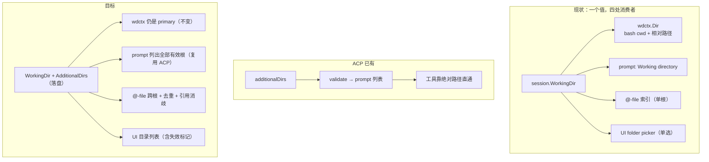
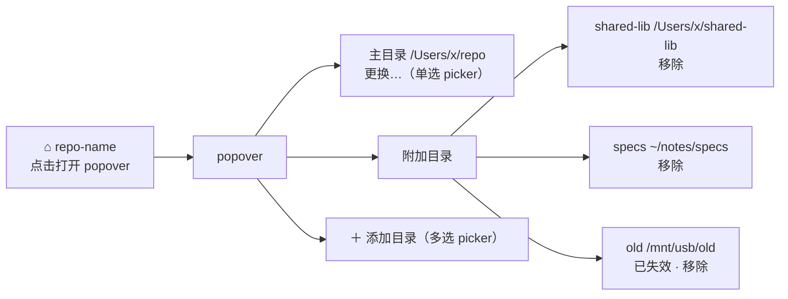

# Desktop 多工作区（附加工作目录）设计

> 版本: 0.4（含工作目录默认值与宽根守卫） | 日期: 2026-09-11 | 状态: Phase 1 已落地
> 关联: [system_prompt.go](../agent/system_prompt.go)、[acp/session.go](../agent/acp/session.go)、
>       [acp/additional_dirs_test.go](../agent/acp/additional_dirs_test.go)、[desktop/fileservice.go](../desktop/fileservice.go)、
>       [desktop/agent_driver.go](../desktop/agent_driver.go)、[atfile.go](../agent/atfile/atfile.go)、
>       [wdctx](../agent/wdctx/workingdir.go)、[App.tsx](../desktop/frontend/src/App.tsx)

## 本版修订（0.3 → 0.4：默认目录与宽根守卫）

起因：`~/` 之所以遍地都是，不是用户选了它，而是 **`NewSession()` 把它写死成了默认值**
（`os.UserHomeDir()`）。所以"限制超广根"必须连**默认值**一起处理，否则限制一上线就把新会话卡住。

1. **新会话的默认目录（§5.5）**：改为「记住上次主动选过的目录 → 否则取最近更新且可用的会话目录 → 都没有就留空」。
   宽根在两条来源里都被跳过（老会话的 `~/` 不会被继承下去）。留空是真实状态，composer 的 chip 会引导选择。
2. **宽根守卫（§5.3）**：判据**只有两条精确匹配**——文件系统根 `/` 与家目录本身——
   对主目录和附加目录一视同仁。不做启发式（"文件数超过 N"需要先走一遍遍历，而遍历成本正是要避免的）。
3. **没有工作目录时 prompt 不再冒充 `/`（§7.3）**：新增 `agent.WithoutWorkingDir()`，
   把空 cwd 表达成"未设置"，而不是回落进程 cwd（GUI 从 Finder 启动时是 `/`）。
   同时 `@` 搜索在没有工作目录的会话里**直接返回空**，不会去索引 `/`。
4. 顺带修掉 `desktop_ui.json` 的跨字段覆盖：主题与"上次目录"共用一个文件，两处写入都改为读-改-写
   （原来存主题会构造新结构体，把另一个字段抹掉）。

## 本版修订（0.2 → 0.3：实现回填）

Phase 0 与 Phase 1 已实现，实现过程中的三处**偏离设计**记在这里（正文已同步）：

1. **§7.5 `Path` 语义改了**：设计里"附加根命中 → Path 用绝对路径"，实现改为**始终相对所属根**
   （`Ref` 已经承载可插入的绝对形式），否则 picker 每行都是重复的长前缀。
   同时补了一件设计里漏掉的事：**绝对路径下钻**（插入绝对引用后继续输入，query 就是路径，
   必须以"列目录"而不是模糊匹配处理），不补的话附加根的目录下钻会静默失效。
2. **§7.2 少导出两个入口**：没有 `SetSessionRoots`；所有 meta 写入收口到内部 `updateSessionMeta`
   （同一份快照读改写）。`AddSessionRoots` 无主目录时直接拒绝。
3. **§7.9 待决 2 定了**：附加根行**同时**显示 base name 与完整路径 —— 名字供扫读，路径消除歧义，
   两者并列比"只显示一个 + hover"更省一次操作。

另外 §11 的待决 3（空 query 是否跨根）已按"参与 + 每根配额"落地，见 §7.5。

## 本版修订（0.1 → 0.2）

评审确认了四条决议，已并入正文；同时修正了若干事实与清单：

1. **§5.3 规范化拆成两层**：共享层只做与前端无关的语法归一（绝对路径 / Clean / 去重 / 保序），
   desktop 约束层额外**拒绝含空白字符的根**、**要求存在且是目录**。空格限制不进共享层 —— ACP 由编辑器下发路径，
   没有 `@` 引用那一层，带空格的根在那边是可用的（见 §5.3 理由）。
2. **§5.4 失效根**：添加之后消失的目录**不进入 prompt**、但在会话里保留并标记 `exists=false`，由用户决定是否移除。
3. **§7.5 多根搜索结果按绝对路径去重**（嵌套根，如 `primary=/repo/pkg` + `additional=/repo`），primary 命中优先。
4. **附录 A 补全 `wdctx.Dir(ctx)` 消费点清单**：实际 12 处（原列 10 处），并标出两处**不能**收口的例外。

事实修正：ACP capability 在 [agent.go:69](../agent/acp/agent.go)；`validateAdditionalDirectories` 在
[agent.go:792](../agent/acp/agent.go)；`acceptAt` 在 [App.tsx:354](../desktop/frontend/src/App.tsx)。
`/transcript` 是 TUI/Channel/ACP 命令，**desktop 没有**（§9 已改）。

---

## 目录

1. [背景与问题](#1-背景与问题)
2. [关键发现：tachi 已有一套多根语义](#2-关键发现tachi-已有一套多根语义)
3. [竞品对照](#3-竞品对照)
4. [目标与非目标](#4-目标与非目标)
5. [语义定义](#5-语义定义)
6. [数据模型](#6-数据模型)
7. [实现设计](#7-实现设计)
8. [风险与边界](#8-风险与边界)
9. [测试计划](#9-测试计划)
10. [分阶段实施](#10-分阶段实施)
11. [待决问题](#11-待决问题)
12. [附录 A：`wdctx.Dir(ctx)` 消费点清单](#附录-awdctxdirctx-消费点清单)

---

## 1. 背景与问题

desktop 每个会话只能绑定**一个**工作目录：`session.Session.WorkingDir`（[session.go:13](../session/session.go)），
UI 上是一个单选 folder picker（`App.tsx:pickWorkDir` → `Dialogs.OpenFile{CanChooseDirectories:true}`）。

实际使用中经常需要**一个会话同时触达多个目录**：

- 主仓库 + 共享库 / sibling repo（`../shared-lib`）
- 代码目录 + 文档 / 规格目录（`~/notes/specs`）
- monorepo 中的一个 package 为主，偶尔要看另一个 package

当前唯一的绕法是让模型写绝对路径，但（a）模型不知道另一个根存在，
（b）`@`-file 补全只搜一个根，（c）system prompt 里只声明了一个目录。
结果就是"能访问但全靠模型猜"。

**本次决策（已确认）**：目标形态为 **L1 单会话多目录**，附加目录**全读写**（与 Claude Code / Codex / Gemini 一致）。

---

## 2. 关键发现：tachi 已有一套多根语义

在设计之前先说明一个重要事实：**tachi 已经实现了"附加工作区根"的完整语义，在 ACP 侧（Zed 集成路径）**，
由 ACP 协议的 `additionalDirectories` 能力驱动（commit `6f55590 feat(acp): support additional workspace roots in sessions`）。

| 环节 | ACP 侧实现 | 说明 |
|---|---|---|
| 协议声明 | [agent.go:69](../agent/acp/agent.go) 广告 `SessionCapabilities.AdditionalDirectories` | `additional_dirs_test.go:36` 断言 |
| 接收 | `NewSession` / `LoadSession` / `Prompt` 接收 `req.AdditionalDirectories` | 客户端每次下发 |
| 校验 | `validateAdditionalDirectories(cwd, dirs)`（[agent.go:792](../agent/acp/agent.go)） | 必须绝对路径；去重、去掉与 cwd 相同项、保序 |
| 会话存储 | `ACPSession.additionalDirs []string`（[session.go:24](../agent/acp/session.go)），**内存态、不落盘** | `cwd` 仍是 primary，有效根集 = `[cwd, ...additionalDirs]` |
| Prompt | `BuildSystemPromptWithRoots(...)`（[system_prompt.go:79](../agent/system_prompt.go)） | 输出 `- Additional workspace roots: ... (absolute paths only; relative paths always resolve against the working directory)`；**根集为空时不输出该行** |
| 工具 | **不做多根解析** | 靠 `filepath.IsAbs` 分支直通，附加根一律用绝对路径 |

**结论：desktop 不需要发明语义。** 需要做的是把 ACP 已验证的语义复刻到 desktop，并补齐 desktop 特有的四处缺口：

1. **持久化** —— ACP 由编辑器每次下发；desktop 的 UI 是唯一输入源，必须落 session meta。
2. **`@`-file 多根** —— desktop 的主交互入口是 `@` 引用，单根索引搜不到附加根的文件。
3. **UI** —— 目录列表的管理界面（添加 / 移除 / 更换主目录）。
4. **校验与失效根** —— 前端是唯一入口，输入质量只能在这里保证：添加时校验、失效后不污染 prompt（§5.3 / §5.4）。



---

## 3. 竞品对照

调研结论（2025-2026，细节以各官方文档为准）：

| 产品 | 多工作区 | 机制 | 权限边界 |
|---|---|---|---|
| Claude Code CLI | ✅ | `--add-dir a b`（变参）、`/add-dir`、`permissions.additionalDirectories`（持久） | **全读写**；附加目录**不加载** `.claude/` 配置（CLAUDE.md / skills / hooks） |
| Claude Desktop app | ❌ | 只有单目录 picker（多文件夹 feature request 仍 open） | —— |
| Codex CLI | ✅ | `--add-dir`（可重复，**仅本次会话**）、`[sandbox_workspace_write] writable_roots`（持久）、`-C` 定 primary | 全读写；`.git` / `.codex` 保持只读 |
| Codex IDE ext / ChatGPT desktop | ✅ | 走 **VS Code 多根工作区** `.code-workspace` | 全读写跨 folder |
| VS Code + Copilot / Cursor / Cline | ✅ | `.code-workspace` | 全读写；Cline 用 `@workspace:path` 消歧；**rules / checkpoints 只跟 primary** |
| Gemini CLI | ✅ | `--include-directories`（多值 / 逗号分隔）、`/directory add`、`context.includeDirectories` | 全读写；无 path 时 glob / grep **跨所有根**搜索 |
| Aider | ➖ | 目录级无多根，只有文件级 `--file`（可写）/ `--read`（**只读**） | `--read` 是唯一明确的只读附加 |
| Zed | ✅ | 多 project 侧栏 + File > Add Folder to Project | agent 访问范围受 project 归属控制 |

三条对本设计有直接指导意义的规律：

1. **默认全读写**，不是只读附加（唯一例外是 Aider `--read`）。
2. **必然存在"主根"概念**：bash 的 cwd、配置加载、rules 都只能属于一个根（VS Code 称 primary directory；Cline 的 rules 也只认 primary）。多根 ≠ 万物平等。
3. **跨根必须消歧**：Cline 的 `@workspace:path`、Gemini 给结果加目录名前缀。

tachi 的 ACP 实现与上述第 2、正面对齐（primary cwd + 绝对路径访问附加根），
且它与 Claude Code 的分歧点也一致：**附加根不参与配置发现**。

---

## 4. 目标与非目标

### 目标

1. 会话级多根：`primary（WorkingDir）+ N × additional`，全读写。
2. 相对路径语义与 ACP / Claude Code 保持一致：**只相对 primary 解析**。
3. `@`-file 跨根可搜，且插入的引用**一定能被正确解析**（含多根去重与消歧）。
4. 附加根持久化到 session meta，重启 / 切换会话后仍然存在。
5. 与 ACP 共用校验 / 规范化逻辑，避免两套语义漂移。
6. 输入质量在入口保证：添加时校验（绝对路径 / 无空白 / 存在且是目录），失效根不进入 prompt。

### 非目标

- ❌ **相对路径 fallback 解析**（依次在各根下试探）——见 §5.2 的理由，列为 Phase 3 可选项。
- ❌ 只读附加目录（本次决定全读写）。若将来要做，参照 Aider `--read` 语义。
- ❌ VS Code 式 workspace 实体 / 多窗口（Phase 4 演进，见 §10）。
- ❌ 路径沙箱。desktop 仍是 `PermissionModeSkip`，本次不引入安全边界（见 §8.5）。

---

## 5. 语义定义

### 5.1 两个角色

| 角色 | 载体 | 职责 |
|---|---|---|
| **primary root** | `Session.WorkingDir`（唯一） | bash 的 cwd、相对路径基准、git 探测基准、`@` 相对引用基准、`/sh` 执行目录、图片相对路径解析基准 |
| **additional roots** | `Session.AdditionalDirs`（有序集合） | 全读写；**只通过绝对路径访问**；出现在 system prompt 中；参与 `@`-file 搜索 |

有效根集 = `[primary, ...additional]`。附加根集合中**不含** primary（规范化时剔除）。

### 5.2 为什么不做相对路径 fallback

考虑过让 `wdctx` 变成多根、相对路径依次在 `[primary, ...additional]` 中试探首个存在者。**不采纳**，理由：

1. **歧义**：两个根都有 `config.yaml` / `src/main.go` 时，`read("src/main.go")` 的结果取决于根顺序——静默且不可见。
2. **一致性**：ACP 现有语义、Claude Code、Codex 都是"相对路径相对 primary"，工具层 fallback 会让 desktop 与 ACP 行为分叉。
3. **成本**：不必改 `wdctx`、不必逐个改工具（清单见附录 A），风险显著更低。
4. **够用**：模型在 prompt 里拿到附加根的**绝对路径列表**，对附加根使用绝对路径是自然行为（工具早已支持：`filepath.IsAbs` 直通）。

> 若 Phase 1 上线后实测"模型频繁误用相对路径指向附加根"，再评估 Phase 3 的 fallback 方案（扩展点见附录 A）。

### 5.3 规范化与校验：分两层

规则按"谁的问题"分两层，避免把 desktop 的 UI 约束塞进共享语义。

**共享语法层**（ACP 与 desktop 共用，§7.1）——只做与前端无关的归一：

- 每项必须是**非空绝对路径**（否则报错，不静默丢弃）；
- `filepath.Clean` 归一化（消掉 `/a/b/../c` 与 `/a/c` 这类伪重复）；
- 精确重复项、与 primary 相同的项被剔除；
- **保持首次出现顺序**。

**desktop 约束层**（仅 desktop）——前端交互带来的额外规则。执行顺序：**先 `filepath.Abs` 得到最终要落盘的绝对路径，
再在它上面校验**（否则 `/Users/x/My Projects/../lib` 这类输入会在清洗前绕过空格检查），最后交给共享层归一/去重：

- **拒绝含空白字符的根**（空格 / Tab / 换行）。
  理由：`@` 引用**按空白切分**（`atfile.IsRefBoundary`，见 [atfile.go](../agent/atfile/atfile.go) 的 `Expand`），
  `@/Users/x/My Projects/a.md` 在发送时只会被解析成 `/Users/x/My` —— 引用**静默失效**。
  多根把绝对引用从边角变成常态，这条约束因此变成必需。
  它**不进共享层**：ACP 由编辑器下发路径，没有 `@` 引用这一层，带空格的根在那边是可用的，不该被误伤。
- **必须存在且是目录**（`os.Stat` + `IsDir`）：输入错误或卷没挂载时不写入配置，错误直接回给用户。
  与空格规则不同，这条纯粹是"不要存一个明显无效的路径"，共享层保持宽容（ACP 侧可能挂在临时不可用的目录上）。
- **宽根只拒两条精确匹配**：文件系统根 `/` 与家目录本身（`wideRootReason`）。
  对**主目录与附加目录一视同仁**——`~/` 曾经是新会话的默认值，只守附加目录等于没守。
  判据刻意不做启发式：真正的"宽"（文件数过多）需要先遍历一次才知道，而遍历成本正是要避免的东西；
  `/` 与 `$HOME` 是唯一两个"无需遍历就能断定毫无意义"的目录（`@` 补全会覆盖整台机器/整个家目录，
  相对路径会解析到一个不是项目的目录）。子目录一律放行：`~/repos`、`~/repos/foo` 都是合法工作区。

> `~/` 在 `filepath.Abs` 之前展开（`os.UserHomeDir`）。

### 5.4 失效根（添加之后消失的目录）

添加时校验过，但目录之后仍可能被删除 / 卸载（外接盘拔掉）。规则：

- **不进入 prompt**：构建 system prompt 时过滤掉已不存在（或已不是目录）的根 —— 否则模型会去访问一个不存在的路径。
- **保留在会话里**：`GetSessionRoots` 照常返回，带 `exists` 标记；UI 灰显「已失效」并提供移除。
- **搜索静默跳过**：`fileindex` 对该根返回错误，多根搜索按"这一根没有结果"处理（与今天 `SearchFiles` 出错返回 nil 一致）。
- **不自动删除**：一张没插电的外接盘不该让用户的会话配置被悄悄改掉。清理是用户的事。

### 5.5 新会话的默认工作目录

历史上 `NewSession()` 把工作目录写死为 `os.UserHomeDir()` —— 这正是"每个会话都指着 `~/`"的来源，
也是宽根守卫必须配套改默认值的原因。现在的规则（`defaultWorkspaceFor`）：

1. `desktop_ui.json` 里 `lastWorkspace`（**用户主动选过**的目录，由 `SetSessionWorkingDir` 记住）；
2. 否则取会话列表里**最近更新**且仍然存在的工作目录；
3. 都没有 → **留空**：会话以"未选择工作区"开始，composer 的 chip 引导选择。

两条来源都会跳过宽根（§5.3）：旧会话里的 `~/` 不会被继承到新会话，否则守卫等于白加。
留空不是异常状态，而是一个明确的、可恢复的状态（见 §7.3 的 prompt 处理与 `@` 搜索的处理）。

> 为什么不"弹 picker 强制选"：那会把每次新建会话都变成一次模态对话。留空 + chip 提示的成本更低，
> 而且继承规则已经把绝大多数新会话直接落在正确目录上。

---

## 6. 数据模型

```go
// session/session.go
type Session struct {
    ID           string `json:"id"`
    // WorkingDir is the PRIMARY workspace root ...
    WorkingDir   string `json:"working_dir,omitempty"`
    // AdditionalDirs are extra workspace roots, absolute paths, ordered.
    // They are fully writable; relative paths NEVER resolve against them —
    // the model is told to use absolute paths (mirrors ACP additionalDirectories
    // and Claude Code --add-dir). Empty for sessions that never added a root,
    // so old session files read back byte-identical behavior.
    AdditionalDirs []string `json:"additional_dirs,omitempty"`
    ...
}
```

**向后兼容**：`omitempty` + 旧 meta 无该字段 → 读出 `nil` → 行为与今天完全一致。

**meta 里允许出现过期项**：目录可能在添加之后消失（§5.4）。读取路径不做"自动清理"，
只把有效性作为信息（`exists`）呈现给 UI，prompt 侧过滤。

**持久化差异（有意为之）**：

| | ACP | desktop |
|---|---|---|
| 来源 | 编辑器每次 `NewSession` / `LoadSession` 下发 | UI（唯一输入源） |
| 持久化 | ❌ 内存态 | ✅ session meta（与 `WorkingDir` 一致） |
| resume 语义 | 请求里的 `additionalDirectories` 是**完整结果列表**（ACP spec） | 直接读 meta，UI 也是完整列表编辑 |

---

## 7. 实现设计

### 7.1 共享规范化函数（消除双份语义）

`validateAdditionalDirectories` 目前是 `agent/acp` 的私有函数。提升为 `agent` 包导出，**只容纳 §5.3 的语法层**：

```go
// agent/workspaceroots.go
// NormalizeAdditionalRoots validates and normalizes additional workspace roots
// against a primary root: every entry must be a non-empty absolute path; entries
// are cleaned, exact duplicates and entries equal to primary are dropped,
// preserving first-occurrence order. A nil/empty input yields nil.
func NormalizeAdditionalRoots(primary string, roots []string) ([]string, error)
```

- `acp.validateAdditionalDirectories` 改为薄包装（保留 `invalid_params:` 前缀，因为那是 ACP spec 的错误契约，
  [additional_dirs_test.go](../agent/acp/additional_dirs_test.go) 已在断言）。
- desktop 在共享层之上叠加 §5.3 的**约束层**（空格、存在性），错误包装成面向用户的中文提示。
- 放在 `agent` 包而非新建包：`system_prompt.go` 已在 `agent`，`acp` 与 `desktop` 都已有该依赖，无新导入边。
- **A2 类的漂移由共享层消掉**：Clean 在共享层内部完成，两个调用方看到的输入形状一致，
  §7.10 的"A↔D 一致性"测试才真正测得住（否则 `/a/b/../c` 与 `/a/c` 会一边被判重、一边没有）。

### 7.2 会话读写 API（`desktop/agent.go`）

保留现有 `GetSessionWorkingDir` / `SetSessionWorkingDir`（primary 的更换路径不变），新增：

| 方法 | 说明 |
|---|---|
| `GetSessionRoots(id) SessionRootsVO` | 返回 `{Primary string, Additional []SessionRootVO}`，供 UI 初始化；每项带 `exists` |
| `AddSessionRoots(id, dirs []string) string` | 多选目录 → 约束层校验（§5.3）→ 语法层规范化（§7.1）→ 追加（去重）→ `UpdateMeta` → `"ok"` |
| `RemoveSessionRoot(id, dir string) string` | 移除一项 → `UpdateMeta` |
| （内部）`updateSessionMeta(id, mutate)` | 所有 meta 写入的唯一入口：**同一份快照**读改写，`Add` / `Remove` / `SetSessionWorkingDir` 都走它 |

> 实现时**没有**导出 `SetSessionRoots`：`Add` / `Remove` / `SetSessionWorkingDir` 已经覆盖全部 UI 动作，
> 少一个能绕过校验的公开写入口。另外两条实现约定：
> - `AddSessionRoots` 在**没有主目录**时直接拒绝（"请先设置主目录"）——否则相对路径会落到进程 cwd；
> - `SetSessionWorkingDir` 在写入新 primary 后**重新归一**附加根，把"刚刚变成 primary 的那个"从列表里摘掉。

```go
type SessionRootVO struct {
    Path   string `json:"path"`
    Exists bool   `json:"exists"` // false = 目录已消失（§5.4）：UI 灰显，prompt 不再列
}
type SessionRootsVO struct {
    Primary    string          `json:"primary"`
    Additional []SessionRootVO `json:"additional"`
}
```

- 写入统一走 `r.sm.Current()` + `r.sm.UpdateMeta(cur)`（与 `SetSessionWorkingDir` 相同的双路径：
  优先 per-session manager，未绑定时回退 stable `d.sm`）。
- 错误文案面向用户：`目录不存在` / `不是目录` / `路径含空格（@ 引用无法表达，请改用不含空格的目录）` / `必须是绝对路径`。

> 注意：**变更根集不需要重建 agent**。与 `WorkingDir` 一样，它是"每 turn 读取"的会话属性（见 §7.3），
> 下一 turn 自然生效，无需 invalidation。`UpdateMeta` 是整文件覆盖写（[store.go:270](../session/store.go)，
> 不 bump `UpdatedAt`）——因此根集写入必须走 `Current()` 的同一份快照，避免与 `SetTitle` 互相覆盖；
> 会话列表排序不因改根集而变化，这是可接受的。

### 7.3 system prompt（`desktop/agent_driver.go`）

```go
roots := d.sessionRootsForPrompt(id) // 只含仍存在的根（§5.4）
prompt := agent.BuildSystemPromptWithRoots(d.cfg.Language, cwd, roots, id,
    d.cfg.ExtraSystemPrompt, agent.WithFrontendCapabilities(agent.MermaidCapabilityPrompt))
```

**缓存键必须带上过滤后的根集**（最易漏的点）。现有 `promptKey{cwd, id}`（[agent_driver.go:93](../desktop/agent_driver.go)）
无法区分"同一会话新增了一个附加根"：

```go
type promptKey struct {
    cwd   string
    id    string
    roots string // strings.Join(roots, "\x00")，顺序敏感；用过滤后的集合
}
```

`roots` 从新增的 `d.sessionRootsForPrompt(id)` 取得（语义同 `sessionWorkDir`）。
prompt 行沿用 ACP 已有的文案（[system_prompt.go:146](../agent/system_prompt.go)），
如需针对 desktop 强化措辞，放在 `WithFrontendCapabilities` 同层，**不要 fork 一份新的 prompt 构造函数**。
根集为空时该行不输出（共享实现已如此），所以"没有任何附加根"的会话 prompt 与今天逐字相同。

**没有工作目录时**（§5.5 的第 3 种情况）：传 `agent.WithoutWorkingDir()`，prompt 输出
`- Working directory: (not set yet — ask the user which directory to work in before using relative paths)`。
共享实现默认会把空 cwd 换成 `config.FindProjectRoot()`（TUI/channel/-p 依赖这个回落），
所以桌面必须显式声明"空就是空"——否则又会把 `/` 写进 prompt（就是最初那个 bug）。
相应地，`@` 搜索在没有工作目录的会话里直接返回空，不去索引 `/`（见 §7.5）。

### 7.4 工具层：不变

`beginTurn` 仍是 `wdctx.WithDir(ctx, cur.WorkingDir)`（[agent.go:1161](../desktop/agent.go)）——
只注入 primary。附加根靠工具的绝对路径分支工作，无改动、零风险。

`wdctx.Dir(ctx)` 的**全部 12 处消费点**与两处例外见[附录 A](#附录-awdctxdirctx-消费点清单)。

### 7.5 `@`-file：多根搜索 + 去重 + 引用消歧

后端（`desktop/fileservice.go`）：

```go
type FileMatchVO struct {
    Path  string `json:"path"`   // 显示用：始终相对它所属的根（"[shared-lib] src/x.go" 才读得下去）
    IsDir bool   `json:"isDir"`
    Ref   string `json:"ref"`    // 可直接插入输入框的完整引用（含 '@'）
    Root  string `json:"root"`   // 展示用根标签："" = primary，否则为根目录 base name
}
```

- `SearchFiles(sessionID, query, limit)`：对**有效根集**逐根调用现有 `fileindex.Search`
  （`Index` 已按 root 缓存 trie，天然支持多根）。失效根直接跳过（§5.4）。
- **每根配额**：`limit` 按根均分（`ceil(limit/根数)`），避免一个大根吃满结果集；合并后按 `Match.Score` 排序再截断。
- **按绝对路径去重，primary 优先**：嵌套根（`primary=/repo/pkg` + `additional=/repo`）会把同一文件搜出两次
  （一次 `@pkg 内相对引用`、一次 `@/repo/...` 绝对引用）。合并时以绝对路径为键去重，先收集的 primary 命中胜出 ——
  同一文件在补全列表里只出现一次，且引用形态稳定。
- `Ref` 由后端用 `atfile.RefForPath(primary, absPath)` 生成——**这一步天然正确**：
  该函数对 primary 内的路径产出 `@rel`，对 primary 外的路径产出 `@/abs/path`
  （[atfile.go:201-204](../agent/atfile/atfile.go)，`filepath.Rel` 返回 `..` 前缀即走绝对路径分支）。
  也就是说**附加根命中的引用自动是绝对路径，无需新规则**。
- `Root` 标签用于 UI 消歧（primary 为空串；附加根取根目录 base name，重名时退化为完整路径）。
- `Immediate`（空 query）走**同一套配额**（每根 `ceil(limit/根数)`），所以附加根一定会露面；没有附加根时会话
  的行为与今天逐字相同（只有 primary，配额即全量）。
  > 已决定（原 §11 待决 3）：空 query 默认参与跨根搜索，不做语法开关，也不额外放宽 picker 上限。
- **绝对路径下钻**：picker 插入绝对引用后，用户继续输入时 query 就是一条路径（`@/Users/x/lib/`）。它不是
  root-relative 的模糊查询目标，所以 `SearchFiles` 对以 `/` 开头的 query 直接**列目录**（`Immediate`），
  并按"路径属于哪个根"打标签。没有这一步，附加根的目录下钻会静默失效。
- 空格的边界：含空格的根在添加时已被拒绝（§5.3），所以这里产出的引用**一定**是可切分的。

前端（`App.tsx`）：

- `acceptAt` 从 `'@' + match.path` 改为 `match.ref || '@' + match.path`
  （[App.tsx:354](../desktop/frontend/src/App.tsx)，`const text = ...` 那一行）。
- 下拉项在 `match.root` 非空时显示 `[shared-lib] src/x.go` 形式的标签——
  标签用**文字前缀**而非仅靠颜色（无障碍 + 一眼可辨）。

### 7.6 拖拽文件

`ResolveDroppedPaths(sessionID, paths)`：对每个路径调用 `atfile.RefForPath(primary, p)` 即可，
**不需要按根循环、也不存在"首个命中"的问题** —— `RefForPath` 对任何存在的路径都返回 `ok=true`，
primary 内产出相对引用、primary 外产出绝对引用（[atfile.go:197](../agent/atfile/atfile.go)）。
落点决定引用形态，无需用户选择。

### 7.7 `/sh` 与 slash 命令

`/sh`（[commands.go:276](../desktop/commands.go)、359）继续用 `sessionWorkDir`（primary）。
附加根不是命令执行目录——这一点要在 UI 文案里说清楚（避免"我加了目录，为什么 `ls` 看不到"的困惑）。

可选：新增 `/roots` 命令列出当前根集（含失效标记）。落地方式是**两处**：

1. `agent/commands/commands.go` 注册表加一条 `{Name: "roots", Modes: []Mode{ModeDesktop}}`；
2. `desktop/commands.go` 的 `desktopCommandHandlers` 加 handler。

`ListCommands` 返回两者的**交集**（[commands.go:62](../desktop/commands.go)），所以只加一处不会出现在 palette 里。

### 7.8 图片与本地资源

`toLocalAsset(src, workDir)`（[lib.ts](../desktop/frontend/src/lib.ts)）对相对路径只用 primary 解析。
prompt 已要求附加根用绝对路径，所以附加根的图片链接**应当**是绝对路径、天然可用；
但模型偶尔仍会写相对路径。建议（低成本兜底）：后端提供

```go
func (s *AgentService) ResolveAsset(sessionID, src string) string
```

对不存在的解析结果按根集重试，前端 `toLocalAsset` 失败后再问一次后端。
若嫌复杂，可只记为已知限制（§8.4）。

### 7.9 UI 交互

在状态栏现有的 `.work-dir` 位置（[App.tsx:1473](../desktop/frontend/src/App.tsx)）从"一个路径"升级为"根集 + popover"：



关键交互决策：

- **"更换主目录"与"添加目录"是两个独立入口**，不复用同一个 picker。
  - 更换主目录 → 单选（`CanChooseDirectories: true`，`AllowsMultipleSelection: false`）——保持现有行为与心智。
  - 添加目录 → 多选（`AllowsMultipleSelection: true`）。Wails v3 已支持：JS→Go 侧在
    `wails/v3 pkg/application/messageprocessor_dialog.go:90` 按该字段分支，返回 `string[]`；
    前端 `pickWorkDir` 已经把返回值类型写成 `string | string[]`（[App.tsx:831](../desktop/frontend/src/App.tsx)），
    只是目前丢掉了数组。
  - 这样避免了"多选时第一个是不是主目录"的猜测。
- 附加根条目显示 base name，hover / title 显示完整绝对路径（重名时直接显示路径）。
- 失效根**灰显 + 「已失效」**，仍然可移除（§5.4）。添加时被拒的路径给出即时错误提示，不写入。
- 主根在列表中**不可移除**（只能更换）。
- 未设置主目录时保持现状（`未设置工作目录`，根集为空）。

### 7.10 与 ACP 的一致性

- 共用 `NormalizeAdditionalRoots`（§7.1）与 `BuildSystemPromptWithRoots`（§7.3）。
- **不共用持久化**（有意的差异，§6）。
- ACP 侧补一条测试：desktop 的规范化与 ACP 的规范化对同一输入产出相同结果（防漂移）。
  注意只比**共享层**：desktop 的约束层（空格 / 存在性）是 desktop 独有的，不应进这条断言。

---

## 8. 风险与边界

### 8.1 同名文件歧义

不做 fallback（§5.2）已经把最大的歧义源堵住。剩余风险是模型在附加根里**写相对路径**（会落到 primary 下，
可能误改 primary 的同名文件）。缓解：

- prompt 文案明确 "absolute paths only; relative paths always resolve against the working directory"（沿用 ACP）。
- `@` 补全插入的引用是绝对路径（§7.5），模型最常用的路径来源已经正确。

### 8.2 切换主目录后历史消息失义

会话历史里工具输出的相对路径（如 `src/main.go`）在 primary 变更后指向不同的文件。
这是**现状已有的问题**（今天就能换主目录），多根不加剧它，但会把"相对路径"的存在感放大。
不做额外处理，仅记录。

### 8.3 LSP / MCP 仍是单根

- `lsp_tool.go:103` 用 `wdctx.Dir(ctx)` 作为 LSP workspace root —— 附加根的文件会走主根的 LSP server。
  跨根跳转可能失败。记为**已知限制**（每个根起一个 server 成本过高，暂不做）。
- MCP 侧无 workspace roots 消费者（已确认无相关代码），不受影响。

### 8.4 图片相对路径

见 §7.8。默认记为已知限制，`ResolveAsset` 为可选兜底。

### 8.5 安全：本次不引入边界

desktop 是 `PermissionModeSkip`、无路径沙箱，附加根全读写与现状的危险面**一致**（模型本来就能 `read /etc/passwd`）。
所以"多根"没有引入新的安全级别变化。

顺带记录一个既存点（与本设计无关，建议单独立项）：`/local` assetHandler
（[main.go](../desktop/main.go)，现已支持 `?p=` 与 `/local/<abs path>` 两种形态）对路径无约束。
需要说明的是那**是有意为之**：HTML 预览必须能加载文档同目录的相对资源，且预览 iframe 是不透明源沙箱
（脚本读不回响应）。真正的边界问题是"任意路径可读"，与多根无关。

### 8.6 context 膨胀与索引成本

- **prompt**：每个有效根占一行，无长度限制。仍建议 UI 软上限（见 §11 待决 1）。
- **索引**：`fileindex` 首次搜某个根要**遍历整棵树**（`rg --files`）。已落地的是宽根的**精确拒绝**
  （§5.3：`/` 与 `$HOME`）——这两个目录"不用遍历就能断定毫无意义"（家目录重定向、`@` 补全覆盖整台机器）。
  真正的体量判据（"文件数超过 N 就提示/拒绝"）需要先遍历一次才知道，与目的矛盾，因此**不做**；
  真要加，只能采便宜的近似（如直属子目录数）或给遍历本身加预算。
- **没有工作目录的会话**：`@` 搜索直接返回空，不回落进程 cwd（§7.5）——GUI 的进程 cwd 是 `/`，
  那一次遍历既慢又毫无意义。

### 8.7 已由设计消掉的边界

- **宽根（`/` 与 `$HOME`）** → 选择时拒绝，且不作为新会话默认值（§5.3 / §5.5）。
- **含空格的根** → 添加时拒绝（§5.3）。
- **失效根** → 不进 prompt、UI 标记（§5.4）。
- **嵌套根重复结果** → 按绝对路径去重（§7.5）。

---

## 9. 测试计划

**后端（Go）**

| 用例 | 断言 |
|---|---|
| `NormalizeAdditionalRoots` | 空 / nil → nil；非绝对路径报错；含 primary 项剔除；重复剔除；`/a/b/../c` 与 `/a/c` 归一后判重；保序 |
| ACP↔desktop 一致性 | 同一输入两侧产出相同（只比共享层，§7.10） |
| desktop 约束层 | 含空格 / Tab / 换行 → 报错；不存在 → 报错；是文件不是目录 → 报错；错误文案可读 |
| `GetSessionRoots` / `AddSessionRoots` / `RemoveSessionRoot` | 落 meta、读出、去重、移除后保序；`omitempty` 兼容旧 session；**改根集不影响 title** |
| 失效根 | meta 里有已删除目录：`GetSessionRoots` 返回 `exists=false`；prompt **不含**该行；`@` 搜索跳过且不报错 |
| `systemPromptFor` | 含 `Additional workspace roots:` 行；根集为空时**不含**该行；**新增根后 prompt 重建**（缓存键含 roots——这是最易回归的点） |
| `SearchFiles` 多根 | 附加根文件可被搜到；`Ref` 对 primary 命中为 `@rel`、对附加根命中为 `@abs`；每根配额生效；**嵌套根同名文件只出现一次且用相对引用** |
| `ResolveDroppedPaths` | primary 内落点产出相对引用；附加根内落点产出绝对引用 |
| `atfile` 回归 | 含空格路径的引用**不**被当作引用（记录现状，配合 §5.3 的拒绝策略） |

**前端 / 手测**

- 多选添加 → chips 立即出现 → 下一 turn 的 prompt 含新根（看 `~/.tachi/logs/debug.log`；desktop **没有** `/transcript` 命令）。
- 附加根文件用 `@` 补全被搜到、插入后**能被正确展开**（这是端到端最关键的一条）。
- 重启 app / 切换会话后根集仍在。
- 主目录更换后，附加根保持不变。
- 删除附加根目录 → popover 显示「已失效」→ 下一 turn prompt 不再包含它。

---

## 10. 分阶段实施

| 阶段 | 内容 | 交付物 |
|---|---|---|
| **Phase 0** ✅ 已实现 | 解析类消费点（附录 A.1 的 7 处）收口到 `tools.ResolvePath`（绝对直通 → primary join），行为不变 | 纯重构（`agent/tools/resolve.go` + `resolve_test.go`），为 Phase 3 铺路 |
| **Phase 1**（本设计主体） | `Session.AdditionalDirs` + `NormalizeAdditionalRoots`（共享层）+ desktop 约束层校验 + 4 个 API + 失效根过滤 + prompt 切 `WithRoots` + 缓存键 + `@`-file 多根/去重/消歧 + UI 多选与列表 + `acceptAt` 用 `ref` | 可用的 L1 |
| **Phase 2** | 打磨：重名标签、软上限与超广根提示、`/roots` 命令、`ResolveAsset` 兜底、（可选）`@` 结果按根分组展示 | 体验完整 |
| **Phase 3**（可选，视实测） | `wdctx` 多根 + 相对路径 fallback（需重新评审 §5.2 的歧义代价） | 模型容错提升 |
| **Phase 4**（未来） | 把"根集"提升为 workspace 实体（`.tachi-workspace` / 侧栏分组 / 多窗口）——数据结构已预留：`Session` 持有根集，可平滑迁移到 `Workspace{ID, Roots}` + `Session.WorkspaceID` | 产品化 |

Phase 0 的边界（务必遵守）：**不包含** `cmd.Dir` 两处（执行目录恒为 primary）、
**不包含** ACP terminal 的 cwd 解析、**不包含** one-off 记录的 cwd —— 理由见附录 A。

---

## 11. 待决问题

1. **软上限取多少？**（建议 8）以及是否需要对 `~` / `/` 这类超广根二次确认（§8.6 的索引成本，不只是 prompt 行数）。
2. **ACP 侧的 desktop 差异化**：ACP 每次下发完整列表（不落盘），desktop 落盘。若同一会话在 Zed 与 desktop
   之间切换，两边的根集不一致——是否接受？（倾向接受，文档化为"desktop 的根集属于 desktop"）

已决定（原 2、3）：附加根行同时显示 base name 与完整路径（§7.9）；空 query 默认参与跨根搜索、
每根分得一份配额、不做语法开关（§7.5）。

---

## 附录 A：`wdctx.Dir(ctx)` 消费点清单

Phase 0 / Phase 3 的共同输入。共 **12 处**（`grep -rn "wdctx.Dir(ctx)" agent --include=*.go | grep -v _test`）。
Phase 0 **已实现**：解析类收口到 `tools.ResolvePath(ctx, p)`（[resolve.go](../agent/tools/resolve.go)，
一行规则：绝对路径直通，相对路径 join 工作目录），行为不变，钉子测试在 `tools/resolve_test.go`。

### A.1 解析类 → 已收口到 `ResolvePath`（7 处）

| # | 位置 | 原形态 |
|---|---|---|
| 1 | `tools/read.go:187` | `if !IsAbs → Join(wd)` |
| 2 | `tools/write.go:49` | 同上 |
| 3 | `tools/edit.go`（2 个调用点） | `resolveEditPath`（已删除，改用 `ResolvePath`） |
| 4 | `tools/rg.go:25` | `resolveSearchPath`：`ResolvePath` + `filepath.Abs`（rg 需要绝对路径） |
| 5 | `tools/sendfile.go:73` | `if !IsAbs → Join(wd)` |
| 6 | `tools/lsp_tool.go:105` | `if !IsAbs → Join(wd)` + `Clean` |
| 7 | `tools/lsp_diagnostics.go:77` | 同上（`wd` 参数仍用于展示用相对路径） |

### A.2 root 消费类 → **不进** `ResolvePath`（5 处）

这些拿工作目录当**根**用，而不是当"用户路径的基准"，语义上恒为 primary：

| # | 位置 | 说明 |
|---|---|---|
| 8 | `tools/bash.go:243` | `cmd.Dir`：bash 的 cwd |
| 9 | `tools/process_manager.go:156` | `cmd.Dir`：后台进程 |
| 10 | `tools/plan.go:92` | 计划文件落点（`<root>/.tachi/plans`） |
| 11 | `tools/bash.go:450` | ACP terminal 的 cwd：契约要求绝对且以 primary 为准（空值显式报错） |
| 12 | `agent/oneoff_recorder.go:296` | one-off 记录的 meta 头部（展示用） |

> 第 11、12 处若被"顺手"收口，ACP terminal 与 one-off 记录的语义会被悄悄改掉 —— 这是 Phase 0 明确划在外面的两处。
> 另：`agent/toolview.go` 里的 `wdctx.Dir(ctx)` 只是注释举例，不是消费点。
