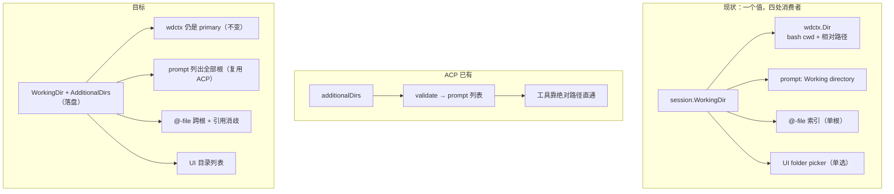
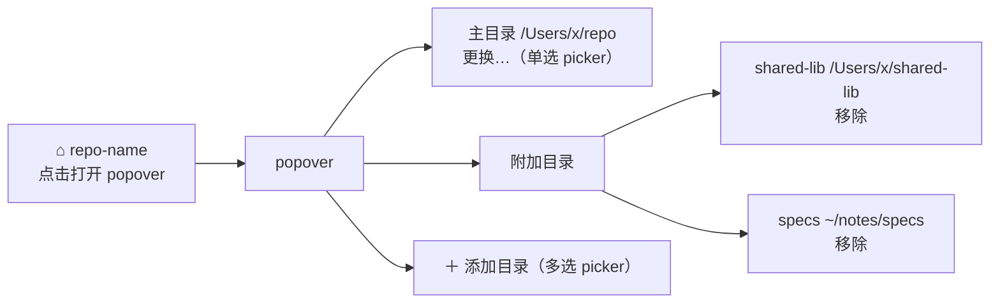

# Desktop 多工作区（附加工作目录）设计

> 版本: 0.1（草案） | 日期: 2026-09-11 | 状态: 待评审
> 关联: [system_prompt.go](../agent/system_prompt.go)、[acp/session.go](../agent/acp/session.go)、
>       [acp/additional_dirs_test.go](../agent/acp/additional_dirs_test.go)、
>       [desktop/fileservice.go](../desktop/fileservice.go)、[desktop/agent_driver.go](../desktop/agent_driver.go)、
>       [atfile.go](../agent/atfile/atfile.go)、[wdctx](../agent/wdctx/workingdir.go)、
>       [App.tsx](../desktop/frontend/src/App.tsx)

---

## 目录

1. [背景与问题](#1-背景与问题)
2. [关键发现：tachi 已有一套多根语义](#2-关键发现tachi-已有一套多根语义)
3. [竞品对照](#3-竞品对照)
4. [目标与非目标](#4-目标与非目标)
5. [语义定义](#5-语义定义)
6. [数据模型](#6-数据模型)
7. [实现设计](#7-实现设计)
8. [风险与边界](#8-风险与边界)
9. [测试计划](#9-测试计划)
10. [分阶段实施](#10-分阶段实施)
11. [待决问题](#11-待决问题)

---

## 1. 背景与问题

desktop 每个会话只能绑定**一个**工作目录：`session.Session.WorkingDir`（[session.go:13](../session/session.go)），
UI 上是一个单选 folder picker（`App.tsx:pickWorkDir` → `Dialogs.OpenFile{CanChooseDirectories:true}`）。

实际使用中经常需要**一个会话同时触达多个目录**：

- 主仓库 + 共享库 / sibling repo（`../shared-lib`）
- 代码目录 + 文档 / 规格目录（`~/notes/specs`）
- monorepo 中的一个 package 为主，偶尔要看另一个 package

当前唯一的绕法是让模型写绝对路径，但（a）模型不知道另一个根存在，
（b）`@`-file 补全只搜一个根，（c）system prompt 里只声明了一个目录。
结果就是"能访问但全靠模型猜"。

**本次决策（已确认）**：目标形态为 **L1 单会话多目录**，附加目录**全读写**（与 Claude Code / Codex / Gemini 一致），
先出设计文档评审。

---

## 2. 关键发现：tachi 已有一套多根语义

在设计之前先说明一个重要事实：**tachi 已经实现了"附加工作区根"的完整语义，在 ACP 侧（Zed 集成路径）**，
由 ACP 协议的 `additionalDirectories` 能力驱动。commit `6f55590 feat(acp): support additional workspace roots in sessions`。

| 环节 | ACP 侧实现 | 说明 |
|---|---|---|
| 协议声明 | `Initialize` 广告 `sessionCapabilities.additionalDirectories` | `acp/additional_dirs_test.go` |
| 接收 | `NewSession` / `LoadSession` / `Prompt` 接收 `req.AdditionalDirectories`（[agent.go:108](../agent/acp/agent.go)、482、598） | 客户端每次下发 |
| 校验 | `validateAdditionalDirectories(cwd, dirs)`（[agent.go:784](../agent/acp/agent.go)） | 必须绝对路径；去重、去掉与 cwd 相同项、保序 |
| 会话存储 | `ACPSession.additionalDirs []string`（[session.go:20](../agent/acp/session.go)），**内存态、不落盘** | `cwd` 仍是 primary，有效根集 = `[cwd, ...additionalDirs]` |
| Prompt | `BuildSystemPromptWithRoots(...)`（[system_prompt.go:75](../agent/system_prompt.go)） | 输出 `- Additional workspace roots: ... (absolute paths only; relative paths always resolve against the working directory)` |
| 工具 | **不做多根解析** | 靠 `filepath.IsAbs` 分支直通，附加根一律用绝对路径 |

**结论：desktop 不需要发明语义。** 需要做的是把 ACP 已验证的语义复刻到 desktop，并补齐 desktop 特有的三处缺口：

1. **持久化** —— ACP 由编辑器每次下发；desktop 的 UI 是唯一输入源，必须落 session meta。
2. **`@`-file 多根** —— desktop 的主交互入口是 `@` 引用，单根索引搜不到附加根的文件。
3. **UI** —— 目录列表的管理界面（添加 / 移除 / 更换主目录）。



---

## 3. 竞品对照

调研结论（2025-2026，细节以各官方文档为准）：

| 产品 | 多工作区 | 机制 | 权限边界 |
|---|---|---|---|
| Claude Code CLI | ✅ | `--add-dir a b`（变参）、`/add-dir`、`permissions.additionalDirectories`（持久） | **全读写**；附加目录**不加载** `.claude/` 配置（CLAUDE.md / skills / hooks） |
| Claude Desktop app | ❌ | 只有单目录 picker（多文件夹 feature request 仍 open） | —— |
| Codex CLI | ✅ | `--add-dir`（可重复，**仅本次会话**）、`[sandbox_workspace_write] writable_roots`（持久）、`-C` 定 primary | 全读写；`.git` / `.codex` 保持只读 |
| Codex IDE ext / ChatGPT desktop | ✅ | 走 **VS Code 多根工作区** `.code-workspace` | 全读写跨 folder |
| VS Code + Copilot / Cursor / Cline | ✅ | `.code-workspace` | 全读写；Cline 用 `@workspace:path` 消歧；**rules / checkpoints 只跟 primary** |
| Gemini CLI | ✅ | `--include-directories`（多值 / 逗号分隔）、`/directory add`、`context.includeDirectories` | 全读写；无 path 时 glob / grep **跨所有根**搜索 |
| Aider | ➖ | 目录级无多根，只有文件级 `--file`（可写）/ `--read`（**只读**） | `--read` 是唯一明确的只读附加 |
| Zed | ✅ | 多 project 侧栏 + File > Add Folder to Project | agent 访问范围受 project 归属控制 |

三条对本设计有直接指导意义的规律：

1. **默认全读写**，不是只读附加（唯一例外是 Aider `--read`）。
2. **必然存在"主根"概念**：bash 的 cwd、配置加载、rules 都只能属于一个根（VS Code 称 primary directory；Cline 的 rules 也只认 primary）。多根 ≠ 万物平等。
3. **跨根必须消歧**：Cline 的 `@workspace:path`、Gemini 给结果加目录名前缀。

tachi 的 ACP 实现与上述第 2、正面对齐（primary cwd + 绝对路径访问附加根），
且它与 Claude Code 的分歧点也一致：**附加根不参与配置发现**。

---

## 4. 目标与非目标

### 目标

1. 会话级多根：`primary（WorkingDir）+ N × additional`，全读写。
2. 相对路径语义与 ACP / Claude Code 保持一致：**只相对 primary 解析**。
3. `@`-file 跨根可搜，且插入的引用**一定能被正确解析**。
4. 附加根持久化到 session meta，重启 / 切换会话后仍然存在。
5. 与 ACP 共用校验 / 规范化逻辑，避免两套语义漂移。

### 非目标

- ❌ **相对路径 fallback 解析**（依次在各根下试探）——见 §5.2 的理由，列为 Phase 3 可选项。
- ❌ 只读附加目录（本次决定全读写）。若将来要做，参照 Aider `--read` 语义。
- ❌ VS Code 式 workspace 实体 / 多窗口（Phase 4 演进，见 §10）。
- ❌ 路径沙箱。desktop 仍是 `PermissionModeSkip`，本次不引入安全边界（见 §8.5）。

---

## 5. 语义定义

### 5.1 两个角色

| 角色 | 载体 | 职责 |
|---|---|---|
| **primary root** | `Session.WorkingDir`（唯一） | bash 的 cwd、相对路径基准、git 探测基准、`@` 相对引用基准、`/sh` 执行目录、图片相对路径解析基准 |
| **additional roots** | `Session.AdditionalDirs`（有序集合） | 全读写；**只通过绝对路径访问**；出现在 system prompt 中；参与 `@`-file 搜索 |

有效根集 = `[primary, ...additional]`。附加根集合中**不含** primary（规范化时剔除）。

### 5.2 为什么不做相对路径 fallback

考虑过让 `wdctx` 变成多根、相对路径依次在 `[primary, ...additional]` 中试探首个存在者。**不采纳**，理由：

1. **歧义**：两个根都有 `config.yaml` / `src/main.go` 时，`read("src/main.go")` 的结果取决于根顺序——静默且不可见。
2. **一致性**：ACP 现有语义、Claude Code、Codex 都是"相对路径相对 primary"，工具层 fallback 会让 desktop 与 ACP 行为分叉。
3. **成本**：不必改 `wdctx`、不必逐个改工具（read / write / edit / rg / lsp / plan / sendfile 共 8 处 `filepath.Join(wdctx.Dir(ctx), ...)`），风险显著更低。
4. **够用**：模型在 prompt 里拿到附加根的**绝对路径列表**，对附加根使用绝对路径是自然行为（工具早已支持：`filepath.IsAbs` 直通）。

> 若 Phase 1 上线后实测"模型频繁误用相对路径指向附加根"，再评估 Phase 3 的 fallback 方案（扩展点见 §7.4）。

### 5.3 规范化规则

沿用 `validateAdditionalDirectories`（[acp/agent.go:784](../agent/acp/agent.go)）的语义：

- 每项必须是**非空绝对路径**（否则报错，不静默丢弃）；
- 精确重复项、与 primary 相同的项被剔除；
- **保持首次出现顺序**；
- `~/` 由桌面端在调用前展开（Go 侧 `os.UserHomeDir`）。

---

## 6. 数据模型

```go
// session/session.go
type Session struct {
    ID           string `json:"id"`
    // WorkingDir is the PRIMARY workspace root ...
    WorkingDir   string `json:"working_dir,omitempty"`
    // AdditionalDirs are extra workspace roots, absolute paths, ordered.
    // They are fully writable; relative paths NEVER resolve against them —
    // the model is told to use absolute paths (mirrors ACP additionalDirectories
    // and Claude Code --add-dir). Empty for sessions that never added a root,
    // so old session files read back byte-identical behavior.
    AdditionalDirs []string `json:"additional_dirs,omitempty"`
    ...
}
```

**向后兼容**：`omitempty` + 旧 meta 无该字段 → 读出 `nil` → 行为与今天完全一致。

**持久化差异（有意为之）**：

| | ACP | desktop |
|---|---|---|
| 来源 | 编辑器每次 `NewSession` / `LoadSession` 下发 | UI（唯一输入源） |
| 持久化 | ❌ 内存态 | ✅ session meta（与 `WorkingDir` 一致） |
| resume 语义 | 请求里的 `additionalDirectories` 是**完整结果列表**（ACP spec） | 直接读 meta，UI 也是完整列表编辑 |

---

## 7. 实现设计

### 7.1 共享规范化函数（消除双份语义）

`validateAdditionalDirectories` 目前是 `agent/acp` 的私有函数。提升为 `agent` 包导出：

```go
// agent/workspaceroots.go
// NormalizeAdditionalRoots validates and normalizes additional workspace roots
// against a primary root: every entry must be a non-empty absolute path;
// exact duplicates and entries equal to primary are dropped, preserving
// first-occurrence order. A nil/empty input yields nil.
func NormalizeAdditionalRoots(primary string, roots []string) ([]string, error)
```

- `acp.validateAdditionalDirectories` 改为薄包装（保留 `invalid_params:` 前缀，因为那是 ACP spec 的错误契约，[additional_dirs_test.go](../agent/acp/additional_dirs_test.go) 已在断言）。
- desktop 直接调用（错误文案自行包装为面向用户的提示）。
- 放在 `agent` 包而非新建包：`system_prompt.go` 已在 `agent`，`acp` 与 `desktop` 都已有该依赖，无新导入边。

### 7.2 会话读写 API（`desktop/agent.go`）

保留现有 `GetSessionWorkingDir` / `SetSessionWorkingDir`（primary 的更换路径不变），新增：

| 方法 | 说明 |
|---|---|
| `GetSessionRoots(id) SessionRootsVO` | 返回 `{Primary string, Additional []string}`，供 UI 初始化 |
| `AddSessionRoots(id, dirs []string) string` | 多选目录 → 规范化 → 追加（去重）→ `UpdateMeta` → `"ok"` |
| `RemoveSessionRoot(id, dir string) string` | 移除一项 → `UpdateMeta` |
| `SetSessionRoots(id, primary, additional []string) string` | 全量替换的底层方法（`Add` / `Remove` 复用） |

写入统一走 `r.sm.Current()` + `r.sm.UpdateMeta(cur)`（与 `SetSessionWorkingDir` 相同的双路径：
优先 per-session manager，未绑定时回退 stable `d.sm`）。规范化后 `filepath.Clean` + 绝对化。

> 注意：**变更根集不需要重建 agent**。与 `WorkingDir` 一样，它是"每 turn 读取"的会话属性（见 §7.3），
> 下一 turn 自然生效，无需 invalidation。

### 7.3 system prompt（`desktop/agent_driver.go`）

`systemPromptFor(id)` 改为：

```go
prompt := agent.BuildSystemPromptWithRoots(d.cfg.Language, cwd, roots, id,
    d.cfg.ExtraSystemPrompt, agent.WithFrontendCapabilities(agent.MermaidCapabilityPrompt))
```

**缓存键必须带上根集**（容易漏的点）。现有 `promptKey{cwd, id}` 无法区分"同一会话新增了一个附加根"：

```go
type promptKey struct {
    cwd   string
    id    string
    roots string // strings.Join(roots, "\x00")，顺序敏感
}
```

`roots` 从 `d.sessionRoots(id)`（新的读取 helper，语义同 `sessionWorkDir`）取得。
prompt 行沿用 ACP 已有的文案（[system_prompt.go:146](../agent/system_prompt.go)），
如需针对 desktop 强化措辞，放在 `WithFrontendCapabilities` 同层，**不要 fork 一份新的 prompt 构造函数**。

### 7.4 工具层：不变

`beginTurn` 仍是 `wdctx.WithDir(ctx, cur.WorkingDir)`（[agent.go:1161](../desktop/agent.go)）——
只注入 primary。附加根靠工具的绝对路径分支工作，无改动、零风险。

> **Phase 3 扩展点**（若要 fallback）：`wdctx` 增加 `WithRoots(ctx, primary, additional)` 与 `Roots(ctx)`；
> 新增 `tools.ResolvePath(ctx, p)`（绝对路径直通 → primary 命中 → 依次 additional 命中 → 兜底 primary join），
> 并把 `wdctx.Dir(ctx)` 的全部消费点收口到它：直接 join 的 5 处（`read.go:189`、`write.go:51`、
> `edit.go:463`、`rg.go:26`、`sendfile.go:75`）、取变量后再解析的 3 处（`lsp_tool.go:103`、
> `lsp_diagnostics.go:65`、`plan.go:92`）、以及注入 `cmd.Dir` 的 2 处（`bash.go:243`、
> `process_manager.go:156`）。其中只有前两组涉及"解析"，`cmd.Dir` 永远只取 primary。
> 这一步无论做不做 fallback 都是重构红利（统一语义 + 便于加校验），可独立提交。

### 7.5 `@`-file：多根搜索 + 引用消歧

后端（`desktop/fileservice.go`）：

```go
// FileMatchVO 增加两个字段
type FileMatchVO struct {
    Path  string `json:"path"`   // 主根命中：相对路径；附加根命中：绝对路径（保持可解析）
    IsDir bool   `json:"isDir"`
    Ref   string `json:"ref"`    // 可直接插入输入框的完整引用（含 '@'）
    Root  string `json:"root"`   // 展示用根标签："" = primary，否则为根目录 base name
}
```

- `SearchFiles(sessionID, query, limit)`：对 `[primary, ...additional]` 逐根调用现有 `fileindex.Search`
  （`Index` 已按 root 缓存 trie，天然支持多根，[fileindex.go:72](../pkg/fileindex/fileindex.go)）。
- **每根配额**：`limit` 按根均分（`ceil(limit/根数)`），避免一个大根吃满结果集；合并后按 score 排序再截断。
- `Ref` 由后端用 `atfile.RefForPath(primary, absPath)` 生成——**这一步天然正确**：
  该函数对 primary 内的路径产出 `@rel`，对 primary 外的路径产出 `@/abs/path`
  （[atfile.go:197](../agent/atfile/atfile.go)，`filepath.Rel` 返回 `..` 前缀即走绝对路径分支）。
  也就是说**附加根命中的引用自动是绝对路径，无需新规则**。
- `Root` 标签用于 UI 消歧（primary 为空串；附加根取根目录 base name，重名时退化为完整路径）。
- `Immediate`（空 query）同样多根：先列 primary 的即时条目（保持今天的体验），
  再按根分组追加附加根的条目。

前端（`App.tsx`）：

- `acceptAt` 从 `'@' + match.path` 改为 `match.ref || '@' + match.path`
  （[App.tsx:383](../desktop/frontend/src/App.tsx)）。
- 下拉项在 `match.root` 非空时显示 `[shared-lib] src/x.go` 形式的标签——
  标签用**文字前缀**而非仅靠颜色（无障碍 + 一眼可辨）。

### 7.6 拖拽文件

`ResolveDroppedPaths(sessionID, paths)`：对每个路径按 `[primary, ...additional]` 顺序尝试 `RefForPath`，
首个命中的根胜出（primary 优先，保证"根内文件仍用相对引用"）。落点决定引用形态，无需用户选择。

### 7.7 `/sh` 与 slash 命令

`/sh`（`commands.go:276`、`359`）继续用 `sessionWorkDir`（primary）。
附加根不是命令执行目录——这一点要在 UI 文案里说清楚（避免"我加了目录，为什么 `ls` 看不到"的困惑）。

可选：新增 `/roots` 命令列出当前根集（纯展示，成本极低，与现有命令表一致）。

### 7.8 图片与本地资源

`toLocalAsset(src, workDir)`（[lib.ts:139](../desktop/frontend/src/lib.ts)）对相对路径只用 primary 解析。
prompt 已要求附加根用绝对路径，所以附加根的图片链接**应当**是绝对路径、天然可用；
但模型偶尔仍会写相对路径。建议（低成本兜底）：后端提供

```go
func (s *AgentService) ResolveAsset(sessionID, src string) string
```

对不存在的解析结果按根集重试，前端 `toLocalAsset` 失败后再问一次后端。
若嫌复杂，可只记为已知限制（§8.4）。

### 7.9 UI 交互

在状态栏现有的 `.work-dir` 位置（[App.tsx:1499](../desktop/frontend/src/App.tsx)）从"一个路径"升级为"根集 + popover"：



关键交互决策：

- **"更换主目录"与"添加目录"是两个独立入口**，不复用同一个 picker。
  - 更换主目录 → 单选（`CanChooseDirectories: true`，`AllowsMultipleSelection: false`）——保持现有行为与心智。
  - 添加目录 → 多选（`AllowsMultipleSelection: true`，Wails v3 `OpenFileDialogOptions` 已支持）→ 全部追加为 additional。
  - 这样避免了"多选时第一个是不是主目录"的猜测。
- 附加根条目显示 base name，hover / title 显示完整绝对路径（重名时直接显示路径）。
- 主根在列表中**不可移除**（只能更换）。
- 未设置主目录时保持现状（`未设置工作目录`，根集为空）。

### 7.10 与 ACP 的一致性

- 共用 `NormalizeAdditionalRoots`（§7.1）与 `BuildSystemPromptWithRoots`（§7.3）。
- **不共用持久化**（有意的差异，§6）。
- ACP 侧补一条测试：desktop 的规范化与 ACP 的规范化对同一输入产出相同结果（防漂移）。

---

## 8. 风险与边界

### 8.1 同名文件歧义

不做 fallback（§5.2）已经把最大的歧义源堵住。剩余风险是模型在附加根里**写相对路径**（会落到 primary 下，
可能误改 primary 的同名文件）。缓解：

- prompt 文案明确 "absolute paths only; relative paths always resolve against the working directory"（沿用 ACP）。
- `@` 补全插入的引用是绝对路径（§7.5），模型最常用的路径来源已经正确。

### 8.2 切换主目录后历史消息失义

会话历史里工具输出的相对路径（如 `src/main.go`）在 primary 变更后指向不同的文件。
这是**现状已有的问题**（今天就能换主目录），多根不加剧它，但会把"相对路径"的存在感放大。
不做额外处理，仅记录。

### 8.3 LSP / MCP 仍是单根

- `lsp_tool.go:103` 用 `wdctx.Dir(ctx)` 作为 LSP workspace root —— 附加根的文件会走主根的 LSP server。
  跨根跳转可能失败。记为**已知限制**（每个根起一个 server 成本过高，暂不做）。
- MCP 侧无 workspace roots 消费者（已确认无相关代码），不受影响。

### 8.4 图片相对路径

见 §7.8。默认记为已知限制，`ResolveAsset` 为可选兜底。

### 8.5 安全：本次不引入边界

desktop 是 `PermissionModeSkip`、无路径沙箱，附加根全读写与现状的危险面**一致**（模型本来就能 `read /etc/passwd`）。
所以"多根"没有引入新的安全级别变化。但顺带记录一个既存问题供后续处理：
`/local` assetHandler（[main.go:61](../desktop/main.go)）对 `p` 参数无任何路径约束，
webview 可请求任意本地文件。与本设计无关，建议单独立项。

### 8.6 context 膨胀

每个附加根都会进入 system prompt（一行），无列表长度限制。
`@` 补全的每根配额（§7.5）防止搜索结果被单根占满。建议 UI 软上限（如 8 个根）并给出提示，避免误加 `~` 这类巨型根。

---

## 9. 测试计划

**后端（Go）**

| 用例 | 断言 |
|---|---|
| `NormalizeAdditionalRoots` | 空 / nil → nil；非绝对路径报错；含 primary 项剔除；重复剔除；保序 |
| ACP↔desktop 一致性 | 同一输入两侧产出相同（§7.10） |
| `GetSessionRoots` / `AddSessionRoots` / `RemoveSessionRoot` | 落 meta、读出、去重、移除后保序；`omitempty` 兼容旧 session |
| `systemPromptFor` | 含 `Additional workspace roots:` 行；**新增根后 prompt 重建**（缓存键含 roots——这是最易回归的点） |
| `SearchFiles` 多根 | 附加根文件可被搜到；`Ref` 对 primary 命中为 `@rel`、对附加根命中为 `@abs`；每根配额生效 |
| `ResolveDroppedPaths` | 附加根内的落点产出绝对引用；primary 优先 |

**前端 / 手测**

- 多选添加 → chips 立即出现 → 下一 turn 的 prompt 含新根（看 `/transcript` 或日志）。
- 附加根文件用 `@` 补全被搜到、插入后**能被正确展开**（这是端到端最关键的一条）。
- 重启 app / 切换会话后根集仍在。
- 主目录更换后，附加根保持不变。

---

## 10. 分阶段实施

| 阶段 | 内容 | 交付物 |
|---|---|---|
| **Phase 0** | 抽 `tools.ResolvePath`，收口 8 处 `filepath.Join(wdctx.Dir(ctx), ...)`（行为不变） | 纯重构，独立 PR，为 Phase 3 铺路 |
| **Phase 1**（本设计主体） | `Session.AdditionalDirs` + `NormalizeAdditionalRoots` + 4 个 API + prompt 切 `WithRoots` + 缓存键 + UI 多选/列表 + `@`-file 多根 + `acceptAt` 用 `ref` | 可用的 L1 |
| **Phase 2** | 打磨：重名标签、软上限提示、`/roots` 命令、`ResolveAsset` 兜底、（可选）`@` 结果按根分组展示 | 体验完整 |
| **Phase 3**（可选，视实测） | `wdctx` 多根 + 相对路径 fallback（需重新评审 §5.2 的歧义代价） | 模型容错提升 |
| **Phase 4**（未来） | 把"根集"提升为 workspace 实体（`.tachi-workspace` / 侧栏分组 / 多窗口）——数据结构已预留：`Session` 持有根集，可平滑迁移到 `Workspace{ID, Roots}` + `Session.WorkspaceID` | 产品化 |

---

## 11. 待决问题

1. **软上限取多少？**（建议 8，含提示）是否需要在添加 `~` / `/` 这类超广根时二次确认？
2. **附加根的展示**：只用 base name + title 完整路径，还是始终显示完整路径（更啰嗦但零歧义）？
3. **`@` 补全的默认行为**：附加根结果默认参与搜索，还是需要一个语法开关（如 `@@` 只搜附加根）？
   参考 Cline 用 `@workspace:path` 显式限定——我们是否用更轻的根名前缀过滤（`@shared-lib/...`）？
4. **ACP 侧的 desktop 差异化**：ACP 每次下发完整列表（不落盘），desktop 落盘。若同一会话在 Zed 与 desktop
   之间切换，两边的根集不一致——是否接受？（倾向接受，文档化为"desktop 的根集属于 desktop"）
5. **Phase 0 是否先做**：它独立可交付且降低 Phase 1 风险，但也可能被视为无收益的额外 PR。
