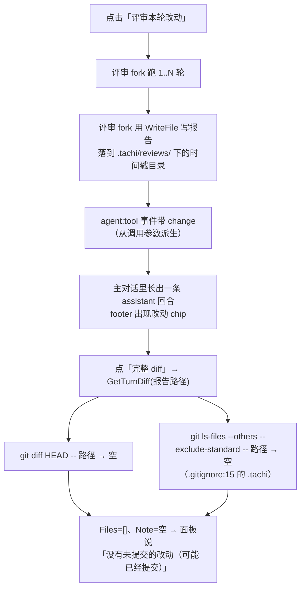
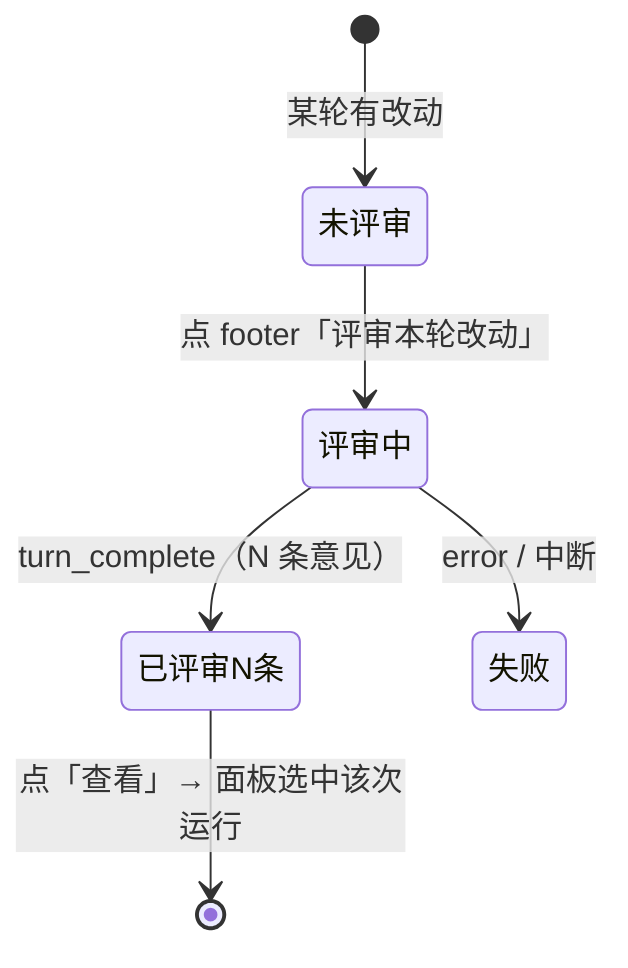
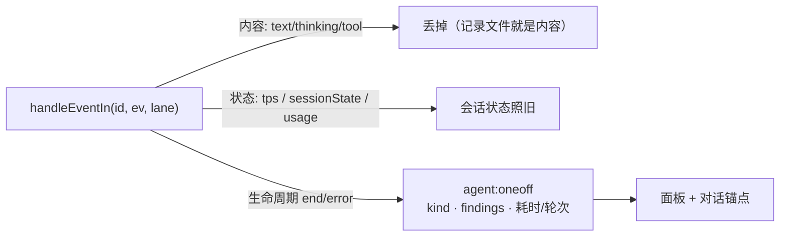

# Desktop 旁路运行面板（One-off Sidecar Panel）设计

> 版本: 0.10 | 日期: 2026-09-13 | 状态: 全部落地（P0–P4 + 收尾三项 + 宽度可拖拽 + 两个 bug + 评审 6 条 + 「完整 diff」回浮层）
> 关联: [commands.go](../desktop/commands.go)、[agent_turn.go](../desktop/agent_turn.go)、
>       [agent_session.go](../desktop/agent_session.go)、[reviewfindings.go](../desktop/reviewfindings.go)、
>       [oneoff_recorder.go](../agent/oneoff_recorder.go)、[uitheme.go](../desktop/uitheme.go)、
>       [agentEvents.ts](../desktop/frontend/src/agentEvents.ts)、[diff.tsx](../desktop/frontend/src/diff.tsx)、
>       [lib.ts](../desktop/frontend/src/lib.ts)、[layout.css](../desktop/frontend/public/layout.css)、
>       [2026-09-11-desktop-diff-review-design.md](./2026-09-11-desktop-diff-review-design.md)、
>       [2026-07-24-oneoff-transcript-design.md](./2026-07-24-oneoff-transcript-design.md)

---

## 目录

1. [背景与问题](#1-背景与问题)
2. [关键事实：原料盘点是齐的](#2-关键事实原料盘点是齐的)
3. [目标与非目标](#3-目标与非目标)
4. [语义定义](#4-语义定义)
5. [交互设计](#5-交互设计)
6. [数据模型](#6-数据模型)
7. [实现设计](#7-实现设计)
8. [评审意见的渲染](#8-评审意见的渲染)
9. [与既有决策的关系](#9-与既有决策的关系)
10. [风险与边界](#10-风险与边界)
11. [测试计划](#11-测试计划)
12. [分阶段实施](#12-分阶段实施)
13. [待决问题](#13-待决问题)

---

## 本版修订（0.9 → 0.10：「完整 diff」回到它自己的表面——它承诺的是回合，不是运行）

使用者报告：「当没有 review 时，点击『完整 diff』，侧边栏展示的是空的」。

根因是**入口和数据源分属两个模型**。那个 chip 承诺的是**这一轮**的完整 diff（`title` 写的就是「与 git
HEAD 对照的完整 diff（真实文件行号）」），而 P3 把它指到了面板上、P4 又把调用方的 paths 从面板里拿掉
（那次是为了修「调用方的文件集永不过期」）——于是面板只能拿**记录里的 `header.paths`**，也就是**某一次
运行**的文件集。两个后果同一个根因：没有评审的会话里面板列表是空的（`ListOneOffs` 的 note 就是使用者
看到的那句「这个会话还没有旁路运行」），有评审时点某一轮的 chip 显示的却是**切换器里选中那次运行**的
diff。P2a 的形态（`openDiffPanel(paths)` → 浮层 → `GetTurnDiff(sid, 本轮 paths)`）本来是对的，P3 把
它改道时没有数据源可以接。

1. **`TurnDiffOverlay`（[diff.tsx](../desktop/frontend/src/diff.tsx)）**：`ViewerOverlay` +
   `DiffFindingsPane`（`findings=[]`、`expandAll`）。paths 是**那次点击自己的**：打开时取、关闭时丢，
   App 侧的 state 只有「哪一轮 + 哪个会话」（切会话即关），因此**不会**变成 P4 修掉的那种长期锚点。
2. **面板回到只回答「这次旁路运行做了什么」**：`openFindings` 失去唯一调用者（它只是 `setTab('findings')`），
   删掉；进 意见 页就是点那一页自己的标签。`DiffFindingsPane` 的 `hasPaths=false` 文案随之改口径
   （「打字发起的 /review 覆盖整棵树」+ 指向回合自己的入口）。
3. **折叠默认值要看表面**：面板的规则「有意见的文件展开、没意见的折叠」在没有意见的表面上是全折——chip
   承诺的 diff 变成一串文件名，smoke 实测 `.diff-ln` 计数 0。`DiffFindingsPane` 多一个 `expandAll`
   （只有 `TurnDiffOverlay` 传），面板行为不变。
4. **smoke 那条断言本来就长错了地方**：`oneoff-footer` 用「完整 diff」当**进 意见 页的触发器**来断言，
   于是它同时钉住了一个按钮和一次页面切换——按钮一改道它就既测不到 意见 页、也测不到按钮本身。现在
   「完整 diff」的 6 条断言挪到**评审之前**（这一事实的产出点是"还没有 run"的时刻：浮层打开、面板没被
   牵连、本轮两个文件、有真实行号、默认展开、Esc 关掉），进 意见 页改点「意见」标签。场景 77 项断言，
   整套 11/11 通过。

---

## 本版修订（0.8 → 0.9：评审意见 6 条——两处跨 run 串数据、一处承诺与实现不符）

1. **报告的缓存没有归属**：`reportText` 只存文本，而「报告」这一页跨切换器保持打开 —— 于是运行 A 的
   报告会配着运行 B 的文件名显示，并且因为 `reportText !== null` 而拒绝重新取（失败的文案同样泄漏）。
   现在缓存带 key（`sessionId/run 名`），不匹配即视为「还没取过」。
2. **调用方塞进来的 `paths` 会一直生效**：P4 之后每条记录自带 scope，面板其实不需要「调用方的文件集」
   了 —— 而它一旦被塞进来就永不过期，于是点过一次「完整 diff」之后，切换器里**任何**一次运行都用那一轮
   的文件集去 diff（`hasPaths` 还是 true，连说明都没有）。这正是 0.7 注释声称已避免的跨运行泄漏。
   现在 diff 一律来自记录（`header.paths`），调用方不再参与，`openFindings` 只切标签。
   顺带：run 名只是 session 内的时间戳，所以「已请求」标记改成 `sessionId/run 名`。
3. **宽度那句承诺兑现了**。0.8 把 clamp 的结果直接写回 state，于是「窗口变宽，宽度回来」只在下次启动
   成立。现在**读者选的宽度**（App 持有、写盘）与**显示的宽度**（面板内派生）是两个数：
   `room` 由 DOM 测量（窗口 resize、侧栏折叠都重算），窄窗口只限制显示、不覆盖选择。
4. **`loadRequest` 的副作用从 state updater 里搬出来**：updater 必须是纯的（StrictMode 会为同一次更新
   跑两次），原来的写法会发两次请求 —— 而且 `prev[seq]` 守卫救不了，因为两次都看到同一份更新前的
   state。现在用 in-flight 集合保证「一次点击一次请求」，响应也按「点击时的那个 run」归属。
5. **`useOneOffs` 的返回值记忆化**：每次渲染返回新对象，会打断 App 侧 `useCallback(..., [oneoff])`
   → memo 化消息气泡这条链，于是每个流式 delta 都重渲染整条对话。
6. **一条空洞的真机断言**：`[class*=tool]` 会命中请求摘要行的 `oneoff-req-tools`，所以「回放里有工具卡」
   在没有工具卡时也成立 —— 收紧成 `.msg-assistant .tool-card`。

**还有两条来自使用者的报告**（同一个 chip）：

7. **「评审中…」这一态曾经不可见**。chip 有三态，中间那态被两件事同时吃掉：`startReview` 在
   `ReviewChanges` 返回时就清掉 pending（那只是「fork 已启动」，不是「已结束」），而 `reviewDoneLabel`
   只看记录里有没有 `reviewedMsg`（记录从第一行起就带着本轮 id），于是 chip 直接跳到「已评审 · 查看」——
   并且因为会话正在跑这次评审而 `disabled`，正是用户说的「没法点击」。现在：pending 只在**被拒绝**时清，
   结束由那次运行的 **end 事件**决定（此前那个「会话一空闲就清」的规则会在 fork 还没忙起来的窗口里
   误清 —— 把它加回去做对照，chip 的观测序列是 `评审本轮改动 → 已评审 1 条 · 查看`，中间态压根不出现，
   换成本实现则是 `评审中… → 已评审 1 条 · 查看`）；「已评审」判据排除仍在跑的 run；
   「评审中…」与「已评审 · 查看」都可点（只有「发起」才等空闲）。
   真机断言也换了测法：这一态的长度就是运行的长度（mock 下几百毫秒 —— 每个 reply 都是瞬时的，
   `textStream` 的第二个参数是 cacheRead 而不是延迟），所以它**采样 chip 的状态序列**，
   而不是等一个瞬时状态出现。
8. **旁路运行结束的通知**：one-off 结束本来会走 `notifyTurnDone`（正文「回合完成」），但一次没有对话回合的
   运行说「回合完成」等于什么也没说。现在有自己的文案：`评审完成 · N 条意见` / `评审完成 · 未报问题` /
   `评审已停止` / `评审未完成（见日志）` / `提交完成`，由 `commands.go` 在知道结局的地方发；
   同时把 `notifyTurnDone` 限制在 transcript lane，避免同一个结局弹两条。文案是纯函数，有单测
   （`TestOneOffDoneBody`）。

**顺带**：拖拽的两条断言不再用固定 `sleep` 等状态（同一段拖拽一次读到 420、一次读到 320），改成等条件成立；
`oneoff-panel` 场景 34 项断言、`oneoff-footer` 36 项（多的是 chip 三态与「可点」四条）。

---

## 本版修订（0.7 → 0.8：面板宽度可拖拽，以及两处「尺子的问题」）

1. **宽度可拖拽，并且记得住**（关掉待决 3）。`uiState.OneOffPanelWidth` +
   `GetUIState`/`SetOneOffPanelWidth`（[uitheme.go](../desktop/uitheme.go)，`validOneOffPanelWidth` 把界外的
   值当没写过，界值 320–1000 由 `TestOneOffPanelWidthBounds` 钉住）；前端 `.oneoff-resizer` 是面板左缘
   一条 6px 的抓带，`role="separator"` + `tabIndex=0`，所以←→键也能改宽度（步长 24）——不是只有鼠标。
   三条边界规则：**窗口里最多留下 `CHAT_MIN_WIDTH = 480` 给对话**、面板不小于 320、拖拽中只改 React
   state、**松手才写盘**（一次手势一次小文件写，而不是每帧一次）。
   这条「留 480」第一版算错了：它只从窗口宽度里扣，**没扣侧栏**（另一根不收缩的列），于是默认 1200px
   窗口里面板能拖到 720px、对话只剩 200px——注释写着「side channel 不吞主内容」，实现却允许它吞。
   现在 `panelRoom()` 从 DOM 读侧栏实际宽度（收起侧栏会把空间还给面板），上限变成 440px；
   真机断言也随之改口径：不再写死「拖到 500」，而是断言**上限存在的理由**——拖到极限后对话仍有 480px
   （抄公式进 driver 只是把实现读给自己听）。另外**窗口 resize 时重新 fit**（只改显示、不改存盘值），
   否则在 1200px 里拖出来的宽度会在 900px 的窗口里挤扁对话。
2. **拖拽的监听挂在 `window` 上，且在 `startDrag` 里同步挂**。两点都是实测逼出来的：指针离开那 6px
   抓带时必须继续改宽度（那才叫拖拽），而合成指针事件下 `setPointerCapture` 会拒绝一个它没见过的
   pointerId；至于同步——原来把监听放在依赖 `dragging` 的 effect 里，React 的状态提交是异步的，
   **背靠背的 down+move 会整帧丢掉**（实测：合成 down+move 打下来，宽度一动不动；改成 `startDrag`
   内直接 `addEventListener` 后，同一对事件就改得动了）。`detachRef` 负责清理，组件卸载时也摘掉
   （拖拽中面板是可以被关掉的）。
3. **宽度断言原本被放在了不会拖拽的场景里**。它长在 `oneoff-footer` 的 `after` 里，而拖手柄的是
   `oneoff-panel` 的 driver —— 于是这条断言永远看到 `oneOffPanelWidth=0`。挪到真正拖宽度的场景后，
   两个场景各断言各的：`oneoff-panel` 管宽度（500px：先拖到极限钳在 320，再 +180），
   `oneoff-footer` 只管开关。教训与 P4 那次漏接线同源：**断言要长在能产生该事实的场景上**。
4. **`switch-scroll` 的判据重做：rAF 探针被撤掉，换成 driver 自己的 `ResizeObserver`**。上一版认为
   「rAF 里读到的就是被画出来的帧」，这错了：**读 `scrollHeight` 会强制 layout**，而 layout 发生在
   app 的 pin 之前 —— 于是这条序列读到的正是「内容长高了、pin 还没跑」的中间态，一个从不落地的
   中间态（实测：孤零零一帧 298px，前后都是 0）。诚实的读法是在**自己的** observer 回调里读：观察者
   按注册顺序回调，driver 后注册，就排在 app 的 pin 之后、paint 之前 —— 读到什么就是屏幕上是什么。
   并且这把新尺子**双向验过**：修复在位时读 0，把 pin 关掉则读到 298px（真被画出来的漂移）。
   记录见 [itest/desktop/README.md](../itest/desktop/README.md)。

**顺带**：`oneoff-panel` 场景现在 32 项断言（多的是拖拽四连：按下即进入拖拽态、拖到极限钳在 320、
往外拖变宽、面板再宽也不吃掉对话的 480px），`oneoff-footer` 33 项（原 34 项里那条错位的宽度断言搬走了）。

---

## 本版修订（0.6 → 0.7：收尾三项——忽略路径的文案、面板开关持久化、重新评审）

1. **`GetTurnDiff` 补上「请求的路径被 git 忽略」这一支**（原来的投诉文案）。被忽略的路径在
   `git diff HEAD` 与 `ls-files --others --exclude-standard` 里都不出现，于是面板拿到空 diff、
   又把沉默解释成「没有未提交的改动（可能已经提交）」—— 那是错的：文件就在那里、还是新的。
   现在 `TurnDiffVO` 多一个 `Ignored` 计数，Note 说出**是哪条规则**挡住的（`git check-ignore -v`
   的 source，如 `.gitignore:15`），`nothingToReview`（评审入口的拒绝文案）据此改口径：
   「评审同样看不到被忽略的文件」，而不是「没有可对照的基线」。单测 `TestGetTurnDiffIgnoredPath`。
2. **面板开关持久化**：`uiState.OneOffPanelOpen`（`desktop_ui.json`）+ `GetUIState` /
   `SetOneOffPanelOpen` 两个绑定。前端只在挂载时读一次（渲染由 React state 驱动，文件只是「从哪恢复」），
   每次切换写一次，best effort。真机断言：driver 结束时面板是开的 → 文件里 `oneOffPanelOpen=true`。
3. **「重新评审」按钮**：长在意见区的标题行上，只在**记录里带着范围**的运行上出现（整树评审没有文件可指）。
   P4 的 `ReviewedMsg` + `Paths` 就是它需要的全部材料 —— 于是从一条历史记录也能「按同一批文件再评审一次」。
   真机断言：重跑后 chip 报出**新的**条数（2 条 vs 1 条）、磁盘上两份记录。

**顺带**：`switch-scroll` 的探针判据被重新设计（判「画出来的帧」，窗口不出帧时退化为「连续偏离」并在日志里
说明用了哪把尺子），`itest/desktop/README.md` 记下两条约束：**一次只跑一个 smoke**、**探针要判被画出来的状态**。

---

## 本版修订（0.5 → 0.6：P4 落地——归属与范围随记录持久化）

P4 落地：`agent.ReviewOrigin`（[oneoff_recorder.go](../agent/oneoff_recorder.go)）+ 两个新的 Extra key
（`OneOffKeyReviewedMsg` / `OneOffKeyPaths`）、`ReviewChanges(sessionID, paths, reviewedMsg)`、
`OneOffVO.ReviewedMsg` / `.Paths`（[oneoff.go](../desktop/oneoff.go)）、前端的 `reviewDoneLabel`
与面板对记录自带 paths 的使用。`oneoff-footer` 扩到 30 项断言。

四件事：

1. **「哪一轮 + 哪些文件」写进记录**。这两个事实此前只活在窗口的内存里：重启后 turn 的 chip 说不回
   「已评审 N 条」，面板也没有文件清单可问 diff。它们都是**那一轮**的属性，所以随 run 一起记下来。
2. **四个前端都要顾及**（.tachi.md 的规矩）：`OneOffMetaForReview` 多收一个 `ReviewOrigin`；
   TUI / ACP / channel 评审的是整棵树、也没有"某一轮"可言，传零值（三处已改）。
3. **前端的两个后果**：footer 的 已评审 状态现在有两个来源 —— 本窗口刚跑完的那次用精确条数，
   磁盘上的记录用「已评审 · 查看」（条数在面板里，因为数它要读完记录）；面板优先用**记录里的 paths**，
   于是从切换器打开历史运行、甚至重启之后，意见区照样有 diff 可看。
4. **真机断言抓到一个漏接线**：`commandRun` 加了 `reviewedMsg` 字段却忘了在 `startCommand` 里赋值 ——
   `paths` 有值、`reviewed_msg` 是空。这条断言的存在就是为了这种"加了一半"的改动。

**未做**：面板开关/宽度持久化（§7.4）。同一轮重跑评审现在**材料齐了**（ReviewedMsg + Paths 都在记录里），
见 §13 待决 8。

---

## 本版修订（0.4 → 0.5：P3 落地——意见 + diff 与报告搬进面板）

P3 落地：`DiffFindingsPane`（[diff.tsx](../desktop/frontend/src/diff.tsx)，去掉 `ViewerOverlay`/`FilePreviewOverlay` 外壳）、
面板的三个标签区（[oneoff.tsx](../desktop/frontend/src/oneoff.tsx)）、`LoadOneOff` 顺带收集本运行的意见
（[oneoff.go](../desktop/oneoff.go)）、`App.openDiffPanel` 改为「开面板 + 选中意见区 + 带上 paths」。
`oneoff-footer` 场景扩到 28 项断言。

四件落地时定下的事：

1. **意见来自选中的那次运行，而不是「本会话最新一次评审」**：`LoadOneOff` 在同一次遍历里把该记录的
   ReportFinding 解析出来（`findingFromToolCall` 是 `readReviewFindings` 抽出来的共用解析）。于是
   面板切到哪次运行就显示哪次的意见 —— §13 待决 6 因此不再需要修 `latestReviewTranscript`。
2. **`GetReviewFindings` 与它的 `latestReviewTranscript` / `readReviewFindings` / 六个测试一并删除**：
   面板是它唯一的调用者，留着就是一条没人走的死路（也是「意见从哪来」的第二个答案）。
   「写了报告但没记结构化意见」这条语义挪进了面板的提示文案（§13 待决 9 记录取舍）。
3. **diff 的 paths 由调用方给**：点「完整 diff」的那一轮本来就持有它的文件集合，面板用它调 `GetTurnDiff`；
   从切换器打开（没有 paths）时明说「这次运行没有带上被评审的文件清单」。paths 与运行的精确绑定留给 P4。
4. **报告是面板的一页，不是又一层浮层**：`PreviewFile` 取正文 + `MarkdownBlock` 渲染，旁边保留「打开」。

**未做**：面板开关/宽度持久化（§7.4）、同一轮重跑评审（§13 待决 8）、paths 与运行的持久绑定（P4）。

---

## 本版修订（0.3 → 0.4：P2 落地——评审不再进对话流）

P2 落地：`runLane` + `commandLane` 表（[agent_turn.go](../desktop/agent_turn.go)、[commands.go](../desktop/commands.go)）、
`agent:oneoff` 生命周期通道（`emitOneOff`）、`useOneOffStream`（[agentEvents.ts](../desktop/frontend/src/agentEvents.ts)）、
composer 的占位气泡降级（`noticeCommandResult`）、footer 三态与自动打开（[App.tsx](../desktop/frontend/src/App.tsx)）、
面板对运行中记录的轮询（`ONE_OFF_LIVE_POLL_MS`）。真机两个场景共 48 项断言。

落地时与初稿不同、且值得记住的三点：

1. **内容不进任何通道**（初稿是「搬到一个新通道」）。发现 transcript 有两条写入通路
   （typed 事件 + 原始 `agent:event` 转发），而内容在磁盘上已经有一份 —— 于是 `laneOneOff` 是
   「关掉对话载荷的发射」，`agent:oneoff` 只带生命周期事实（start / end / error + findings 计数 + 耗时/轮次）。
   后端在事件流里数 `ReportFinding`，比跑完解析文件更省更快。省掉了一整套流式 reducer。
2. **`runLane` 属于命令而不是"命令运行"**：`/compact` 与 `/sh` 的输出本来就是对话内容，仍走 transcript 通道。
3. **锚点的配对不能靠 `reviewPending`**：会话转 idle 会先清掉它，而评审的 end 事件与 idle 只差一帧；
   改用 `reviewForRef`（记下这次评审是哪一轮发起的），前端实测稳定。

**未做**：面板的「意见 + diff」「报告」两个标签区（P3）、面板开关/宽度持久化（§7.4）、
同一轮改动不能重跑评审（footer 完成后变成「查看」；见 §13 待决 8）。

---

## 本版修订（0.2 → 0.3：P1 落地——第三列、切换器、过程回放）

P1 落地：`desktop/frontend/src/oneoff.tsx`（`useOneOffs` + `OneOffPanel`）、`parts.tsx`（从 App.tsx 抽出的部件
渲染器）、`App.tsx` 的第三列与标题栏开关、`layout.css` + `chat.css` 的 `.oneoff-*` 规则，
以及真机场景 `itest/desktop/drivers/oneoff-panel.js` + `scenarios.go` 的 `oneoff-panel`（22 项断言）。

两处实现决定：

1. **`TurnPart` 抽成 `parts.tsx` 并与主对话共用**。面板的「过程」区用 `buildTurns` 重建轮次，再用**同一个**
   部件渲染器（思考行 / 工具卡 / 片段 diff / markdown）渲染 —— 面板不是第二套渲染器，这正是 §2.2 那条
   「记录行就是 session.Message」的兑现。抽取是纯搬运：App.tsx 里 `TurnPart` 依赖的
   `ThinkingPart` / `NoticePart` / `ToolCard` / `FileCard` / `MarkdownBlock` 本来就都在共享模块里。
2. **「运行中」标记要同时满足后端 mtime 启发式与会话忙状态**。记录没有结束标记，后端只能按
   "文件 15 秒内被写过" 判断，于是刚跑完的运行会假报在跑（smoke 输出实测到这条）。
   面板拿会话自己的 `isCurrentRunning` 收敛它：两个信号都为真才显示。

**未做（留给后续期）**：面板的「意见 + diff」「报告」两个标签区（P3）、点入口自动打开面板（跟着 P2 的
锚点状态机走）、面板开关/宽度持久化到 `desktop_ui.json`（§7.4，待决 3）。

---

## 本版修订（0.1 → 0.2：P0 落地，以及三处与初稿不同的决定）

P0（后端读取 + 绑定 + 单测）与 §8（findings 渲染）已落地：`desktop/oneoff.go`、`desktop/oneoff_test.go`、
`markdown.tsx` 的 `InlineMd`、`diff.tsx` 的 `FindingRow` 与 `chat.css` 的 finding 规则。
实现时有三处与本文档初稿不同，都是被代码推翻的，记在这里：

1. **列表按 meta 的 `started_at` 排序，不按文件名。** 文件名是 `<kind>-<时间戳>-<随机>`，
   **字典序等于先按 kind 排**：所有 `review-round-*` 会排在任何 `review-*` 之前、`commit-*` 最后，
   与日期无关（这是单测抓到的）。`started_at` 缺失时退化为文件 mtime。附带发现：
   `latestReviewTranscript`（[reviewfindings.go:104](../desktop/reviewfindings.go)）也用文件名取
   "最新一次评审"，同一目录里同时存在单轮与多轮记录时它会挑错——见 §13 待决 6。
2. **`ListOneOffs` 返回 `OneOffListVO{Items, Note}` 而不是裸切片**，与 `TurnDiffVO` / `ReviewFindingsVO`
   的既有约定一致：空列表必须能说清是"没有记录"还是"读不到目录"。
   同时 **`Findings` 只由 `LoadOneOff` 填**：数它必须把文件读完，列表阶段对每个文件都做一遍不划算
   （§5.2 因此改为"选中该项后显示计数"）。`EndedAt` 也改名 (`UpdatedAt`)，值是文件 mtime ——
   记录没有结束标记，mtime 就是最省且不撒谎的近似。
3. **会话 id 与记录名都按不可信输入处理**：两者都来自 webview，只接受单个路径元素
   （`filepath.Base` 相等 + 扩展名 `.jsonl`）。这是新增的读取入口，不做校验就能被
   `../../` 把读取点搬到别的会话目录去。

另有两条实现中确认的边界，写进 §10：`OneOffRequestVO` 只带**工具名**（不带 schema），
以及 `SessionMessage` 不携带 `duration_ms`，所以面板里的工具卡暂时看不到耗时。

---

## 本版决定（0.1 初稿：三件事先定下来）

1. **形态：消息区右侧的第三列**。不是覆盖式抽屉、不是复用 `ViewerOverlay`。理由：诉求是「不混在主对话区」+「能切换」，
   这两件事都要求面板是**常驻区域**；浮层会盖住对话，切换器的价值也随之打折。
2. **锚点：主对话流里留一行**，但**不新增气泡**：
   - 从某一轮 footer 发起的评审 → 该轮的 footer 自己承担状态（`评审中…` → `已评审 N 条 · 查看`）；
   - 打字发起的命令（`/review`、`/commit`）→ 保留既有的用户行，把那个占位 assistant 气泡**降级成一行 notice**。
3. **评审与其它旁路运行（`/commit`）共用同一口面板与同一条事件通道**，不为 commit 另开一条路。

---

## 1. 背景与问题

### 1.1 症状（实测）

- 点「评审本轮改动」后，评审的**全过程**（本 session 实测：25 次 API 调用、39 个工具调用、20 段思考）整段铺进主对话。
- 评审那一轮结尾冒出 `🧾 1 files +N`、「完整 diff」、「评审本轮改动」三个 chip —— 长得像一轮**改过代码**的回合。
- 点「完整 diff」：**看不到任何 diff**，只剩一堆评审意见；文案还说「没有未提交的改动（可能已经提交）」。
  文件明明刚写出来（`ls -l` 9286 字节），只是**被 `.gitignore` 忽略了**。
- 重启之后：那次评审的卡片从对话里消失（它不在 `messages.jsonl` 里），但意见还在（从 one-off 记录里读）。
  同一件东西，**在 UI 上像回合，在磁盘上却是一次性记录**。

### 1.2 根因链



三层问题互相独立，但**都源自同一件事**：旁路运行在对话流里冒充普通回合。

| 层次 | 问题 | 根因落点 |
| --- | --- | --- |
| 展示 | 评审过程淹没对话，读不到重点 | `startCommand` 把命令的事件按普通回合投给 transcript（[agent_turn.go:322](../desktop/agent_turn.go)、[commands.go:207](../desktop/commands.go)） |
| 归属 | 评审自己的报告被算成「本轮的改动」 | `turnDiffStat` 只看 part 有没有 `change`（[transcript.ts](../desktop/frontend/src/transcript.ts)、[lib.ts](../desktop/frontend/src/lib.ts)），而报告是评审 fork 的 WriteFile |
| 解释 | 空 diff 被解释成「已经提交」 | `GetTurnDiff` 的两条 git 查询按定义跳过被忽略路径，但 `Note` 没有这一支（[gitdiff.go](../desktop/gitdiff.go)） |

### 1.3 为什么改结构比打补丁划算

三层的补丁分别是「过滤内部产物」「补一条 note」「把评审入口从 footer 拿掉」。而**面板一次消掉三层的第一层与本层**：
评审不再进对话流 → 不再有冒充回合的 footer → 报告与 diff 在同一块地方对齐。剩下的 `GetTurnDiff` note 仍值得补（见 §9），
因为它是通用边界缺口，与面板无关。

---

## 2. 关键事实：原料盘点是齐的

### 2.1 one-off 记录就是 `session.Message` 的序列化

`oneoffRecorder.record(msg *session.Message)` 直接把 `session.Message` marshal 成一行
（[oneoff_recorder.go](../agent/oneoff_recorder.go)），因此行里的 `type` 取值与
`session.MessageType*` **完全一致**（[session.go:44-51](../session/session.go)），字段名也一致：
`content / name / args / result / is_error / tool_call_id / duration_ms / iteration / seq / usage / timestamp`。

只有**两种行是 one-off 独有**的，它们也是适配器唯一要特殊处理的东西：

| 行 type | 内容 | 处理 |
| --- | --- | --- |
| `meta` | kind / session_id / cwd / provider / model / started_at / system_prompt / **extra.report** | 进面板 header，不进 messages |
| `api_request` | `session.APIRequest`：system prompt、user prompt、工具 schema、耗时 | 默认只取摘要，按需懒加载（§6.4） |

其余行（`user` / `assistant` / `thinking` / `tool_call` / `tool_result`）**可以直接 unmarshal 成 `session.Message`**。

本 session 实测的一份评审记录（`<sessionDir>/2026-09-12-193137-a8acf6c3/oneoff/review-20260912-193535-bc05.jsonl`）：

```
150 行 / 686KB
type 分布: meta×1  user×1  api_request×25  assistant×25  thinking×20  tool_call×39  tool_result×39
```

即：**完整可回放** —— 谁发出的 prompt、模型每一步说了什么、调了哪个工具、参数与结果、每轮 token 用量，都在。

### 2.2 已经存在的链路（可复用清单）

| 需要的能力 | 现成的落点 | 复用方式 |
| --- | --- | --- |
| 把原始消息变成气泡/工具卡/思考块 | `buildSessionMessages`（[agent_session.go:270](../desktop/agent_session.go)） | 直接调用，零改动 |
| 前端重建轮次（含片段 diff、thinking 归并） | `buildTurns`（[lib.ts:69](../desktop/frontend/src/lib.ts)） | 直接调用，零改动 |
| 找到最新一次评审 | `latestReviewTranscript`（[reviewfindings.go:104](../desktop/reviewfindings.go)） | 列表逻辑照抄（文件名倒序 = 时间倒序） |
| 兼容「args 是字符串或对象」 | `readReviewFindings`（[reviewfindings.go:132](../desktop/reviewfindings.go)） | 抽成共用小函数，别重写 |
| 把占位气泡降级成一行说明 | `finishNotice`（[transcript.ts](../desktop/frontend/src/transcript.ts)） | 直接复用 |
| 工具卡（含 `changeVO` 片段 diff） | `changeVO`（[diff.go](../desktop/diff.go)）+ `TurnPart` | 事件照发，前端同一套组件 |
| 面板宽度/开关的持久化 | `uiState` + `desktop_ui.json`（[uitheme.go:49](../desktop/uitheme.go)） | 加两个 key |

**结论**：要新写的只有「列文件」「读文件」「路由事件」「面板 UI」四件事，渲染链路基本不用碰。

### 2.3 哪些运行落进本 session

- **本 session 目录** `<sessionDir>/<sid>/oneoff/`：评审（每轮一个文件）、`/commit`
  （`agent/commit.go:41` 传了 sessionID）。
- **全局目录** `<home>/oneoff/<kind>/`：没有会话归属的运行（ambient / dream / github-*），`meta.session_id` 为空。

→ 面板的「本 session 的旁路运行」= 读**本 session 目录**。全局那些**不做**（§3 非目标）。

### 2.4 量级

`api_request` 行平均 **16.4KB**（25 行占 686KB 里的 ~410KB，每轮重发 system prompt 与工具 schema）。
去掉它之后单个文件约 276KB —— 面板默认 payload 必须是**去掉 api_request** 的版本，这也是 §6.4 的截断策略来源。

---

## 3. 目标与非目标

**目标**

1. 旁路运行（评审、提交）的过程**不进主对话**，在右侧第三列展示，对话流只留一行锚点。
2. 能**列出并切换**本 session 的所有旁路运行（含一次运行的多个轮次）。
3. 从被评审那一轮的入口打开面板时，**报告、意见、diff 在同一处对齐**。
4. 评审意见不再是裸文本。

**非目标**

- 全局 one-off（无会话归属的 ambient / dream / github-*）不进这个列表。
- 不改评审的作用域语义（仍是本轮 path 集合）、不改 findings 的坐标系（仍是文件真实行号）。
- 不做自动评审（既有决定，见 diff-review 文档 §12.4）。
- 不做 one-off 记录格式的迁移；`api_request` 的懒加载是增量能力，不是重写。

---

## 4. 语义定义

### 4.1 运行（run）、批次、文件

- **运行（run）**：一次 `startCommand`（[commands.go:163](../desktop/commands.go)）。面板列表的一行 = 一次运行。
- **文件**：recorder 每个 run 写一个文件，命名 `<kind>-<filestamp>-<rand4>.jsonl`；多轮评审**每轮一个文件**
  （kind 形如 `review-round-N`，`normalizeUsageKind` 折回 `review` 记账）。
- **批次分组键**：**`filepath.Dir(meta.extra.report)`**。orchestrator 为一次评审只建一个报告目录
  （[review.go:222](../agent/commands/review.go)），几轮共享；文件名的秒级时间戳可能跨秒，**不能**用来分组。

### 4.2 内容与生命周期分界

| 类别 | 事件 | 去哪 | 理由 |
| --- | --- | --- | --- |
| 内容 | text / thinking delta、`agent:tool` | **面板**（新通道 `agent:oneoff`） | 这就是「过程」本身 |
| 生命周期 | 状态机 busy/idle、`turn_complete`、error、`agent:idle` | **留会话** | `startTurn` 的忙判、Stop、待发队列的排空、`reviewPending` 复位都挂在它们上面 |

### 4.3 一句话原则

> **面板回答「这次旁路运行做了什么」，对话流回答「谁在什么时候要它做了什么」。**

---

## 5. 交互设计

### 5.1 第三列


- 位置：`.app-body` 的第三个 flex 子项（[layout.css:186](../desktop/frontend/public/layout.css:186)）。
- 收起/展开沿用 `.sidebar.collapsed` 的宽度过渡（同一套 `--ease`），标题栏放开关按钮。
- 窄窗口：`@media (max-width: 900px)` 时默认收起；不做覆盖式降级（宁可让用户自己开）。
- 打开时机：**用户点击发起的那次运行自动打开**（他刚点了它，就是要看结果）；其它入口（标题栏、⌘ 快捷键）不自动打开，避免打断。
- **宽度是读者的**（0.8/0.9）：左缘 6px 抓带可拖，`role="separator"` 也让 ←→ 键能调（步长 24）。
  上限的语义是「**对话至少还剩 480px**」——注意它要扣掉侧栏（另一根不收缩的列），1200px 窗口里
  面板最多 440px；窗口变窄时重算，而这只是**显示**上的限制，读者选的宽度不会被改写（见 §7.4）。
  拖拽中只改面板内的 state，**松手才写盘**。

### 5.2 切换器

面板 header 一行：`[⌄] 评审 · 19:35 · judge/deepseek-flash · 🐛2 ⚠1` + 「过程 / 意见+diff / 报告」三个标签。

- 数据源：`ListOneOffs`（§6.1），**新→旧**排列；正在跑的那次置顶并带 `运行中` 标记。
- 列表项显示：kind 图标与名字、开始时间、模型、有无报告；**意见计数在选中该项后出现**
  （数它必须读完整个文件，列表阶段不做——见 §6.4）。一次运行的多轮折叠在同一项里（轮次作为该项内的分段）。
- 切换 = 换 `oneoff` 选择，不改会话；面板状态（当前选中、标签页）随会话走，切会话时重置。

### 5.3 三个区（P3 已落地）

| 标签 | 内容 | 来源 |
| --- | --- | --- |
| **过程** | 这次运行的 transcript：用户 prompt、思考、工具卡（含片段 diff）、回复；`api_request` 折叠成「本次请求」 | `LoadOneOff`（结束后）+ 运行中轮询记录文件 |
| **意见 + diff** | 该运行自己的意见，锚在它评审的那些文件的 diff 行上（「其它文件」成组），底部 `发给 agent` | `LoadOneOff` 的 `Findings` + `GetTurnDiff(sid, paths)`（paths 由调用方给） |
| **报告** | 报告 markdown 内联渲染（`PreviewFile` + `MarkdownBlock`），旁边「打开」 | `meta.extra.report` |

标签只显示这次运行**有**的区：`/commit` 没有意见也没有报告，就只显示「过程」。

「对上」就是这么来的：同一块面板里，报告是叙述、意见是索引、diff 是现场，不用在两个浮层之间来回切。

### 5.4 两条入口与锚点状态机



- **入口 A（turn footer）**：被评审那一轮的 footer，状态串 `评审中…` → `已评审 N 条 · 查看`。
  零新增节点，归属天然正确（消息 id 就是那一轮）。
- **入口 B（打字发起）**：`/review`、`/commit` 走后端 `RunCommand`，而 composer 的 `runCommand`
  **已经**推了一条用户行 + 一个 assistant 占位气泡（[composer.tsx:277](../desktop/frontend/src/composer.tsx)）。
  保留用户行（它是对话里的动作记录），用 `finishNotice` 把占位气泡变成一行：
  `⤴ 已在右侧面板运行 · 查看`；内容不进这个气泡。
- **入口 C（标题栏）**：打开面板看任意一次历史运行。

---

## 6. 数据模型

### 6.1 绑定（新增三个方法，已落地）

```go
// ListOneOffs 列出本会话的旁路运行（新→旧，按 meta 的 started_at）。
// 只读每个文件的首行(meta)与文件元信息；Note 解释空列表的原因。
func (s *AgentService) ListOneOffs(sessionID string) OneOffListVO

// LoadOneOff 读一次运行的全部消息（复用 buildSessionMessages），默认不含 api_request 正文。
func (s *AgentService) LoadOneOff(sessionID, name string) OneOffDetailVO

// LoadOneOffRequest 按需取某一轮请求的全文（system prompt / user prompt / 工具名）。
func (s *AgentService) LoadOneOffRequest(sessionID, name string, seq int) OneOffRequestVO
```

`sessionID` 与 `name` 都当不可信输入校验（单个路径元素）；新增/改动的服务方法会重新生成
`frontend/bindings/**`（`build/Taskfile.yml:176` 的 `generate:bindings`，该目录是生成物、不入库）。

### 6.2 VO

```go
type OneOffVO struct {
    Name      string   `json:"name"`      // 文件名，列表的唯一键
    Run       string   `json:"run"`       // 批次键 = filepath.Dir(extra.report)，缺 report 时退化为 name
    Kind      string   `json:"kind"`      // review / commit / review-round-1 …
    Round     int      `json:"round,omitempty"`
    SessionID string   `json:"sessionId,omitempty"`
    Provider  string   `json:"provider,omitempty"`
    Model     string   `json:"model,omitempty"`
    StartedAt string   `json:"startedAt,omitempty"`
    UpdatedAt string   `json:"updatedAt,omitempty"`  // 文件 mtime（记录没有结束标记，故不叫 EndedAt）
    Running   bool     `json:"running,omitempty"`   // mtime 在窗口内；前端还要叠会话忙状态（§5.1）
    Report    string   `json:"report,omitempty"`    // extra.report（绝对路径）
    ReviewedMsg string `json:"reviewedMsg,omitempty"` // P4：哪一轮发起的（重启后仍能对上）
    Paths     []string `json:"paths,omitempty"`      // P4：这次评审的范围（面板据此取 diff）
    Findings  int      `json:"findings,omitempty"`  // 只有 LoadOneOff 填（数它要读完记录）
}

type OneOffDetailVO struct {
    Header   OneOffVO        `json:"header"`
    Messages []SessionMessage `json:"messages"`             // ← 与主对话同构
    Requests []OneOffRequestVO `json:"requests,omitempty"`  // 摘要（seq/耗时/工具名），正文按需
    Notice   string          `json:"notice,omitempty"`
}
```

### 6.3 复用映射

`LoadOneOff` 的实现就是一个循环 + 一次 `buildSessionMessages`：

| 行 type | 处理 |
| --- | --- |
| `meta` | → `OneOffVO`（含 `extra.report`） |
| `api_request` | → `OneOffRequestVO` 摘要；正文留给 `LoadOneOffRequest` |
| 其它 | `json.Unmarshal` → `session.Message`，收集后一次性交给 `buildSessionMessages` |

由 `buildSessionMessages` 免费获得：thinking 归并到下一个 assistant、`ToolArgsSummary` 标题、
`changeVO` 片段 diff（**评审报告那次 WriteFile 也会在这里变成片段 diff，这是对的：它是这次运行自己的改动**），
以及 `SessionMessage{Role: "tool_result", IsError, DurationMs}`。前端则原样走 `buildTurns`。

### 6.4 分组、排序、截断

- 排序：**按 meta 的 `started_at`（缺失时文件 mtime）倒序**。不能用文件名：文件名是
  `<kind>-<时间戳>-<随机>`，字典序先比 kind，`review-round-*` 会整体排到 `review-*` 之前。
- 分组：同 `Run` 的文件在一项内按 `Round` 升序展示（`round-1` 是初审，最后一个是 judge）。
- 截断：`api_request` 正文不进 `LoadOneOff`（按 Seq 懒取）；单条内容本身的阈值**尚未做**，
  见 §13 待决 2。

---

## 7. 实现设计

### 7.1 后端：`desktop/oneoff.go`（新文件）

- `listOneOffFiles(sessionID) []string`：读 `<sessionDir>/<sid>/oneoff/`，只看 `.jsonl`。
- `readOneOffMeta(path) OneOffVO`：首行 + 末行（`bufio`，**不要** `os.ReadFile` 全文）。
- `LoadOneOff`：逐行分流（§6.3）。
- 归属校验：`meta.session_id` 与会话不符的文件跳过（防串会话）。
- 复用：把 `readReviewFindings` 里那段「args 可能是字符串」的解析抽成 `unmarshalToolArgs(raw) any`，
  两个调用点共用（[reviewfindings.go:132](../desktop/reviewfindings.go) 与适配器）。

### 7.2 事件路由（P2 已落地，与初稿的设计不同）

初稿说「内容事件搬到 `agent:oneoff`，面板自己拼流式轮次」。落地时发现**有两条通路**写进
transcript（typed 事件 + 原始 `agent:event` 转发），而且**再写一套流式 reducer 是没有必要的**。
最终实现是三件事：



1. **`runLane` 是「命令」的属性，不是「命令运行」的属性**：`commandLane` 表（[commands.go](../desktop/commands.go)）
   声明 `/review`、`/commit` 走 `laneOneOff`，`/compact`、`/sh` 走 `laneTranscript` ——
   `/compact` 的摘要就是它的输出、`/sh` 的输出是用户要看的东西，它们必须留在对话里。
2. **内容不进任何通道**：`handleEventIn` 对 `laneOneOff` 只关掉「对话载荷」的发射
   （`agent:tool`、`agent:plan`、`agent:result`/`agent:turn`、`agent:error`、以及最终的
   `agent:event` 转发），tps / 状态机 / usage 一律照样更新。于是评审期间状态栏照常显示「执行/思考」，
   而对话里一个部件都不会多出来。
3. **`agent:oneoff` 只带生命周期事实**：`start`，以及结束时的 `kind / findings / durationMs /
   iterations`（或 `error` + `interrupted`）。`findings` 是后端在事件流里数 `ReportFinding` 调用得到的 ——
   比跑完再去解析文件更省、更快。内容由面板**轮询记录文件**取得（§7.3），因此不存在第二套流式实现。

**两个必须一起改的陷阱（已按此处理）**：`agent:turn`（summary）与 `agent:error` 的处理器都是
「找到**最新一条 assistant 气泡**再打补丁」（[agentEvents.ts](../desktop/frontend/src/agentEvents.ts)）。
一旦评审不再产生气泡，评审的耗时/成本/错误就会打到**被评审那一轮**上 ——
在 `laneOneOff` 下这两个事件根本不发，问题从源头上不存在。

**锚点的两条路径**（§5.4 的落地）：
- 从 turn footer 发起的评审：结果通过 `reviewForRef` 与那一轮配对（不能靠 `reviewPending`——
  会话转 idle 会先清掉它，而 end 事件与 idle 只差一帧），footer 变成 `已评审 N 条 · 查看`；
- 打字发起的 `/review`、`/commit`：composer 记住自己开的那个占位气泡的 id，end 事件到达时
  用 `finishNotice` 把它换成一行（`⤴ 评审已完成 · 3 条意见 · 过程与报告在右侧面板`）。

### 7.3 前端

- 新文件 `oneoff.tsx`：`useOneOffs(currentId)`（列表 + 选中 + live 合并）+ `OneOffPanel`（三个标签区）。
- `useAgentStream` 里加一路 `Events.On('agent:oneoff')`（与现有订阅同构），写到面板自己的 store，
  **不碰** `updateSession`；live 期间用事件拼临时轮次，`turn_complete` 后调 `LoadOneOff` 用文件替换（文件即事实源）。
- `App.tsx`：第三列挂载 + 标题栏开关 + footer 状态串（把 `reviewPending` 扩成 `{msgId, state, count}`）；
  `DiffPanel` 从 `ViewerOverlay` 改为面板内的一个标签区（组件本身不分叉，只换外壳）。
- CSS：`layout.css` 加 `.oneoff-panel`（对称于 `.sidebar` 的收起过渡），`chat.css` 复用 `.diff-*` 与 `.finding-*`。

### 7.4 面板状态的持久化

`desktop_ui.json` 两个 key（沿用 [uitheme.go](../desktop/uitheme.go) 的 `uiState` 约定，字段可缺省）：

| key | 读 | 写 |
| --- | --- | --- |
| `oneoffPanelOpen bool` | 挂载时读一次（渲染由 React state 驱动，文件只是「从哪恢复」） | 每次开/关写一次 |
| `oneoffPanelWidth int` | 同上 | **一次拖拽一次**（`onResizeCommit`，松手或按 ←→ 键）；拖拽中只改 state |

- **两个数字：读者选的宽度（存盘）与显示的宽度（派生）**。App 只持有前者（`uiState.OneOffPanelWidth`），
  面板里 `shownWidth = clampPanelWidth(width, room)` 算出后者；`room` 由 `panelRoom()` 从 DOM 量出来
  （窗口 − 侧栏 − 对话的 480），并在 `resize` 与侧栏尺寸变化时重算。0.8 版把 clamp 结果写回 state，
  于是「窗口变宽，宽度回来」要等到下次启动才成立（评审抓到承诺与实现不符）；现在窄窗口只限制**显示**，
  不会覆盖读者的选择。拖拽中宽度只活在面板内（`draggingWidth`），松手才 `onResizeCommit`（一次手势一次写盘）。
- 后端只负责存盘与合法性（`validOneOffPanelWidth` 把界外的值当作没写过）。谁算谁负责，避免两处各有一套边界。
- 两个写都是 best effort：写失败只让下次启动回到默认值，不打扰用户（与 theme 一致）。
- **不做** `ui:theme` 那种后端→前端事件：宽度没有第二个写入者（不像主题会被系统跟随改掉）。

---

## 8. 评审意见的渲染

### 8.1 现状

`FindingRow` 把 `finding.text` 与 `建议：{suggestion}` 直接当纯文本渲染
（[diff.tsx:136](../desktop/frontend/src/diff.tsx)），而意见文本几乎总带行内标记
（`` `path:line` ``、`**重点**`、`- 列表`）。另外 `FindingVO.category` 后端一直有、**前端从未渲染**。

### 8.2 行内 markdown：不要用 `MarkdownBlock`

- 代价：一次评审 30+ 条 × 2 段 ≈ 60 个 `ReactMarkdown` 实例（还带 `remark-gfm` + `rehype-highlight` + mermaid 的 `PreBlock`）；
- 版面：`MarkdownBlock` 外面是 `.assistant-text`，块级间距会撑爆紧凑的列表行。

→ 写一个约 40 行的 `InlineMd`：只认 `` `code` ``、`**粗**`、`*斜*`、链接；其余保留为文本，
多行继续靠 `white-space: pre-wrap`。评审意见里偶尔出现的列表/代码块，按 §13 待决 4 处理（折叠或退化成 `<pre>`）。

### 8.3 category 与折叠

- `category`（Correctness / Quality / …）做成小标签：`🐛 bug · Correctness`，扫读性明显不同。
- 超过 4 行的意见默认折叠 + 「展开」：面板的主要动作是**勾选**，不是通读。
- `buildFindingMessage`（回灌给 agent 的消息）保持纯文本原样 —— 渲染只发生在显示层，
  别让「看到的渲染结果」与「发出去的原文」错位。

---

## 9. 与既有决策的关系

| 既有项 | 本设计的影响 |
| --- | --- |
| diff-review 文档 §12.4「chip 上显示 评审中 / 已评审（N 条）」 | **本次落地**（此前只有「评审中…」） |
| 上一轮 issue 的「方案 B：评审产物不算本轮改动」 | **被本设计覆盖**（评审回合不再进对话流，也就没有冒充回合的 footer）；若面板分多期做，B 仍是最好的临时止血 |
| 上一轮 issue 的「方案 A：`GetTurnDiff` 补被忽略路径的 note」 | **仍要做**：通用边界缺口，与面板无关（报告也可能被其它路径问到，`nothingToReview` 的拒绝文案同样受益） |
| diff-review §12.3「只显示最近一次评审的意见」 | 面板里保留这条规则（默认选中最新一次）；列表只在**用户主动切换**时才显示历史运行 |
| 「报告 ↔ 记录显式关联」（`extra.report`） | 继续沿用，并成为批次分组键 |

---

## 10. 风险与边界

| 风险 | 说明 | 处理 |
| --- | --- | --- |
| 事件分流的回归面 | 命令的生命周期事件与回合共用一套 handler，分流不当会让状态机卡在 busy | §7.2 的两个陷阱必须同批改；`agent:idle` 的排空语义保持不变 |
| 大文件读进 webview | 单个 one-off 686KB（含 api_request） | 默认跳过正文 + 单条结果截断（§6.4） |
| 面板挤压对话区 | 窄窗口下正文过窄 | <900px 默认收起；宽度持久化 |
| live 与文件双源 | 同一运行两个事实源 | live 只用于「正在跑」，结束即以文件替换（§7.3） |
| SubAgent 卡降级 | one-off 记录里 `SubagentID` 与子记录文件是另一套（`agent/subagent/`） | 面板里 SubAgent 显示为普通工具卡（本次不追） |
| 归属丢失 | 重启后「这一轮 ↔ 这次评审」无法对上 | P4 写 `meta.extra.reviewed_msg`（§12） |
| **路径穿越** ✅已处理 | 新增的读取入口收 `sessionID` 与记录名，两者都来自 webview | 都按单个路径元素校验 + 扩展名白名单（`oneoff.go` 的 `isSinglePathElement`，单测覆盖） |
| 面板里工具卡没有耗时 | 记录里有 `duration_ms`，但 `SessionMessage` 不带这个字段 | 面板暂不显示；要做就把 `DurationMs` 补进 `SessionMessage`——那同时会补上主对话历史里同样的缺口（§13 待决 7） |

---

## 11. 测试计划

**Go（`go test`，全部写 `t.TempDir()`）**

- `listOneOffFiles` / `readOneOffMeta`：空目录、损坏首行、末行缺失时间戳、`session_id` 不匹配被跳过。
- 适配器：真实一份 one-off 文件（含 `meta`/`api_request` 混合）→ 消息序列与 `buildSessionMessages` 的期望一致；
  `tool_call.args` 为字符串与对象两种形态各一例（**这个坑已经逃过一次单测**，见 diff-review §12.3 第 2 条）。
- 分组：同一 `extra.report` 目录下的 3 个 round 归为一项；不同目录不合并。

**desktop-smoke（真机）**

- `oneoff-panel`（typed `/review`，34 项断言）：面板随运行**自动打开**；切换器列出刚落盘的记录；
  过程区回放出 prompt / 工具卡（真的工具卡，不是请求摘要行）/ 回复；请求正文按需取回；
  **主对话零工具卡、零评审回复，只留一行 notice 锚点**；
  宽度四连（按下即拖拽态、拖到极限钳在 320、往外拖变宽、且对话仍留 480px，都等状态成立而不是等固定时长）
  ＋ `desktop_ui.json` 里存的是最后一次拖拽的值。
- `oneoff-footer`（turn footer 入口，33 项断言）：一轮写文件的对话拥有「评审本轮改动」；
  点击后 chip 变成「已评审 1 条 · 查看」（条数来自后端对 ReportFinding 的计数）；
  评审的回复与 ReportFinding 卡都不在对话里；chip 变成回到面板的入口。
- 复用 `sessions` 场景的写法：断言前先把状态摆正（例如先把焦点移走），不要依赖时序巧合。
- **探针要能在正确的时刻读**（0.8 的教训，详见 [README](../itest/desktop/README.md)）：`switch-scroll`
  的读数必须在 app 的 pin 之后（`driver 自己的 ResizeObserver`），因为在 pin 之前读只会得到
  「内容已长高、pin 未跑」这一从不落地的中间态。并且判据要**双向**验过：修复在位读 0，修复关掉读 298px。
- 断言要长在**能产生该事实的场景**上：宽度断言曾长在不拖手柄的 `oneoff-footer` 里，于是它看到的永远是 0。

---

## 12. 分阶段实施

| 期 | 内容 | 产出 | 验证 |
| --- | --- | --- | --- |
| **P0** ✅ 已落地 | `desktop/oneoff.go`：列文件、读 meta、适配器 + 三个 binding | 纯后端，无 UI | `desktop/oneoff_test.go`（5 个用例：列表与分组、重放、路径校验、round 解析、空列表）✅ |
| **P1** ✅ 已落地 | 第三列外壳 + 切换器 + 「过程」区（回放） | 面板可看历史运行 | `oneoff-panel` 场景：22 项断言全过（列表来自磁盘、回放出 prompt/工具卡/回复、请求正文按需取回）；5/5 场景整体通过 |
| **P2** ✅ 已落地 | 事件改投（`agent:oneoff`）+ summary/error 归位 + 锚点状态机（footer 三态、`finishNotice` 那一行） | 评审不再进对话流 | `oneoff-panel`（26）+ `oneoff-footer`（22）两个场景：主对话零工具卡/零回复、只留一行锚点、footer 三态翻转、面板自动打开 |
| **P3** ✅ 已落地 | 「意见 + diff」与「报告」两个标签区搬进面板，DiffPanel 去掉浮层外壳 | 报告/意见/diff 同屏对齐 | `oneoff-footer`（28 项）：「完整 diff」切到意见区、区里有被评审文件的 diff、意见挂在行上、报出条数；6/6 场景 |
| **P4** ✅ 已落地 | `ReviewChanges` 带 msgId + paths → `meta.extra` | 归属与范围持久化 | Go 单测 `TestListOneOffsReviewOrigin` + `oneoff-footer`（30 项：记录里带上了被评审的那一轮与范围）；6/6 场景 |
| **§8** ✅ 已落地 | `InlineMd`（行内 markdown）+ `CATEGORY_META`（category 标签，此前后端有、前端从未渲染） | 意见不再是裸文本 | `tsc` + 构建通过；词法器用 9 个用例手工核过（仓库无前端测试 runner）。**未做**：>4 行折叠（§13 待决 4） |
| 并行 ✅ 已落地 | 上一轮 issue 的方案 A（`GetTurnDiff` 被忽略路径的 note + `Ignored` 计数） | 文案不再诬赖「可能已经提交」，并说出是哪条规则挡住的 | `TestGetTurnDiffIgnoredPath`（含 `nothingToReview` 的口径） |
| 收尾 ✅ 已落地 | 面板开关持久化（`uiState.OneOffPanelOpen` + 两个绑定）；意见区的「重新评审」 | 开着的面板重启后还开着；历史记录也能按同批文件重跑 | `oneoff-footer`（33 项）：`desktop_ui.json` 写入开关、重跑后 chip 报出新条数（2 条）、两份记录 |
| 宽度 ✅ 已落地 | `uiState.OneOffPanelWidth` + `.oneoff-resizer`（拖拽 / ←→ 键 / 钳位 / 窗口与侧栏变化时重算 room / 松手写盘） | 面板宽度是读者的，而且记得住；再宽也吃不掉对话 | `TestOneOffPanelWidthBounds`（Go 侧界限）；`oneoff-panel`（34 项）：按下即拖拽态、极限钳在 320、往外拖变宽、对话仍留 480px，写盘的是最后一次拖拽的值 |
| 评审 6 条 ✅ 已落地 | 报告/diff 缓存的归属、`paths` 改由记录单源、宽度「显示 vs 存盘」分离、`loadRequest` 副作用出 updater、`useOneOffs` 返回值记忆化、收紧一条空洞断言 | 跨 run 不再串数据；承诺与实现一致 | `tsc` + 7/7 场景（`oneoff-panel` 34、`oneoff-footer` 36） |
| chip 三态与通知 ✅ 已落地 | pending 由运行的 end 事件结束（不再被「会话空闲」误清）、「已评审」排除仍在跑的 run、两个可点；`notifyOneOffDone`（按 kind 与结局说话的文案） | 「评审中…」看得见、点得动；旁路运行结束时桌面会通知 | `TestOneOffDoneBody` + `oneoff-footer` 36 项（含 chip 状态序列 `评审中… → 已评审 1 条 · 查看`） |

---

## 13. 待决问题

1. **`/commit` 的锚点落点**：它没有「被评审的轮次」可挂，计划是「用户行 + 一行 notice」，是否需要额外的标题栏计数？
2. **截断策略**：本 session 实测——最大的一行是 **thinking（22.8KB）**，最大的 `tool_result` 约 **14.8KB**，
   `tool_call` 参数最大 9.9KB。是整体截断还是按需懒拉？若只截 `tool_result`，thinking 会漏出来，
   两者要么同策略、要么各有阈值；先观察真实打开速度再定。
3. **面板宽度** —— ✅ 已解决（0.8）：默认 420px，可拖拽（320–1000，且给对话留 480），松手写盘，
   ←→ 键同效。见 §5.1 与 §7.4。
4. **意见里的多行结构**：列表/代码块是折叠、还是退化成 `<pre>`（行内渲染器不处理块级）。
5. **全局 one-off 列表**：将来要不要在面板里加一个「无会话归属」分组（ambient / dream）？当前决定是不做。
6. **`latestReviewTranscript` 的排序**（实现 P0 时发现，既有问题）：它同样按**文件名**取「最新一次评审」
   （[reviewfindings.go:104](../desktop/reviewfindings.go)），而目录里同时存在单轮（`review-<ts>`）与多轮
   （`review-round-N-<ts>`）记录时，字典序挑出的不一定是新的（`review-round-*` 恒大于 `review-*`）。
   同一会话里跑过一次多轮评审再跑单轮，面板默认显示的意见可能来自旧的那次。
   修法与 `ListOneOffs` 相同：读首行 meta 的 `started_at` 再比。要不要顺手修，取决于 P1 是否已经
   让面板改为「按选中的 run 取意见」——若是，这条自然消失。
7. **面板里工具卡的耗时**：记录带着 `duration_ms`，但 `SessionMessage` 不携带它（§10）。补字段会同时
   改善主对话历史里工具卡没有耗时的现状，属于独立的小改动。
8. **同一轮改动不能重跑评审** —— ✅ 已解决（0.7）：意见区标题行的「重新评审」按钮，材料来自记录里的
   `ReviewedMsg` + `Paths`。整树评审（typed `/review`）没有范围，因此不显示该按钮。
9. **`GetReviewFindings` 已删除（P3）**，随之删掉 `latestReviewTranscript` / `readReviewFindings` / 六个测试。
   面板按运行读意见之后它没有调用者了。取舍：「写了报告但没记结构化意见」（旧 `emptyFindingsNote`
   区分的那两种"零意见"）现在由面板的提示文案表达，判据只有 `header.report` 是否存在 ——
   不再 `os.Stat` 报告文件，因此"记录了路径但文件没落盘"会显示成「写了报告…」。
   要不要恢复那条更严的判据，看它是否值得一次 stat。
