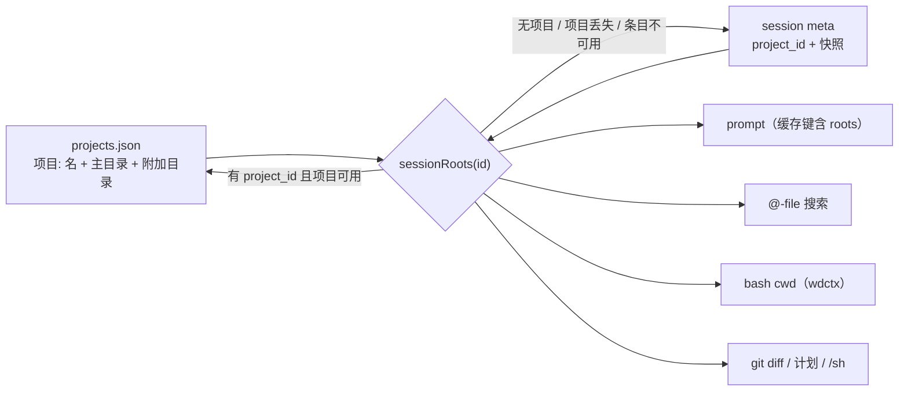

# Desktop Project（会话管理容器）设计

> 版本: 1.0 | 日期: 2026-09-15 | 状态: 项目本体未实现；§14.1/§14.2（checkpoint 根身份）、P0 收口与 P0-x 已在仓库里
> 前置: [2026-09-11-desktop-multi-workspace-design.md](2026-09-11-desktop-multi-workspace-design.md)（根集语义、
>       校验层、prompt 缓存键、`@`-file 多根已落地）
> 关联: [desktop/roots.go](../desktop/roots.go)、[desktop/agent_session.go](../desktop/agent_session.go)、
>       [desktop/agent_turn.go](../desktop/agent_turn.go)、[desktop/fileservice.go](../desktop/fileservice.go)、
>       [desktop/agent_driver.go](../desktop/agent_driver.go)、[desktop/agent_mcp.go](../desktop/agent_mcp.go)、
>       [desktop/uitheme.go](../desktop/uitheme.go)、[session/session.go](../session/session.go)、
>       [agent/compact.go](../agent/compact.go)、[agent/agent_checkpoint.go](../agent/agent_checkpoint.go)、
>       [agent/bootstrap.go](../agent/bootstrap.go)、[desktop/frontend/src/App.tsx](../desktop/frontend/src/App.tsx)

## 1. 背景与目标

desktop 现在每个会话各自持有 `WorkingDir + AdditionalDirs`（多工作区设计已落地）。同一棵树的多个会话因此
**互相不知道对方存在**：换一个仓库要多选一次目录，改了目录结构要一个个会话去改，侧栏里"同一个项目的
5 个会话"和"5 个无关的会话"长得一样。

本次引入 **Project**：一个有名字的工作区定义（主目录 + 附加目录），**拥有**一组会话。
会话从项目**继承**根集，自己不能改；改项目，里面所有会话一起变。

### 目标

1. 项目 = `{名称, 主目录, 附加目录}`，可创建 / 重命名 / 改目录 / 删除。
2. 项目里的会话**只读继承**根集：UI 上不可编辑，后端也**拒绝**写入（不是"界面没给按钮"）。
3. 改项目对**所有**成员会话立即生效，且不需要重建 agent、不需要 fan-out 写文件。
4. **项目不是必须的**：`NewSession()`（无项目）行为与今天逐字相同。
5. `tui` / `acp` / `channel` / `-p` **零改动、零依赖**：项目只存在于 desktop 的解析路径里。
6. 复用多工作区已建立的校验层（空白拒绝 / 存在且是目录 / 宽根拒绝 / `NormalizeAdditionalRoots`），
   项目根集与会话根集是**同一种东西**，不允许项目能存下会话存不下的路径；**读取侧也校验**——
   `projects.json` 是可以被手改的文件，不算可信输入（§3.1）。
7. **派生的会话不丢绑定**：任何"从已有会话创建新会话"的路径（今天只有 `/compact`）必须显式继承
   `project_id` 与快照，否则会话会在压缩之后**悄悄离开项目**（§3.2）。

### 非目标

- ❌ 项目级 provider / thinking / mode 默认值（见 §9，数据结构预留，本期不做）。
- ❌ 项目级 skills / MCP / hooks。技能的发现根仍只跟"主目录"走（`sessionSkillStore`）。
- ❌ 会话在项目之间迁移或在项目与"无项目"之间迁移（见 §6.3）。
- ❌ 跨窗口 / 跨进程的工作区实体（`.code-workspace` 式），项目只是 desktop 的会话分组。
- ❌ 把项目写进 `config.yaml`（理由见 §3.1）。

---

## 2. 核心机制：引用而非复制

**项目里的会话不存"根集"，存的是"我是哪个项目的会话"。根集在读取时由项目解析出来。**

这个选择之所以可行，是因为多工作区设计已经把根集做成了**每 turn 读取的会话属性**：prompt 每次重建
（`promptKey{ cwd, id, roots }`）、`@`-file 每次现搜、`wdctx` 每 turn 注入。今天"改会话目录"就已经是
"下一 turn 生效、无 invalidation hook"。项目要做的只是把"根集从哪来"再往前推一层：

```go
// desktop/roots.go —— 唯一的根集出口，项目解析插在这一个地方
func (d *desktopApp) sessionRoots(id string) (primary string, additional []string) {
    // 绑定了 run → 它的 per-session manager.Current()；否则稳定 manager.Load(id)
    return d.sessionRootsFrom(d.sessionRecord(id))
}

// sessionRootsFrom 拿的是已经加载好的记录：agent 构造发生在 run 绑定之前，只有 manager 可用；
// 它自己不取锁，beginTurn / expansionRoot 这类已经持有 d.mu 的地方可以直接调。
func (d *desktopApp) sessionRootsFrom(sess *session.Session) (primary string, additional []string) {
    if sess == nil {
        return "", nil
    }
    if sess.ProjectID != "" {
        if p, ok := d.projects.Usable(sess.ProjectID); ok {   // 项目在，且根集通过校验（§3.1）
            return p.WorkingDir, append([]string(nil), p.AdditionalDirs...) // 项目赢
        }
        // 项目不存在 / 条目不可用（被删、文件丢了、根是坏的）：退回会话自带的快照，见 §3.2、§8.6
    }
    return sess.WorkingDir, append([]string(nil), sess.AdditionalDirs...)
}
```

出口本身已经落地（§4）：今天 `sessionRootsFrom` 只有最后一行，项目解析是**唯一**待加的分支。

于是：

| 需求 | 怎么成立 |
|---|---|
| 改项目对所有会话生效 | 纯推论。没有副本可失去同步：成员会话**没有**自己的根集可读（快照不被读，见 §3.2） |
| 不需要 fan-out 写 | 一次写 `projects.json`，不是 N 次写 meta.json |
| 不需要重建 agent | 根集本来就是 per-turn 读的；prompt 缓存键已含 roots，下一 turn 自动重建 |
| 没有并发覆写 | 不写成员会话的 meta，就不会跟"running turn 的 AppendMessage / 用户重命名"抢同一份快照 |

> 反方案（把项目的根集**扇出复制**进每个成员会话的 meta）在数据上是自洽的，但会引入两个真实问题：
> N 份 meta 写放大，以及"某个会话的 per-session manager 手里拿着旧快照，下一次 `UpdateMeta`
> 把新根集覆盖回去"——`updateSessionMeta` 存在的全部理由就是这个。本期不走这条路。



---

## 3. 数据模型

### 3.1 项目存储：`~/.tachi/projects.json`

放 `config.BaseDir()` 下，与 `desktop_ui.json` 同一层、同一套读写方式
（`fileutil.ReadJSON` / `AtomicWriteJSONShared`，见 [uitheme.go](../desktop/uitheme.go)）。

```go
// desktop/projects.go
type project struct {
    ID             string    `json:"id"`                 // session.GenerateID()
    Name           string    `json:"name"`
    WorkingDir     string    `json:"workingDir"`         // 必填；相对路径基准、bash cwd
    AdditionalDirs []string  `json:"additionalDirs,omitempty"`
    CreatedAt      time.Time `json:"createdAt"`
    UpdatedAt      time.Time `json:"updatedAt"`
}
type projectFile struct {
    Projects []*project `json:"projects"`
}
```

- **全文件 JSON + 内存 map + 一把 `sync.RWMutex`**。单进程、低频写（用户点几次），不需要更复杂的东西。
- **读取侧同样校验**（`projects.Usable`）：根集要过与写入同一套规则（非空白、存在且是目录、非宽根、
  不含 `config.BaseDir()`，见 §8.5）。不过关的条目**不参与解析**：`sessionRoots` 退回该会话的快照并
  log 一条 warn。`projects.json` 是手可改的文件，一个 `/` 或 `$HOME` 从这里漏进 bash cwd / `@` 索引 /
  checkpoint 是这个特性最贵的失败方式。
- 文件缺失 / 损坏 → **降级为空项目表并 log**，与 `loadUIState` 同样的宽容策略；损坏的 `projects.json`
  不该让 app 起不来，最坏结果是成员会话退回自己的快照（§3.2，工作区仍然可用）。
- **没有跨进程锁**：全文件读写落在两个同时运行的 desktop 实例之间是"最后写者赢"。与 `desktop_ui.json`
  今天的语义一致——同时跑两个 desktop 属于不受支持的状态，不为它加锁。
- **锁序**：项目表自己的锁是纯数据锁，不做任何回调、不碰 `d.mu`。所以 `d.mu → projects.mu`
  这个顺序是安全的；反向不允许（写进注释约束住）。

为什么不放 `config.yaml`：那是用户手写的配置（provider / 权限），app 往里写是另一个量级的契约；
而且项目是**状态**不是配置。为什么不放仓库内 `.tachi/project.json`：那样项目会变成"目录的属性"，
既不能拥有仓库之外的会话，也会把其它入口拖进语义里——本期明确不做（§9）。

### 3.2 会话侧：`project_id` + 快照

```go
// session/session.go
type Session struct {
    ...
    // ProjectID binds this session to a desktop project. When set, the project's
    // roots WIN over WorkingDir/AdditionalDirs, which then hold only the snapshot
    // (see §3.2). Desktop-only: no other entry point reads it. Empty for every
    // session created outside a project, so old meta.json files read identically.
    ProjectID string `json:"project_id,omitempty"`
}
```

`WorkingDir` / `AdditionalDirs` **保留原字段不变**，在项目会话里充当**快照**：创建时写入一次，之后不改。

快照为什么还要留着（既然项目赢）：

1. **其它入口只读 meta。** TUI 选中会话会 `os.Chdir(s.WorkingDir)`（[session_selector.go:156](../tui/session_selector.go)），
   ACP 用 `loaded.WorkingDir` 当 cwd（[agent.go:479](../agent/acp/agent.go)）。不留快照，desktop 建的会话
   在 TUI 里就是"没有工作目录"——能用，但落在进程 cwd，等于丢掉了工作区。
2. **悬空项目**（项目被删、文件丢了）退化成"最后一次已知的好根集"，而不是"没有工作区"。
3. 零新概念：就是今天那两个字段，语义从"权威"降级为"快照"。

快照只在**三个时刻**写：**创建**（从项目复制）、**删除项目时的 detach**（§6.2）、**压缩派生的子会话**
（继承，见下）。正常编辑项目**不碰**它——这正是"不写成员 meta"这条承诺的落点，代价是其它入口看到的
可能是旧值（§8.2，明说）。

**绑定的写入点很窄，但"复制会话"的路径必须显式带上它。** `session.Manager.New(provider, workingDir)`
只接两个参数：任何没被显式赋值的字段都会静默变成零值，而不是报错。

| 路径 | 处理 |
|---|---|
| `NewSession(projectID)`（desktop，§6.1） | 唯一设值的入口：写 `project_id` + 从项目复制快照 |
| `FinalizeCompact`（`agent/compact.go`；`/compact` 与自动压缩共用同一条） | **必须显式继承**。它今天只带了 `ProviderName`/`WorkingDir`/`Title`/`ThreadID`/父链——`AdditionalDirs` 已经因此丢失；压缩子会话要补 `ProjectID` **和** `AdditionalDirs`（§10 钉住） |
| channel / ACP / agent 自动建会话 | 不设 `project_id`（项目是 desktop 的概念），行为不变 |

### 3.3 会话与项目的关联不落名

会话不存 `projectName`。`SessionInfo` 只加 `ProjectID`，名字由前端与 `ListProjects()` 的结果 join。
好处：**重命名项目 = 一次写 projects.json**，侧栏所有行、所有正在跑的会话措辞立刻一致，
不需要任何 fan-out，也没有"两处名字不一致"的状态。

---

## 4. 生效路径：根集只有一个出口

根集解析全部收在 `desktop/roots.go` 的两个函数里：**`sessionRoots(id)`**（按 id 取记录：绑定了 run 就用它的
per-session manager，否则读稳定 manager）与 **`sessionRootsFrom(sess)`**（已经拿到记录时用；不取锁，
因此可以在持有 `d.mu` 的地方调用）。**每一个消费点都走这两个函数，项目解析也只在 `sessionRootsFrom`
里加一个分支。**

| 消费点 | 出口 | 用在哪 |
|---|---|---|
| `beginTurn`（`desktop/agent_turn.go`） | `sessionRootsFrom` | turn 的 bash cwd（`wdctx`） |
| `expansionRoot`（`desktop/fileservice.go`） | `sessionRootsFrom` | `@` 引用的解析基准 |
| `sessionWorkDir`（`desktop/fileservice.go`） | `sessionRoots` 的薄封装 | prompt 的 cwd、`/sh`、git diff、composer chip |
| `sessionPrimaryDir`（`desktop/agent_driver.go`） | `sessionRootsFrom` | skill store 的扫描根（build 时定，见 §4.1） |
| `promptRoots`、`GetSessionRoots`、计划面板、`@` 搜索、turn changes | `sessionRoots` | 其余全部消费点 |

**为什么必须是"一个"**：这些消费点各自读 `Session.WorkingDir` 时，一次目录变更只移动了读记录的那几个
（bash、`@`、git），而 prompt 与 chip 还在说旧树——**没有任何东西会失败**，只是安静地分叉。项目把解析
从会话记录推到了项目表，这条缝只会更宽，所以新加的消费点也必须走这两个函数。

唯一的例外是 `defaultWorkspaceFor`：它按定义要看会话**自己的快照**来做"最近用过哪个目录"的推断（§8.1）。

界面之外还有一处不走 desktop 的解析器：**checkpoint 的根集在 agent 侧解析**，它读会话记录——见 §14.3。

### 4.1 skill store 必须显式重建（两处"显式动作"之一）

技能 store 的扫描根在 **build 时固定**（[agent_driver.go](../desktop/agent_driver.go) 的 `sessionSkillStore`），
今天的 `SetSessionWorkingDir` 是用 `a.ReloadSkillsIn(abs)` 把活着的 agent 重新指过去的。
根集改成 per-turn 解析之后，**prompt / 工具 / `@` 自动跟上，但 skill store 不会**——
它只在 agent 构造时读一次。所以：

> **改项目的主目录时，必须把 `ReloadSkillsIn(<配置根>)` 扇出给所有成员会话的活 agent**（遍历 `d.runs`）。

传的是**配置根**而不是工作根：无 worktree 绑定时两者是同一个目录，有绑定时技能必须来自主检出（§13.5）。

这是"每-turn 读取"与"build 时固定"两种机制之间最隐蔽的一条缝。漏掉它的症状很轻：工具去了新目录，
prompt 说了新目录，但项目技能列表还是旧仓库的。写进实现清单，并由 §10 的测试钉住。

### 4.2 prompt 缓存

不用做任何事，但要理解为什么不用做：`promptKey{cwd, id, roots}` 已经含 roots，
改项目 = 新键 = 重建。**代价是真的**：system prompt 变了，provider 侧的前缀缓存从那一行起全 miss,
所有成员会话的下一 turn 都会重读尾巴。这是正确性的必然代价（prompt 确实变了），
但意味着"编辑项目"是一个**比它看起来更贵的动作**——UI 文案上不必说，但别做成拖拽式实时落盘
（每次拖动都写文件、每次读都是新根集 = 连续 miss）。

---

## 5. 不可改：两处都堵

"会话继承设置，且不能改"必须在**后端**成立，不能只靠前端不渲染按钮——binding 是可独立调用的。

| 位置 | 行为 |
|---|---|
| `SetSessionWorkingDir(id, dir)` | 成员会话 → 直接返回 `项目「X」管理该会话的工作区：请到项目里改目录` |
| `AddSessionRoots(id, dirs)` | 同上 |
| `RemoveSessionRoot(id, dir)` | 同上 |
| `GetSessionRoots(id)` VO | 加 `projectId` / `projectName` / `projectMissing`（+ 现有 `primary`/`additional`），前端据此渲染只读面板 |

判定条件是**"会话带 `project_id`，且该项目当前可用"**——与 §2 的解析调用同一个 `projects.Usable`。
三种状态各自有明确出路：

| 会话状态 | 根集来自 | 可编辑 | UI |
|---|---|---|---|
| 项目在 | 项目 | 否 | 只读面板 + 「编辑项目…」 |
| 项目被删（走过 detach，§6.2） | 自己的快照 | 是（已是普通会话） | 普通面板 |
| `project_id` 悬空（`projects.json` 丢了 / 被手改坏） | 自己的快照 | **是** | 只读面板 + 「项目已丢失，当前使用快照；可直接编辑工作区」 |

悬空必须是**可编辑**的：只读面板 + 三处拒绝写入 + §6.3「不提供移出项目」叠起来，会让用户除了手改
`meta.json` 无路可走；而它保护的东西——"别让两个会话各自长出一个工作区"——在那个状态里已经没有项目
可以让人去同步了。项目丢失是**降级**，不是**锁定**。

---

## 6. 生命周期

### 6.1 创建

```
项目:      CreateProject(name, primary) → SetProjectRoots(id, primary, additional)
           name 默认取 primary 的 base name（~/repos/foo → foo），重名加 -2 / -3 后缀
会话:      NewSession(projectID string) SessionInfo
             projectID == ""  → 与今天逐字相同（defaultWorkspaceFor 继承规则不变）
             projectID != ""  → meta 写 project_id + 快照（从项目复制）
```

- **这是唯一给会话设 `project_id` 的地方**；`/compact` 派生子会话走继承，不重新解析（§3.2 的表）。

- 校验复用 desktop 约束层：`validateRootPaths`（拒空白 / 必须存在且是目录）+ `wideRootReason`（拒 `/` 与 `$HOME`）
  + `agent.NormalizeAdditionalRoots`。**项目主目录照同样标准守卫**：`~/` 是宽根，项目也不许。
  空白规则在项目上更要紧——一条坏根会**乘上会话数**继承下去。
- 绑定签名：`NewSession()` → `NewSession(projectID string)`。前端两处调用改为显式传 `''`；
  **必须重跑 `cd desktop && GOWORK=off wails3 generate bindings -clean=true -ts -i`**（绑定是提交进仓库的）。
  先 grep `itest/desktop/drivers/` 有没有直接调 binding 的脚本（目前都是点 UI）。
- 新建项目时**不改** `desktop_ui.json` 的 `lastWorkspace`：项目选择不是"无项目会话的工作区选择"，
  两者混在一起会让"新建无项目会话"落在一个人没预期的地方。

### 6.2 删除项目

删除必须给成员一个交代。三种做法里选**detach（保留工作区）**：

| 方案 | 评价 |
|---|---|
| **detach**（采用） | 每个成员会话：`WorkingDir/AdditionalDirs ← 项目当前根集`，清 `project_id`。会话变成普通会话，可继续用、可再编辑。**用户不会丢工作区** |
| 拒绝删除 | 语义最干净，但一个项目攒了几十个会话后，删除前要一个个搬——用户会恨它 |
| 级联删会话 | 删数据，不做 |

detach 的实现要点（这是本设计里唯一一次写成员 meta，要按最严格的规矩来）：

1. **"有没有成员在跑 turn" 的判定与随后的写入必须在同一个临界区里**（`d.mu` 下取成员列表与
   `r.running` 快照），与 `DeleteSession` 同一写法：两者之间插进一个新 turn，就会在 turn 正在写会话目录
   时改 meta。错误文案复用同一句式。
2. detach 循环走 `updateSessionMeta(id, mutate)`（**同一份快照读改写**）：绑定了 run 的会话改
   `r.sm.Current()` 再 `UpdateMeta`，未绑定的走稳定 manager 的 load+UpdateMeta。不许直接写文件。
3. 快照刷新到**删除那一刻**的项目根集，而不是创建时的——否则"调大过目录的项目被删掉，成员会话跳回旧根集"
   会很意外。
4. detach 之后：`ReloadSkillsIn` 已经是活 agent 的成员（同上 §4.1），`GetSessionRoots` 的只读标志失效，
   并按 §7.4 推一次工作区刷新——否则打开的会话还挂着项目名与旧目录。

### 6.3 会话能否离开项目

**不提供**"移出项目"（严格按"不能改"）。理由：只要存在个体退出路径，"项目改了所有会话都跟着变"
就不再是无条件成立的，而 §2 的整套机制正是建立在"成员会话没有自己的根集"之上。
真要做，语义应当是"detach = 快照当前根集"，与删项目复用同一段代码，届时再评审。

项目**丢失**不算退出路径（§5 的状态表、§8.6）：那时项目已经无从同步，会话自动回到"用自己的快照、
可编辑"，但 `project_id` 保留，修好 `projects.json` 就回到项目里。

---

## 7. UI

### 7.1 侧栏：按项目分组

`ListSessions()` → `SessionInfo` 加 `ProjectID`；侧栏把会话渲染成「项目组 + 无项目组」：

```
＋ 新建会话        ＋ 项目
─────────────────────────
▾ tachi            (3)      ← 项目组头：名字 / 成员数 / 主目录 title
    · 会话 A
    · 会话 B
    · 会话 C   ▸ 压缩前 2 节
▾ shared-lib       (1)
    · 会话 D
─────────────────────────
无项目                       ← 只在非空时显示
    · 会话 E
```

- 组头右键菜单：重命名 / 编辑目录… / 删除项目…（删除走 §6.2 的确认，列出受影响会话数）。
- 组头自带 `＋`：**在该项目里新建会话**，这是最直接的入口，也天然回答了"新会话属于谁"。
- 折叠状态与 `openChains` 一样只存内存、不落盘。
- 会话行上加项目徽标会与分组重复，**不加**——分组已经说清楚了。

### 7.2 工作区面板：项目会话只读

`RootsPanel`（[components.tsx](../desktop/frontend/src/components.tsx)）加一个只读分支：

```
工作区目录            由项目管理
主目录     /Users/x/tachi
附加目录   shared-lib /Users/x/shared-lib
           ─────────────────────────
           该项目下的会话共用这组目录，修改项目会影响其中所有会话。
           [ 编辑项目… ]  [ 新建项目会话 ]
```

- 只读分支**不渲染**更换 / 添加 / 移除按钮——后端已拒绝，前端还要让"为什么不能点"一眼可见。
- composer 的 chip 在项目会话里显示项目名（而不是目录 base name），popover 里才有完整路径。
- 没有主目录的普通会话保持现状（`未设置工作目录` + 引导选择）。

### 7.3 新建项目对话框

名字 + 主目录（单选 picker）+ 附加目录（多选 picker，复用 `addRoots` 的同一条路）。
两处 picker 的形态与现有"更换主目录 / 添加目录"一致，不引入新交互（多选 picker 的 `AllowsMultipleSelection`
已经在用，见多工作区设计 §7.9）。

### 7.4 项目变更后的刷新契约

前端关于工作区的 state（composer 的 chip、只读面板、侧栏组头）都是**拉取**来的：`refreshWorkspace(id)`
只在切会话与手动选择目录之后跑。而项目变更改的是**后端**的解析结果，它不会自己到达一个已经打开的页面。
所以每次项目写操作（新建 / 重命名 / 改目录 / 删除）之后，desktop 必须做到：

1. **当前会话**重读一次工作区（`GetSessionWorkingDir` + `GetSessionRoots`），更新 chip 与面板；
2. **侧栏**重读 `ListSessions()` + `ListProjects()`——重命名只改后端名字，行上的措辞来自 join（§3.3）；
3. detach 之后把该会话的面板从只读切回普通形态（§5 的状态表）。

实现上走已有的事件通道推一条 `agent:workspace_changed`（带 `sessionId` / `projectId`），比在每个按钮的
回调里各写一次刷新更难漏掉。

---

## 8. 边界与风险

### 8.1 与"无项目会话"的默认目录规则共存

`defaultWorkspaceFor()` 不变：`lastWorkspace` → 最近更新的会话目录 → 留空。项目成员会话的**快照**里
仍然有 `WorkingDir`，所以它们照旧参与"最近更新"这条扫描——行为连续，不用改。副作用：无项目新会话
可能继承到某项目的主目录，这是**可接受的**（那确实是一个合法、不宽的目录）。

### 8.2 其它入口看到的是快照（已知且有意的差异）

项目改了根集之后，TUI / ACP 打开这个会话用的是**创建时**的快照。选择：

- ✅ 接受并文档化："项目的根集属于 desktop"。
- ❌ 在每次项目编辑时同步写 N 份 meta（fan-out，见 §2 反方案）。
- ❌ 让其它入口也解析项目（把 `projects.json` 变成共享状态，并且要动 4 个入口——本期明确不做）。

真正要紧的一点：**快照不会把用户带进一个危险的目录**。它要么是创建时校验过的合法根，要么（detach 时）
是删除那一刻校验过的合法根，永远不会是 `/` 或 `$HOME`。

### 8.3 项目主目录变更后的历史消息

与"切换会话主目录"同一个既存问题（历史里的相对路径指向新树），多工作区设计 §8.2 已记录，
不因项目而加剧。不做处理。

### 8.4 每次编辑项目的真实成本

- 成员会话下一 turn 的 prompt 前缀缓存 miss（§4.2）。
- 成员的 skill store 重新扫描（`ReloadSkillsIn`）。
- 成员的 git 探测/`@`-file 索引按新根重建（首次搜索要遍历整棵树）。
- 前端按 §7.4 跑一轮刷新（binding 往返，不贵，但漏了就是"面板在说谎"）。
- **有两样东西不跟随**：MCP servers 与 per-project 权限是**进程级**的——前者在 bootstrap 时按进程 cwd
  加载一次（`agent/bootstrap.go`），后者同样取进程 cwd（`agent/agent_configure.go`）。改项目不会动它们，
  它们的落点是 §13.5 的配置根改造（worktree 那一期），不在本期范围。
  → 编辑项目 = "一次不算小的动作"，UI 上不要做成连续拖动落盘。

### 8.5 宽的、坏的根会乘上会话数

会话级校验里 `wideRootReason` 只拒 `/` 与 `$HOME`，空白路径直接拒。项目层面**一条都不能放宽**：
一条坏根会继承给所有成员。校验代码**必须复用同一个函数**，不许为项目另写一套。

这条规则同时约束**写入与读取**：写入侧拒收（用户当场看到理由），读取侧把不过关的条目当作不可用
（§3.1 的 `Usable`，退回快照 + warn）——手改过的 `projects.json` 不该是一条绕过校验的快车道。

**`config.BaseDir()` 也纳入宽根拒绝。** 今天只拒 `/` 与 `$HOME`，于是 `~/.tachi` 是一个合法根——
可它底下是 Tachi 自己的状态（每个会话的影子仓库、`session/`、worktree 目录）：一个罩住它的根会把
自己的快照、`@` 索引和 git 探测全部指向 Tachi 的内部文件，而 worktree 的"不落在任何根内"（§13.3）
也就再无保证。规则与既有两个宽根同级：同样是"不用遍历就能断定的错误"，同样一句话说清理由。

### 8.6 项目表丢失、损坏、条目不可用

三种情况都**降级，不锁定**，差别只在粒度：

| 情况 | 项目表 | 成员会话 | 后果 |
|---|---|---|---|
| 文件缺失 / JSON 损坏 / 半写 | 空表 + warn | 退回自己的快照 | **可编辑**（§5 状态表第三行） |
| 单个条目不可用（根是 `/`、`$HOME`、含 `config.BaseDir()`，或目录已消失） | 其余条目照用 | 该项目的成员退回快照 + warn | 同上；修好文件即恢复 |
| 项目被正常删除 | 该条目移除 | 已 detach（§6.2） | 普通会话，可编辑 |

`project_id` **不自动清除**：用户修好 `projects.json` 就回到项目里，这正是"引用而非复制"的应有之义（§2）。
降级方向永远是"回到会话自己的那组目录"——它要么是创建时校验过的合法根，要么（detach 时）是删除那一刻
校验过的合法根，永远不会是 `/` 或 `$HOME`。

---

## 9. 非目标与后续演进

**数据结构预留**：`project` 是 whole-file JSON + 字段 `omitempty`，加字段是加法。后续可考虑：

1. **项目级 provider / thinking / mode 默认值**：语义不同于根集——新会话**复制**（copy-at-creation），
   老会话不追溯（provider 变更要重建 agent，不是 per-turn 读取能覆盖的）。
2. **项目级 skills**：`sessionSkillStore` 现在只扫主目录；项目可以声明一个额外的技能根。
3. **`/roots` 命令**：多工作区设计 §7.7 的 Phase 2 项，项目落地后更有价值（一条命令看清根集来自哪）。
4. **项目内会话的看板 / 活跃度**：侧栏组头的 `(3)` 只是计数。

---

## 10. 测试计划

**Go（`desktop/projects_test.go` + 既有 roots/session 测试扩展）**

| 用例 | 断言 |
|---|---|
| 项目表读写 | 创建/重命名/改目录落盘；文件缺失 → 空表不报错；**损坏 JSON → 空表 + 不 panic** |
| 读取侧校验 | 手改的 `projects.json` 里根是 `/` / `$HOME` / `config.BaseDir()` / 已消失 → 该条目不可用，成员退回快照（`sessionRoots` 与 `GetSessionRoots` 都是） |
| 解析优先级 | 成员会话 `sessionRoots` 返回**项目**的根集；**改项目后再读拿到新值**（不需要任何 fan-out） |
| 悬空 project_id | 项目不存在 → 退回会话快照、`GetSessionRoots` 仍可读，且**三个编辑 API 放行**（§5 状态表第三行） |
| 不可改 | 项目可用时：`SetSessionWorkingDir` / `AddSessionRoots` / `RemoveSessionRoot` **返回拒绝**且**不写盘** |
| 创建 | `NewSession(projectID)` 写 `project_id` + 快照 == 项目根集；`NewSession("")` 行为与今天一致 |
| 压缩 | `/compact` 后子会话**仍带 `project_id`**，且 `AdditionalDirs` 不再丢失（§3.2 的表） |
| 宽根 | `~/.tachi`（`config.BaseDir()`）作为会话根或项目根一律被拒（§8.5） |
| 删除项目 | 有成员在跑 → 拒绝；否则成员 detach（`project_id` 清空、快照 == 删除那一刻的根集）；**绑定了 run 的成员会话其 `sm.Current()` 也被更新**（否则下一次 UpdateMeta 会覆写回去），且面板恢复可编辑 |
| skill store | 改项目主目录 → 成员活 agent 的 store 根已重指（§4.1，最易回归） |
| checkpoint 根 | 成员会话的 checkpoint 覆盖**项目解析出来的**根，而不是 meta 里的快照（§14.3 的 `RootsFunc`） |
| prompt | 成员会话的 prompt 含项目主目录；改项目后下一 turn 的 prompt 变了（缓存键含 roots） |
| `@`-file | 项目附加根可被搜到，引用是绝对路径；主目录命中是相对引用 |
| bash cwd | 成员会话的 turn ctx 的 `wdctx.Dir` == 项目主目录（§4 的 #1） |

**前端 / smoke**：新增一个 scenario（sandbox 预置 `projects.json` + 会话 `project_id`，因为 UI 里
建项目要过 native picker，driver 点不动——与 `extraRoots` 同样的处理）：

- 侧栏出现项目组头与成员行；无项目会话在另一组。
- 成员会话的工作区面板**只读**（没有更换/添加按钮），且文案指向项目。
- 改项目主目录 → **另一个**成员会话的下一 turn prompt 里是新目录（在 LLM 边界断言，不是只断言 UI）。
- 改项目 / 删项目之后，**打开着的**那个会话的 chip 与面板跟着变（§7.4 的刷新契约）。

---

## 11. 分阶段

| 阶段 | 内容 |
|---|---|
| **P0 收口**（✅ 已落地，纯重构） | 根集解析收成 `sessionRoots` / `sessionRootsFrom` 一个出口，4 个直读 `Session.WorkingDir` 的消费点全部改走它（§4）；`wideRootReason` 补上 `config.BaseDir()`（§8.5）；`TestRootSetHasOneSource` 钉住"五个消费点同源" |
| **P0-c（✅ 已落地，与项目无关）** | checkpoint 的根身份规则（§14.1/§14.2）：工作树从记录里取、影子仓库按路径命名、预览说清"这一轮记录的是哪个树"、目录不存在时明确报错。**独立于项目，可单独合**（有回归测试） |
| **P0-x（✅ 已落地，独立的小修）** | `FinalizeCompact` 丢掉 `AdditionalDirs`（§3.2）：压缩子会话显式继承附加根。它与项目无关，但正是 `project_id` 之后会踩的同一个坑 |
| **P1 项目本体** | `projects.json` 存储（含读取侧校验）+ 校验复用 + `Session.ProjectID` + `sessionRoots` 项目解析 + 4 个项目管理 API + 只读 + 后端拒绝写 + checkpoint 根集走同一出口（§14.3） |
| **P2 创建与删除** | `NewSession(projectID)` + 快照写入 + `/compact` 继承绑定（§3.2）+ detach 删除（含同一临界区取 running、skill 重指）+ 绑定重生成 |
| **P3 UI** | 侧栏分组 + 组头菜单 + 只读 RootsPanel + 新建项目对话框 + 刷新契约（§7.4）+ smoke scenario |
| **P4 worktree** | 会话级 worktree 绑定（§13）：创建 / 绑定解析 / 配置根区分 / 清理入口。依赖 P0-c；**配置根那一步（§13.5）要先做完 MCP 与 permissions 的进程级改造**，范围以那一节的结论为准 |
| **P5（可选）** | §9 的演进项 |

---

## 12. 决议

1. **项目存储位置**：`~/.tachi/projects.json`（§3.1）。与 `desktop_ui.json` 同层同套读写；项目是 desktop
   的**状态**不是用户配置；其它入口零依赖。不进 `config.yaml`，不进仓库内 `.tachi/project.json`。
   不设跨进程锁（多实例同时运行属不受支持的状态）。
2. **删除项目**：**detach 保留工作区**（§6.2）。成员把"删除那一刻"的项目根集写进自己的快照、清 `project_id`，
   变成普通会话；有成员在跑 turn 时拒绝删除。
3. **会话能否离开项目**：**不提供**（§6.3）。"项目改了所有会话都跟着变"必须是无条件的——存在个体退出
   路径就不再成立，而整套机制正建立在"成员会话没有自己的根集"之上。项目**丢失**时的降级不算退出路径：
   那时已经无从同步，会话回到可编辑（§5 状态表、§8.6）。
4. **侧栏形态**：**按项目分组**（§7.1）。组头 = 项目名 + 成员数 + 主目录 title，右键菜单
   （重命名 / 编辑目录 / 删除项目），组头自带 `＋` 直接在该项目里建会话；无项目会话单独一组；
   压缩链折叠保留在组内。
5. **不可用即降级**：项目表损坏、单个条目坏、项目被删——一律退回会话快照，且**会话可编辑**。项目丢失是
   降级不是锁定（§5、§8.6）。
6. **派生的会话跟着项目**：`/compact` 的子会话继承 `project_id` 与快照，不重新解析（§3.2）。
7. **项目名默认值**：取主目录的 base name（`~/repos/foo` → `foo`），重名加 `-2` / `-3`。
8. **无项目会话的默认目录规则不交叉**（§8.1）：`defaultWorkspaceFor()` 保持现状——项目成员的快照照旧参与
   "最近更新"扫描，可继承到某项目的主目录，这是可接受的。
9. **宽根不加启发式**：只有"不用遍历就能断定"的判据（`/`、`$HOME`、`config.BaseDir()`），不做
   "目录下文件太多"这类软提示。

---

## 13. worktree 支持

### 13.1 要解决的问题

项目的主目录通常是一个 git 仓库，而**同一个仓库里的两个会话会互相踩**：共用分支、共用工作区、共用 index，
一个会话的 `git checkout` 会把另一个会话正在看的文件换掉。`git worktree` 给出第二份检出：独立 HEAD /
index / 工作区，对象库共享（几乎不占额外磁盘）。这正是"一个项目多个会话并行干活"缺的那一块。

### 13.2 粒度：绑定在**会话**上，但只能在项目声明的 repo 之间派生

```
项目: { 主目录: /repos/tachi, 附加目录: [/repos/shared-lib] }
  会话 A → 主 checkout      roots = [/repos/tachi, /repos/shared-lib]
  会话 B → worktree         roots = [~/.tachi/worktrees/<pid>/9f3a2c8e, /repos/shared-lib]
                             绑定 { RepoRoot: /repos/tachi, Branch: tachi/9f3a2c8e }
```

- 会话记 `Worktree { RepoRoot, Path, Branch }`（`RepoRoot` 必须是**项目当前根集里的某一项**；v1 只放开主目录）。
- 解析规则与项目一致地插在 `sessionRoots` 里：**主根 = `Worktree.Path`**，其余照抄项目当前的附加目录。
  v1 的项目主目录就是被绑定的那一项，所以这条写死为"主根换成 worktree"；项目后来改了主目录也不影响
  绑定——会话不会因为项目换了目录就失去工作区，附加目录照旧跟随项目。
- 于是"会话不能改自己的根集"仍然成立：它选的不是"一个目录"，而是"项目这个 repo 的哪一份检出"。
- **不是**项目级开关：项目级一旦切换，全体成员会话的根集同时变，而并行工作恰恰是这个特性的目的。

### 13.3 硬约束：worktree 路径不能落在任何根内部

`checkpoint.normalizeRoots` 会**丢掉嵌套根**（嵌套会被父根重复快照），`@`-file 索引也会重复覆盖。
所以 worktree 若建在主检出之内（`<repo>/.worktrees/x`），结果是：worktree 自己的快照**静默消失**，
而父根的快照把它整份吞进去。

规则：**worktree 路径必须不落在会话根集的任何一项之下**，**创建时逐项校验**（包含关系由 `filepath.Rel`
判定），错误文案与宽根守卫同级——同样是"不用遍历就能断定"的判据。这条校验是**真判据**，不是对位置选择的
背书：`~/.tachi` 曾经是合法根（只拒 `/` 与 `$HOME` 时），"放在 `~/.tachi/worktrees` 下就安全"这个推论
只有在校验器自己也拒绝 `config.BaseDir()` 之后才成立（§8.5，本期纳入，两层保险）。

### 13.4 生命周期

| 动作 | 规则 |
|---|---|
| 创建 | `git worktree add -b tachi/<会话短ID> <path> <base>`；repo 无首个提交 → 明确报错；分支已存在 → 报错，不静默换名 |
| 绑定 | **只在会话创建时选定**（"在主检出中新建 / 新建 worktree"）；整个对话历史因此总是发生在同一棵树里，检查点与树一一对应 |
| 解绑 | 与 §6.3 一致：不提供（要么换会话，要么删会话） |
| 清理 | 删会话时**询问**是否移除 worktree：`git worktree remove`（脏工作区会被 git 拒绝 → 如实转述，不自动 `--force`）；**分支保留**（工作成果不丢） |
| 被外部删掉 | 目录消失 → 根集失效规则（多工作区 §5.4）：不进 prompt、`@` 跳过；rewind 必须给可读原因（§14.2 第 2 条） |

**位置**：`~/.tachi/worktrees/<project-id>/<会话短ID>`（`config.BaseDir()` 下，与 `session/` 同级）。
`<project-id>` 用 **ID 而不是名字**：项目重命名不该移动磁盘上的目录，而 `git worktree list` 里那条路径
跟着改名走只会让人困惑。分支名 `tachi/<会话短ID>` 本身已经标识了归属，路径不必再重复一遍分支名。

这个位置带三条连带影响，实现时必须覆盖：

1. **Tachi 是这棵树的拥有者**，所以 `git worktree remove` 失败（脏工作区）、目录被手删、项目/会话记录
   消失留下的孤儿目录，都要有一个**清理入口**——落在项目组头菜单的「worktree…」里：列出该项目下
   `git worktree list` 与磁盘现状的差集（在册 / 磁盘上已消失 / 孤儿目录），逐条给「移除」与「prune」。
   prune 不是可选项：`.git/worktrees/<name>` 元数据在**用户的仓库里**，手删目录不会让它自己消失。
2. **位置不保证 §13.3**（见上）：嵌套由创建时的显式校验拦住，位置只是让这个校验在正常配置下必然通过。
3. **配置根必须显式指向主检出**（§13.5）—— 这一条从"应该做"变成"必须做"。

**不要复用 `agent/subagent/worktree.go`**：那是 tmp 目录 + detached HEAD + 用完自动删除 + 失败降级共享目录，
语义与"用户长期持有的检出"正相反。可以复用的只有 `isGitRepo` 这类探测。

### 13.5 配置根与工作根分离（必须显式处理，否则技能会凭空消失）

`config.FindProjectRootFrom(dir)` 找的是**含 `.git` 的那一层**（`fileutil.Exists`，所以 worktree 的 `.git`
文件也算）。worktree 是一份干净检出，项目级的 `.tachi/skills`、`.claude/skills`、`.cursor/skills`、
`.tachi/mcp.json` **通常不在里面**（未跟踪 / 被 .gitignore），而技能 store 的扫描根正是取自这一层，
且 `List()` 在目录不存在时**静默跳过**——症状是"技能列表空了"，没有任何报错。

规则：**工作根 = worktree；配置根 = 项目主目录（该 repo 的主检出），由会话显式给出**，
不再依赖 `FindProjectRootFrom` 的向上探测（后者在没有 `.git` 的目录里原样返回入参，语义会含糊）。
没有 worktree 绑定时两者是同一个目录，今天的所有会话行为不变。

| 跟随工作根 | 跟随配置根 |
|---|---|
| `@`-file 索引与 `SearchFiles`、bash cwd（`wdctx`）、git 探测、`/sh`、diff / turn changes | `sessionSkillStore` 的技能扫描根、MCP profile（`mcp.json` / `mcp.<profile>.json`）、`permissions.yaml`、`.tachi.md` |
| `.tachi/plans`（`SavePlan` 本来就取 `wdctx.Dir`）：计划是这个会话的产物，不是项目配置 | |

**落点与前置条件**（不是"改两个地方"就够）：

1. **技能**：`sessionSkillStore`（`agent_driver.go`）本来就接收一个目录，改成接收**配置根**即可；
   `ReloadSkillsIn` 的入参同步改成配置根，否则在 worktree 会话里换目录会把技能指回工作根（§4.1 同一条路径）。
2. **MCP 是进程级的，而且今天取的是进程 cwd**：`agent/bootstrap.go` 启动时按 `config.FindProjectRoot()`
   加载一次 `cfg.MCPServers`（一份全局 slice），`desktop/agent_mcp.go` 的 profile 列表与切换也都取
   `config.FindProjectRoot()`。desktop **从不 chdir**，所以"进程 cwd"在 Finder 启动时是 `/`——项目级
   `mcp.json` 今天在 desktop 里并不是"按会话生效"，而是"按 app 启动目录生效"。
   配置根要真正成立，这里必须先做一步改造：**MCP servers 按项目（主检出）加载或合并，profile 查询接受
   一个显式的配置根**。这是 P4 的前置项，不是附带项。
3. **权限**：`permissions.yaml` 同样取进程 cwd（`agent/agent_configure.go`），与 MCP 是同一条改造。
4. **`.tachi.md`**：它读的是工作目录（`project_reminder.go`）。按上表改取配置根——它是项目级的模型指令，
   与 `.tachi/skills` 同一性质；不改的话 worktree 会话同样会"静默少一条项目上下文"。

### 13.6 UI

侧栏组头的 `＋` 改为菜单：`在主检出中新建` / `新建 worktree`（无需输入分支名，默认 `tachi/<会话短ID>`，
只在分支冲突时提示改名）。组头右键菜单里再放一条「worktree…」= §13.4 的清理入口。会话行上给 worktree
会话一个分支标记（`⑂ tachi/9f3a2c8e`）。工作区只读面板（§7.2）里列出
`主检出 → ~/.tachi/worktrees/<pid>/9f3a2c8e（分支 tachi/9f3a2c8e）`，并说明"由项目派生，会话不可修改"。

---

## 14. 对 checkpoint / rewind 的影响

### 14.1 根身份：一棵树 = 一个影子仓库（✅ 已落地）

一条不变式：**检查点记录的是"哪一棵树"（路径），不是"根集里的第几项"**。根集是排序过的、可变的
（换主目录、增删附加根、项目编辑、切 worktree 都会动它），而按位置索引的东西会在一次排序平移之后
指向另一棵树。落地成三条规则：

1. **影子仓库按根路径命名**（路径短哈希；`RootState.Store` 记目录名），不按 index：两棵不同的树不共用
   ref 命名空间与 index 缓存。
2. **读一个已有检查点时，工作树从记录里取**（`repoFor(state)` 用 `record.RootState.Root` 当 `--work-tree`），
   永不从当前根集取；当前根集只用来**给本轮**打快照（`currentRepo`）。违反这条的后果不是报错，而是
   **跨树写入**：`Preview` 拿现在这个目录去跟旧树的快照比（数字毫无意义），`Restore` 把旧树的内容写进现在
   这个目录、还会删掉"旧树里没有"的当前文件——而卡片照样报告"已还原"。
3. **增删一个附加根也是一次"换根"**：排序会让后续 index 全部平移，`refs/tachi/NN/*` 于是指向另一棵树。
   这是规则 1、2 的直接理由，也说明它们不能靠"换主目录时清理一下"绕过去。

老记录（`Store` 为空）按 index 布局继续可读，且**同一路径沿用已有的那个 store**（`storeFor`）：升级不会
让老会话付一次冷快照，提交链也不会断（`parentRef` 按「路径 + store」找父提交）。**不需要数据迁移。**

### 14.2 说清"记录的是哪个树"、目录没了给原因（✅ 已落地）

1. **预览必须说清"这一轮记录的是哪个工作区"**：`Preview.RootMismatch` 在目标轮的根集与当前根集不一致时
   给出那句话，desktop 卡片与回退通知都显示它。
2. **目录已不存在**时给出可读原因（不再是原始 git 报错）：`resolveTarget` 用 `missingRootDirs` 判定，
   结果是 `FilesUnknown` + 一句话，对话照常回退、文件一个不还原（与快照侧同样的 all-or-nothing）。
3. **回归测试**：`agent/checkpoint/rootchange_test.go` 五条 —— 换根后回退还原**记录过的**那棵树且不动新树、
   同一路径因排序平移到别的 index 仍回到自己的 store、无变化时不误报 mismatch、记录根消失时给原因、
   老布局的 store 被沿用且提交链不断。

语义因此是**每棵树各自回到它记录过的状态**：在某棵主检出里跑的轮次，回退还原的是那棵主检出；在 worktree
里跑的轮次，还原的是 worktree。这比"根集一变就禁止回退"更对 —— 后者恰好会在用户最需要回退的时候
（刚切了树）把它拿走，也就等于把"换目录"变成一个不可逆动作。

### 14.3 项目会话：根集必须来自同一个出口

`checkpointRoots(sess)` 现在**直接读会话记录**的 `WorkingDir + AdditionalDirs`。项目会话里那是**快照**
（创建时的值），而工具、prompt、`@` 都用项目解析出来的**实时**根集。若不改，后果是静默的：

| 情况 | 症状 |
|---|---|
| 项目改了主目录，旧快照路径**还在** | 检查点一直在给**旧目录**打快照，agent 却在**新目录**里写 → 回退还原不到任何真实改动，还报"已还原" |
| 项目改了主目录，旧快照路径**没了** | `guard` 失败 → `rec.Skipped` → 该轮**没有文件状态**，回退只能报"未还原任何文件" |

所以：**checkpoint 的根集必须与工具用同一套解析**。落点最小改动是给 `agent.Config` 加一个可选解析函数
（`nil` = 今天的行为，tui/acp/channel 一字不改）：

```go
// RootsFunc resolves the roots a checkpoint should cover for a session.
// nil = WorkingDir + AdditionalDirs as recorded (today's behavior).
// Desktop sets it to the project-aware resolver, so a checkpoint covers exactly
// the tree the tools worked in.
RootsFunc func(*session.Session) []string
```

不把项目解析结果回写进内存里的 `sm.Current()` 让 agent 顺便看到：那是在没有锁保护的情况下改一个别的
goroutine 正在读的结构体，数据竞争换来的只是省一个字段。

### 14.4 worktree 特有的几点

1. **不产生跨树写入**：靠 §14.1 的规则成立 —— 每个轮次还原的是它自己记录过的那棵树。
2. **冷快照成本**：`git worktree add` 出来的是一份完整检出，首次写入的那一轮要付一次全树遍历
   （量级：2k 文件约 1.4s）并计入 `max_files` 守卫。正常，但别当成卡顿。
3. **`.git` 排除仍然成立**（worktree 的 `.git` 是一个文件，按名字排除），所以检查点**不记录任何 git 元数据**；
   `userHead` 在 worktree 里读到的是**这个 worktree 的分支 HEAD**，「不可逆清单」的提交检测因此在
   worktree 上照样正确。
4. **嵌套根**：见 §13.3，建 worktree 时校验；否则父根的检查点会把 worktree 整份吞掉。
5. **detach / 项目编辑**在语义上与"换目录"是同一件事：都走 §14.1 的规则，不另开路径。

---

## 15. worktree 决议

1. **粒度**：**会话级**（§13.2）。会话仍只能从项目声明的 repo 派生——选的是"哪一份检出"，不是"一个目录"。
   项目级方案（全体成员跟随）被否：那样两个会话还是共用一棵树，并行工作这个目的就没了。
2. **位置**：**`~/.tachi/worktrees/<project-id>/<会话短ID>`**（§13.4）。选它意味着 Tachi 是这棵树的拥有者，
   因此必须配一个清理入口（脏工作区、手删目录、孤儿目录、`git worktree prune`，落点为组头菜单的
   「worktree…」）；好处是不会往用户仓库里塞东西。**"不落在任何根内"由创建时的校验保证，不由位置保证**
   （§8.5 同时把 `config.BaseDir()` 纳入宽根拒绝，两层保险）。**代价：配置根必须显式指向主检出**（§13.5）。
3. **切换时机**：**只在会话创建时选定**（§13.4）。整个历史与一棵树一一对应，最干净；想试别的分支就开新会话。
   worktree 本身**不会**在对话中途改变根集——§14.1 的规则是前提而不是可选项，因为**项目编辑**与
   **增删附加根**照样会改根集。
4. **分支名**：**`tachi/<会话短ID>`**（§13.4），无需用户输入，只在已存在时提示改名。


