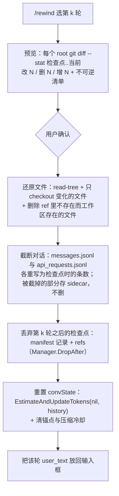

# 会话检查点与回退设计（checkpoint / rewind）

> 版本 0.7 | 日期 2026-09-14 | 状态：**P1 已落地**：核心 + agent 接线 + 桌面入口 + `rewind` 冒烟场景。命令面（tui/acp/channel）与 P2/P3 未做。同日 review 后修订了「没有文件状态」的语义、回退时的索引裁剪与还原顺序 —— 见下方的「复核修订」
> 关联：[prompt-cache 手册](agents/prompt-cache.md)（前缀逐字节不变式，本设计的正确性根基）、
> [desktop 手册](agents/desktop.md)（smoke 与场景约定）

## P1 落地（2026-09-14）

落地范围：`agent/checkpoint/`（影子仓库、懒打点、守卫、裁剪、预览、还原）→ agent 接线
（轮边界 + 写前懒快照）→ `session.TruncateTo`（截断 + sidecar）→ `agent.Rewind`（预览 / 应用）→
桌面入口（右键用户气泡 → 预览卡 → 回填输入框）→ 冒烟场景 `rewind`（23 项断言，端到端证明
**shell 新建/改动的文件都被还原/删除**）。

尚未做：`/rewind` 命令面（tui / acp / channel）、跨压缩边界的回退、桌面回退链展示（P2）、`/branch`（P3）。
另外 §12 的冒烟「负向控制」落在**单元层**（`TestRewindWithCheckpointsOffSaysSo` +
`TestCheckpointWiringDisabledByConfig`）：同一段代码路径、成本却低得多，值得偏离一次。

实现时暴露的东西，前三条是**真问题**（按最初的写法会出错）：

1. **边界与快照拆成两个方法**：`Begin`（记轮边界，只是一条 manifest 记录）与 `Snapshot`（拍文件，懒）。
   只读轮次只调 `Begin`，所以 UI 仍能「回退到这一轮」，而它一分遍历/对象写入的钱都不付。
2. **「没有快照」有两种含义，必须区分**（`resolveTarget`）：一是**这一轮没写**——那么「这一轮开始时的
   文件状态」就等于下一个写入轮开始时的状态，向前解析（用后来的快照）是正确的；二是**快照被守卫拒绝、
   或已被裁剪**——状态**未知**，此时向后找替代快照会把文件悄悄还原到**错误的时间点**。所以只有前者允许
   向前解析，后者一律拒绝并说明原因。
3. **比较必须树对树**：`git diff <tree>` **看不见未跟踪文件**，而「agent 用 shell 新建了文件」正是这个功能
   存在的理由。因此预览与还原前先把当前状态 `add -A` + `write-tree`，再比两棵树（代价是那点对象写入，
   本来下一次快照也要写）。
4. **检查点的根必须来自会话，绝不能来自环境的 CWD** ⭐。`wdctx.Dir(ctx)` 在没有 ctx 值时**退化到进程
   CWD**，而 macOS GUI 进程的 CWD 是 `/`：一次 `PreviewRewind` 用 `context.Background()` 调下去，管理器
   就以 `/` 为根重建，`git add -A --work-tree=/` **开始遍历整个文件系统且永不返回**（实测：回退永久卡在
   一个无法结束的子进程上，pprof 栈停在 `syscall.Wait4`，`sample` 显示 git 在 `read_directory_recursive`）。
   修法：根取 `sess.WorkingDir` + `AdditionalDirs`（`/cd` 更新的正是它，重载后也还在）；并加一道守卫，
   `/` 与 `$HOME` 永不作为检查点根（与桌面 `defaultWorkspaceFor` 的 `wideRootReason` 同一条规则）。
5. **轮次是否结束的标记必须挂在主路径上**：`defer rs.markFinished()` 最初落进了 `RunOneOffStream`（两个
   函数结构相似，第一次匹配容易中招；one-off 从不发布 `currentRun`，所以那里没有任何读者），于是主轮次
   的 run 永远是「未结束」，回退被自己的守卫一直拒绝。教训：给相似结构打补丁时要确认**所在函数**，
   编译通过不代表改对了位置。
6. **回退提示不能走 `applyToSession`**：它只挂到「最新的 running assistant」上，而回退之后 transcript
   可能是**空的**（整轮都被撤销了）——最需要提示的时刻恰好是它会被丢掉的时刻。改成 `updateSession`
   追加一条独立的 notice 消息。

## 复核修订（2026-09-14 晚，review 后）

三处「实现与本节/§6 的说法不一致」的地方，已修（各有回归测试；桌面冒烟 `rewind` 场景从 23 项断言扩到
33 项，把下面第 7 条也端到端证明了一遍）：

7. **「没有文件状态」有三种，不能合成一个 `Blocked`**（决定 16）。`resolveTarget` 现在返回 `FileState`
   三态：`FilesAvailable`（有快照）/ `FilesUnchanged`（本轮及之后都没写，工作区本来就在目标状态）/
   `FilesUnknown`（快照被守卫拒绝、没有 git、已被裁剪）。**前两种都照常回退**（第一种连 git 都不跑），
   只有第三种要在卡片与提示里显式说明「未还原任何文件」。修之前 `FilesUnchanged` 被当成拒绝：
   **任何只读会话、以及任何只读的末尾一轮，都完全无法回退** —— 恰好是「答得不好，想重问」这个最常见
   的场景。顺带把 checkpoint 层那些面向读者的理由串改成中文（此前英文原因直接拼在「不能回退：」后面）。
8. **回退要把 manifest 一起裁掉**：`Rewind` 之后 `Turn > N` 的记录描述的是已经不存在的对话（切点越过
   `messages.jsonl` 的新末尾，ref 指向被放弃的分支）。留着它，第二次回退到那一轮会**把文件跳到放弃分支
   的时间点，而对话截断是个空操作 —— 却报成功**（实测）。现在 `Manager.DropAfter(N)` 删记录 + 删 ref +
   gc；保留第 N 轮自身：它的 `Records` 就是新切点，下一轮从它续号。
9. **还原必须先删后写**：路径换了形态时（`foo.ts` → `foo/index.ts`），checkout 旧形态会被新形态挡住，
   git 会删掉挡路者，于是后一半在「已经不存在的路径」上失败 —— **工作区已经动过，却报「会话未改动」**。
   先删新增文件即可，两个方向实测都通。
10. 顺带修：`desktop/roots_test.go` 少传了 `buildSessionMessages` 的 offset —— **桌面模块的测试自上一版
    提交起编译不过**（`go test ./...` 从仓库根跑不到它，所以一直没暴露）。这条坑已记进
    [desktop 手册](agents/desktop.md)。

### 第二轮（同日，继续清 P2）

11. **边界读失败必须 fail-closed**（`turnBoundary.Known`）：切点是往 `messages.jsonl` 里切的，所以读不到
    就不能当成 0 用。`LoadMessages` 遇到**一行**不可解析就整体返回 nil（一次 append 中途崩溃留下的半行
    就是这种），于是 `records` 变成 0——**再回退到那一轮会把整段会话搬进 sidecar**，而且一路报「正常
    回退」。现在读失败的那一轮干脆不记检查点（回退时明确说「没有检查点」）。代价是少一轮可回退，
    换来的是不会整段丢。
12. **不可逆检测落地了**（原来 §12 列着、但 `Irreversible` 是个没人写值的空字段）：快照时记下每个 root
    自己的 `HEAD`（`RootState.Head`），预览时与现在的 `HEAD` 比对，不一致就列一条
    `git commit 在 <root>（HEAD a1b2c3 → d4e5f6）`——§6 那条「不可逆」清单里唯一**可检测**的一项。
    零额外每轮成本（跟着懒快照一起取），且只回退对话（`FilesUnchanged`/`FilesUnknown`）时同样会报。
    随之删掉了 manifest 里那个永远空的 `Record.Irreversible`：它是「调用方自己上报」的口子，但没有任何
    调用方，留着就是下一个「看着有、永远不响」的字段。§6 清单里其余几项（MCP / SendFile / Cron /
    memory / 后台进程 / 已推送到外部的状态）**仍未检测**。
13. 三个小的：多 root 快照中途失败时回滚已经建好的 ref（否则那些 ref 与对象永不被回收，任何 prune /
    drop / rewind 都看不见它们）；`rewindTag` 提到纳秒（同一秒内两次回退会互相覆盖 sidecar）；
    `pruneEmptyParents` 的前缀比较补上分隔符（`/a/bc` 会通过 `/a/b` 的裸前缀判断，而那个循环会删目录）。

仍未做（§12 里列着、但**尚未落地**，别再当成已完成）：`bash_ran` 与「覆盖范围之外的改动」提示、
后台 bash 活跃时拒绝建检查点、侧栏回退链（P2）、`/rewind` 命令面、`itest/tui` 的逐字节一致验证，
以及 §6 清单里上面点到的那些不可逆项。

## 1. 问题

长会话里 agent 走错路之后，今天只有两条路：手工 `git checkout`（并不知道它动过哪些文件），或者重开会话
（丢掉几十轮上下文）。竞品普遍的答案是 **checkpoint + rewind**：每轮自动打点，随时回到某一点。

对 Tachi 还多一层约束：五个入口（`tui` / `acp` / `desktop` / `channel` / `-p`）加上 `tachi web` 与 dream
**读的是同一份会话文件**。「回到过去」必须定义在这套共享存储上，而不是某一个前端的私有状态里。

## 2. 现状盘点（实施前的事实）

### 2.1 会话存储

- 一个会话一个目录：`<configDir>/session/<session-id>/{meta.json, messages.jsonl, api_requests.jsonl}`，
  另有 `subagent/`、`oneoff/` 两个子目录先例（`session/store.go`）。检查点沿用这个形状。
- `messages.jsonl` 只追加。唯一的重写路径是 `ReplaceLastMessage`，注释写明它是 read-modify-write、
  **锁由调用方持有**。本设计的截断要复用这个模式。
- 记录字段（`session/session.go:61-97`）：`type / content / name / signature / args / result / is_error /
  diff / tool_call_id / subagent_id / usage / duration_ms / iteration / seq / timestamp`；
  类型只有 `user / assistant / thinking / tool_call / tool_result / confirm / reminder`。
- **`Message.Diff` 从未被赋值**（全仓只有权限流程里的 `ToolDiff`，不相干），不能当快照来源。

### 2.2 对话重建——本设计要绕开的地方

- `ConvertSessionToLLMMessages(msgs, providerType)` 是对**消息切片的纯函数**，不需要会话 id
  （`agent/session_convert.go:30`）。
- 它的注释承诺：重建出来的历史必须与当时发送的**逐字节**一致，否则 provider 前缀缓存整段失效
  （实测记录：一个多余的 `\n` ≈ 47k token）。
- 由 `agent/session_convert_test.go` 的四个接缝测试钉住：`..._ReminderSeamMatchesTheLiveWrap`、
  `..._MidTurnReminderStaysWhereItWasSent`、`..._MidTurnReminderAtTheEnd`、
  `..._StrandedReminderBeforeALaterTurn`。

### 2.3 会话谱系与恢复

- 压缩链：`compacted_parent_id` / `compacted_child_id` / `compacted_parent_title`——**双向、单子、
  语义写死为「压缩」**。`followCompactedChain` 跟到最新的延续（`agent/acp/agent.go:836`），
  ACP 的 `ResumeSession` 依赖它，桌面按「压缩前 N 节」折叠展示（`itest/desktop/drivers/compact.js`）。
- 恢复路径三条，各自重建的东西不同：TUI（`tui/session_selector.go`：provider / mode / 工作目录，
  **不**调 `EstimateAndUpdateTokens`）、ACP（`agent/acp/agent.go:736`：调）、
  桌面（`desktop/agent_session.go`：`LoadSession` + `LoadSessionHistory`）。

### 2.4 文件侧：没有任何 before-image

- **工具参数的片段**：`agent/tools/filechange.go`。`EditFile` 带 `old_string`（可反演，零成本），
  `WriteFile` **没有旧内容**（注释明说「读文件去编一个既慢又错」）。
- **工作区 diff**：`desktop/gitdiff.go` 的 `GetTurnDiff` 是 `git diff HEAD`——相对 HEAD 的**现状**，
  不是相对上一轮。非 git 工作区只有片段 diff。
- `desktop/commands.go:166` 明写：一轮之后只剩文件列表，**没有内容快照**。
- **没有工具可逆性分类**，只有权限确认（`NeedsConfirmation` / `GetDiff`）。

### 2.5 可复用的地基

| 需要 | 已有 |
|---|---|
| 跑 git | `pkg/shutil`（`Run` / `Output` / `Success`）；`agent/subagent/worktree.go` 已在做 `git worktree add`、`git add -A`、`git diff --cached --stat`、`isGitRepo()` |
| 忽略规则 | `agent/lsp/gitignore.go` 的批量 `git check-ignore` |
| 多根 | `session.Session.WorkingDir + AdditionalDirs`（"effective root set"）与 `agent.NormalizeAdditionalRoots` |
| 轮起点 | `agent/agent_loop.go` 一轮开始处：`ensureSessionAndRecordUser` → `sessionSeqBase` → `EventTurnStart` → `EstimateAndUpdateTokens(rs, messages)` |
| 压缩后重算估算 | `agent/compact.go:46` 的 `EstimateAndUpdateTokens(nil, newHistory)`——回退后重置估算的同款做法 |

## 3. 竞品对照（决定语义的依据）

| | 回退的落点 | 覆盖面与限制 |
|---|---|---|
| **Claude Code** `/rewind` | **同一会话内原地**。菜单：恢复代码 / 恢复对话 / **两者** / 从这里往后总结 / 往前总结 | 官方文档明写 **不跟踪 bash 命令改的文件**、子 agent 的编辑不恢复、会话外的改动不跟踪、symlink/硬链接跳过并告警；每会话 100 个检查点、约 30 天清理，快照没了报 `No files were restored`；**中途插入的消息不建检查点** |
| **Claude Code** `/branch`、`--fork-session` | **新会话**（新 session id）："creates a copy of the conversation so far and switches you into it, **leaving the original intact**" | `/branch` 在原进程内切过去（权限批准跟着走）；`--fork-session` 另起进程（不继承批准） |
| **Pi** `/tree` vs `/fork` vs `/clone` | `/tree` = 同会话内**挪 leaf**；`/fork` = 抽成**新文件**；`/clone` = 当前分支另存 | 会话本身就是树（每条记录有 `id` + `parentId` + `leaf`）；切换分支时可对**被放弃的那段**生成摘要，否则新分支会重复踩坑；选中用户消息时 leaf 落到其**父节点**并把原文放回输入框 |
| **Cline** | 默认是回退**代码**、**保留对话**；另有 "Restore Task and Files" | 有已知 bug 类：部分回退后**被放弃的请求会渗回来**（cline#2866）——「切在哪」是隐式状态才出的错 |
| **Codex** | `/side` 临时分叉（新线程）、`/fork`；resume 原地 | — |

两条来自竞品的产品细节值得抄：**回退后把该轮的原始提示词放回输入框**（Claude Code 与 Pi 都这么做）；
Claude Code 明说检查点**不替代版本控制**。

**结论**：

1. 行业把「回退」与「分支」拆成两个命令，**回退一律原地**（同一会话），分支才开新会话。
2. **没有一家覆盖 bash 的写入**（Claude Code 官方明写不覆盖）。做到这一点，Tachi 就是超过而不是对齐。
3. 原地切分最容易出的错是「被放弃的内容渗回来」，根因是切点被表达成隐式状态。**本设计因此选择重写
   文件，让切分在任何读者眼里都是结构性事实**（见 §5.4）。

## 4. 目标与非目标

**目标**：每轮自动打点；`/rewind` 回到某轮之前；**文件与对话一起**；覆盖 bash 的写入（工作区内）；
不可逆副作用必须显式告知。

**非目标**：**「只回退代码、保留对话」**（决定 7——需要那个粒度就自己 `git` 操作）；会话 fork / 树（P3）；
把检查点当版本控制（Claude Code 明确不做，我们也不做）；root 之外的路径（`/tmp`、`$HOME`）；
它人的并发改动（Claude Code 同样不跟踪）。

## 5. 设计

### 5.1 切分边界与打点时机

- 检查点只打**用户轮的起点**。同一轮内的 steering / 中途注入**不**产生检查点——对应 Claude Code
  「queued mid-turn message 不建检查点」，也对应我们把 `applySteer` 的那条路排除在外。
- **务必是轮的起点、不是终点**：要回退到「动手之前」，快照就必须拍在动手之前。轮与轮之间用户手动改的
  文件属于下一轮的「之前」，因此会被下一次快照自然吸收（Claude Code 同样如此）。
- 边界必须落在**下一轮用户消息的 reminder 包装之后**。接缝有两种形态且只能按位置区分，切错一位就
  等于整段前缀缓存失效。**这条必须由测试钉住**，是本设计里唯一可能造成大额回退的地方。
- 检查点**不进入对话记录**：manifest 是 out-of-band 的 JSON。任何新的 `MessageType` 都要让
  `ConvertSessionToLLMMessages` 认识它，不值得为纯内部状态去动那个文件。
- one-off 与 subagent（`rs.SkipSessionWrites`）不打点——它们不写主会话，也就不该有主会话的检查点。
- **记边界是免费的，拍文件是懒的**（决定 11）：轮起点只记「记录条数」这个数字；`git add -A` 等到
  本轮第一次**可能写盘**的工具调用（`Bash` / `WriteFile` / `EditFile` / `SubAgent`）之前才执行。
  纯读的一轮（问答、看代码）因此零成本，而 16s 级的冷启动也只落在真的要写的那一刻（见 §5.6）。
  代价：快照失败时必须在**写之前挡住**那个工具调用——诚实优先于让命令跑过去。

### 5.2 文件状态：每个 root 一个影子 git 仓库

- 位置：`<session>/checkpoints/<root-index>/repo.git`——一个 **bare 仓库**（只有对象与 ref）。
  它**不是 `git worktree`**，这一点必须写清楚，否则会和 `agent/subagent/worktree.go` 混淆：那里是
  真的 `git worktree add`，在磁盘上多出一份完整检出，用于 subagent 隔离；这里**不产生任何目录副本**。
- `GIT_WORK_TREE` 直接指向**用户自己的目录**——git 只是把它当作「内容取自哪里」，`<root>` 本身既是
  用户的工作区也是被记录的工作树。**完全不碰用户仓库的 HEAD / index / 工作区**；用户工作区**是不是
  git 仓库都无所谓**——这才是关键，git 是 Tachi 的既有依赖（`desktop/gitdiff.go`、
  `agent/lsp/gitignore.go`、`subagent/worktree.go`），但不是每个工作区的既有事实。实测：跑完用户
  目录里连 `.git` 都不会出现。
- 仓库里存的是**按内容寻址的 blob**（文件内容的压缩副本，相同内容自动去重）——不是目录副本。
- 打点（§5.1 的懒执行点）**同步**执行：`git add -A` → `git write-tree` → `git commit-tree`
  （父 = 上一个检查点）→ 记进 manifest。`-A` 覆盖新增 / 删除 / 修改 / **未跟踪**文件——这是覆盖 bash
  写入的关键；index 的 stat 缓存让没变的大树只花 lstat 的开销（实测 §5.6）。
- 仓库配置：`core.compression=1`（决定 13）——它是草稿存储，不追求最小体积，换更快的对象写入。
- 排除：内建 `.git`、`.tachi`，加项目 `.gitignore`（复用批量 `git check-ignore`）。
  **被忽略的路径永久在覆盖范围之外**（决定 5）——这既是边界，也是每轮开销可控的原因：
  `git add -A` 不必去遍历 `node_modules` 那类目录。
- `.git` 排除但**顺带检测**：对比相邻检查点之间用户仓库的 HEAD / 分支是否变化，变了就记进
  「不可逆清单」（Bash 里的 `git commit` 不该被悄悄撤销）。这是清单里最值的一条，成本却很低。
- 多根：`WorkingDir` + `AdditionalDirs`，每个 root 一套仓库；manifest 记明本检查点覆盖了哪些根。

### 5.3 manifest

`<session>/checkpoints/manifest.json`——记「回到这一轮需要什么」：

```json
{
  "version": 1,
  "checkpoints": [
    {
      "turn": 3,
      "records": 47,
      "api_records": 12,
      "at": "2026-09-14T10:11:24+08:00",
      "user_text": "把导出改成流式",
      "roots": [{"root": "/repo", "ref": "refs/tachi/00/3", "tree": "…", "head": "a1b2c3…"}]
    }
  ]
}
```

- `records` = 该轮起点时 `messages.jsonl` 的条数（= 回退的切点）。
- `api_records` = 同一时刻 `api_requests.jsonl` 的条数（决定 10：两个文件一起回滚）。
- `user_text` = 该轮的用户原文，回退后放回输入框（Claude Code 与 Pi 都这么做）。
- `roots[].head` = **用户自己仓库**在那一刻的 HEAD（2026-09-14 复核后加，见「第二轮」第 12 条）：
  预览时与现在的 HEAD 比对，不一致就在卡片上列一条「不可逆」——快照能还原文件、还原不了提交历史。
  它是唯一可检测的不可逆项。
- 设计原稿里的 `irreversible` / `bash_ran` 两个字段**没有落地**：前者的可检测部分改成了上面这种
  「记 HEAD、预览时比对」（记录里那个「由调用方上报」的空字段已删），后者的「覆盖范围之外」提示
  仍未做。

### 5.4 回退流程（原地）



- **顺序**：预览 → 确认 → 文件 → 对话 → 索引 → 状态。任何一步失败必须停下并如实报告；绝不允许出现
  「文件回退了但对话没动」这种错位。
- **文件状态有三种**（2026-09-14 复核后，决定 16）：有快照 → 按下面的方式还原；**本轮及之后都没写** →
  工作区本来就在目标状态，不跑 git；**状态未知**（守卫拒绝 / 无 git / 已裁剪）→ 跳过后两类都要在卡片与
  提示里说清，第三种必须明说「未还原任何文件」。只有「这一轮根本没有检查点」才拒绝回退。
- **只写变化的文件**（决定 15）：不要用 `checkout-index -a -f`——那会刷新每一个文件的 mtime，
  让 `make` / 增量构建全量重建。按 `diff --name-only <ref> <current>` 的结果逐条 checkout（删掉的
  文件也按同一份清单处理）。
- **两个文件一起截断**：`messages.jsonl` 与 `api_requests.jsonl`（决定 10）。请求记录与活动对话
  必须一致，否则请求面板与缓存排查会看到已经不存在的轮次。
- **截断用重写，不用「前缀长度」**：这一步是本设计最重要的取舍。用 `meta.json` 记活动前缀长度，
  意味着 agent、TUI、桌面 transcript、ACP resume、`tachi web`、dream **每个读者都必须自觉遵守**，
  漏一个就是 Cline#2866 那类「被放弃的内容渗回来」。重写文件让切分对所有读者都是结构性事实，
  **现有读者零改动**。
- **尾巴存 sidecar**（与 `messages.jsonl` 同生命周期，决定 9）而不是删掉：成本为零，且让将来的
  `/branch` 从「加功能」变成「读 sidecar」而不是数据迁移。
- **重置 `convState` 必须显式做**：原地回退拿不到新会话白送的「全新状态」，否则环/告警会停在错的数上
  （与「one-off 污染锚点」是同一类坑）。

### 5.5 会话关系：给将来的 fork 留位

今天只有压缩用的双向单子字段，且语义写死。回退若复用它：UI 会说「压缩前」，`followCompactedChain`
会把回退当成「新的延续」。将来 fork 还需要多个孩子，这组字段装不下。

**因此现在就把关系一般化**：一个 `relation`（`compaction` / `rewind` / `branch`）+ 现有父子指针，
孩子侧允许多值；旧数据缺 `relation` 时视为 `compaction`，语义不变。

抄 Claude Code 的两条产品语义（P3 用）：`/branch` 是**复制对话并切过去、原会话原样保留**；
`--fork-session` 另起进程时**权限批准不继承**。

### 5.6 成本模型（实测，2026-09-14）

在本机（macOS / APFS）用 Go 仓库的形状测的：50 个目录、每个小文件 ~30B；`git` 用
`--git-dir=<影子 bare 仓库> --work-tree=<用户目录>`，测的是 `git add -A` + `write-tree`。

| 文件数 | 冷启动（首个检查点） | 之后每轮（改 1 个文件） | 之后每轮（无改动） | 对象数 | 影子仓库 |
|---|---|---|---|---|---|
| 2,000 | 1.37s | 0.09s | 0.04s | 2,056 | 8.3 MB |
| 20,000 | 16.6s | 0.15s | 0.07s | 20,056 | 80 MB |

读法，以及它直接决定的三件事：

- **每轮很便宜，第一次很贵。** 每轮的成本几乎只剩遍历——index 的 stat 缓存让没变的文件只 lstat、
  不重新哈希，所以 10 倍文件数只从 0.09s 涨到 0.15s。贵的是冷启动。
- **冷启动的贵在「写对象」而不是「哈希」**：2 万个 ~30B 的文件合计才 ~1MB 内容，影子仓库却 80MB
  ——全是每个 loose object 占 4KB 块的开销。因此**冷启动后立刻 `git gc`**（决定 12），量级立刻降下来。
- **所以打点必须是懒的**（决定 11）：16s 不能压在一轮的起点上，而纯读的一轮根本不需要文件快照。
  打点用的 `core.compression=1`（决定 13）也是同一目的：草稿存储换写入速度。

**未测，因此不写进结论**：真实大型仓库（`node_modules` 被忽略的情形）、「一轮改动一个 100MB 产物」的
情形、以及 `git gc` 后的实际体积。`max_files` 与字节守卫的阈值应在 P1 落地时按真实仓库标定。

## 6. 边界与限制（诚实清单，必须进 UI）

- 覆盖范围 = 会话的各个 root；root 之外（`/tmp`、`$HOME`）不覆盖。
- **被 `.gitignore` 排除的路径永久不在覆盖范围内**——不只是「改了不还原」，也包括「**新建的不会被
  删掉**」（`npm run build` 产生的 `dist/` 会留在原地）。没有开关可以放开（决定 5）：要那个粒度
  就自己 `git` 操作。
- **不可逆**：git 提交（会检测并列出）、MCP 调用、`SendFile`、Cron、memory 写入、后台进程；
  **外部服务状态**（push 出去的东西、发出去的消息）永远不可能撤销。
- 后台 bash 活跃时**拒绝建检查点**（简单、诚实），而不是拍一张可能不一致的快照。
- 检查点随 session 目录一起清理（已确认接受）。快照已不在时必须**明确报错**（Claude Code 的
  `No files were restored` 是正确姿势），不能静默地「回退成功」。
- 检查点**不替代版本控制**。

## 7. 落点（文件级）

| 面 | 改动 |
|---|---|
| 新 `agent/checkpoint/` | 影子仓库、检查点、预览、还原；git 一律走 `pkg/shutil` |
| `agent/agent_loop.go` | 轮起点打点（用户轮边界）；跳过 `SkipSessionWrites` |
| `session/store.go` | `messages.jsonl` **与** `api_requests.jsonl` 一起「截断到第 N 条 + 尾巴存 sidecar」（复用 `ReplaceLastMessage` 的原子重写），锁由调用方持有 |
| `session/session.go` / `manager.go` | 关系字段一般化为 `relation`（旧数据视为 `compaction`） |
| `agent/compact.go` / acp `followCompactedChain` | 与新 relation 对齐 |
| `agent/commands` + `tui/` | `/rewind` 命令与选择界面 |
| `config` | `checkpoints.{enabled, max_files, max_bytes, retain}` |
| `acp/`、`desktop/`、`channel/` | P2：命令/事件与每轮回退入口 |
| smoke | 新场景 `rewind`（见 §12） |

## 8. 已拍板的决定（2026-09-14）

1. **回退是原地**（不是新会话）；分支以后作为独立命令做。
2. **现在不做 fork**，但会话关系字段现在就一般化（§5.5），且尾巴结构上保留。
3. **被放弃的分支可丢弃**（不要求可继续；sidecar 保留是顺带的好处，不是需求）。
4. **`git add -A` 同步执行**可接受（配 `max_files` 守卫与耗时度量）。
5. **`.gitignore` 排除的路径永久不覆盖**——没有开关可以放开。曾考虑过 `include_ignored`（强制收录，
   `git add -A -f`），已否掉：那会让每轮去遍历并哈希 `node_modules` 这类目录，而**排除正是每轮开销
   可控的原因**。要那个粒度就自己 `git` 操作。见 §6。
6. **检查点随会话目录清理**——接受。
7. **不提供「只回退代码、保留对话」**。要那个粒度就自己 `git` 操作——回退是「回到那一刻」，
   文件和对话必须一起动（§5.4）。
8. **每会话保留最近 100 个检查点**（对齐 Claude Code 的量级）；超限裁剪最旧的 ref 并顺带
   `git gc`。裁剪后仍可能被指向的检查点必须拒绝回退并明确报错（§6）。
9. **sidecar 与 `messages.jsonl` 同生命周期**：一起创建、一起清理，不做单独保留。
10. **`api_requests.jsonl` 随回退一起回滚；usage ledger 不回滚。** 前者是「这次会话发了什么」的记录，
    与活动对话必须一致（否则请求面板与缓存排查会看到已经不存在的轮次）；后者是**账本**——token 已经
    真的花掉了，回退不是退款。
    两个附带结论：`sessionSeqBase()` 同时读 messages 与 api_requests，回滚后二者仍然一致；
    账本行**不带 seq**（`llm/usage_recorder.go` 只记 `ts / session_id / kind / model / tokens / prices /
    band / credit`），所以回滚导致的 seq 复用不会与账本撞键。

以下五条来自 §5.6 的实测（"听你的"，由实现方定）：

11. **打点是懒的**：轮起点只记边界（一个数字，免费）；`git add -A` 推迟到本轮第一个「可能写盘」的
    工具调用之前。纯读轮零成本，冷启动的 16s 也只落在真要写的那一刻。快照失败必须在写之前挡住工具调用。
12. **冷启动后立刻 `git gc`**，并在裁剪到 100 个检查点时再跑一次（loose object 是 4KB 块浪费：
    2 万个小文件 = 80MB）。
13. **影子仓库 `core.compression=1`**：草稿存储，换更快的对象写入。
14. **字节守卫**（与 `max_files` 并列）：数量守卫管不了「一轮改了一个 100MB 产物」。
15. **还原只写变化的文件**：不刷新未变文件的 mtime，否则下游增量构建全量重建。

以下两条来自 2026-09-14 晚的复核（review 后补拍）：

16. **「没有文件要还原」不阻塞回退**：文件状态**已知**为「就是目标状态」（本轮及之后都没写）时照常
    回退，连 git 都不跑；状态**未知**（守卫拒绝 / 无 git / 已裁剪）时也照常回退，但卡片与提示必须明说
    「未还原任何文件」。**只有「这一轮根本没有检查点」才 `Blocked`**。依据是 §6 的措辞与 Claude Code 的
    `No files were restored`：只回退对话是这个功能的正当用法，拒绝它等于把最常见的场景（只读会话想重问）
    整个砍掉。
17. **索引随对话一起切**：回退到第 N 轮后，`Turn > N` 的检查点记录与 ref 一并丢弃
    （`Manager.DropAfter`），保留第 N 轮自身（它的 `Records` 就是新切点、下一轮从它续号）。理由见决定 3：
    被放弃的分支可丢弃；而留着它会让第二次回退到那些轮次时「文件跳到放弃分支、对话截断却是空操作」，
    且报成功。

## 9. 分阶段

- **P1（覆盖 bash）**：影子仓库 + 懒打点 + 预览 + 还原 + 原地回退 + TUI `/rewind` + 不可逆清单 +
  §5.6 的五个配套项（gc 时机、`core.compression`、`max_files` / `max_bytes` 守卫、选择性还原）。
- **P2**：桌面每轮的回退入口与回退链展示；跨压缩边界的回退。
- **P3**：`/branch`（读 sidecar / 复制对话到新会话）。

## 10. 风险与取舍

- **切点错位 → 整段缓存失效**：本设计第一大风险。对策：只允许用户轮边界；切分后复用现有接缝测试；
  P1 可以先更保守（只在「下一轮用户消息之前」打点）。
- **每轮一次 `git add -A` 的延迟**：大树上是 lstat 的开销。对策：同步 + 度量（pprof 端口现成）+
  `max_files` 守卫（超限跳过并记一条警告）。
- **重写 `messages.jsonl` 的并发**：与正在跑的轮冲突。对策：回退只在会话空闲时允许（有活跃 run 就拒绝），
  沿用 store 的调用方持锁约定。
- **原地回退的读者面**：重写文件正是为了消除这个风险；一旦有人改成「前缀长度」方案，风险立刻回来。
- **不做「只回退代码、保留对话」**（Claude Code / Cline 都有这个组合）：那会让对话与磁盘错位。
  已决定不提供（§8 决定 7）——要那个粒度就自己 `git` 操作。

## 11. 待决问题

**无。** 十七条取舍已于 2026-09-14 全部拍板（§8：1–15 首轮，16–17 复核后补）；曾考虑但被否掉的两个方向
也记在那里（`include_ignored` 强制收录、只回退代码），以免日后有人重新提。

## 12. 验证

> **2026-09-14 复核后的实际状态**：本节的清单是设计时的计划。已落地的部分是：单元层的
> manifest / ref 编排、排除规则、守卫、预览、两个文件一起截断 + sidecar、保留上限裁剪、
> 懒打点、选择性还原、**文件状态三态**、**DropAfter**、**路径换形态的还原**、**HEAD 变化检测**
> （判定的不可逆项）；桌面冒烟 `rewind`（33 项断言，含只读轮的回退）。**尚未落地**：
> `itest/tui` 的逐字节一致验证、侧栏回退链、「负向控制」的端到端版本。下面照原样保留，读到哪条
> 没做，以上文为准。

- **单元**：manifest / ref 编排；排除规则；**HEAD 变化检测**（构造一次 `git commit` 看是否被抓到）；
  预览计算；两个文件一起截断 + sidecar（含并发拒绝）；截断后 `sessionSeqBase()` 的取值与
  messages / api_requests 里实际存在的 seq 集合一致（决定 10 的直接推论）；**保留上限 100 的裁剪**
  （第 101 个进来时最旧的 ref 被删、`git gc` 被触发、指向已裁剪检查点的回退被拒绝并报错）。
- **单元（§5.6 那五条）**：纯读轮**不产生**影子对象（懒打点，决定 11）；快照失败时工具调用被挡住、
  不执行（决定 11 的代价）；`max_files` 与字节守卫各自都能拦住并记警告（决定 14）；
  还原只触碰变化的文件（决定 15——比对未变文件的 mtime 不变）。
- **`itest/tui`**：回退后 `m.history` 与「重新导入再重建」逐字节一致（沿用现有 session-restore 测试的写法）。
- **桌面冒烟新场景 `rewind`**（关键）：mock 让模型用 **`Bash`** 写一个 fixture 文件 → 再走一轮 →
  `/rewind` → `after` 里读 `c.work/<path>` 断言内容还原、断言 Bash 新建的文件被删除、断言侧栏出现
  回退链、断言环的数字回落（复用 `compact` 场景的断言套路）。
- **负向控制**：把检查点关掉，该场景必须红——这是本仓库 smoke 的规矩（一个数字要成为证据，得有反证）。
